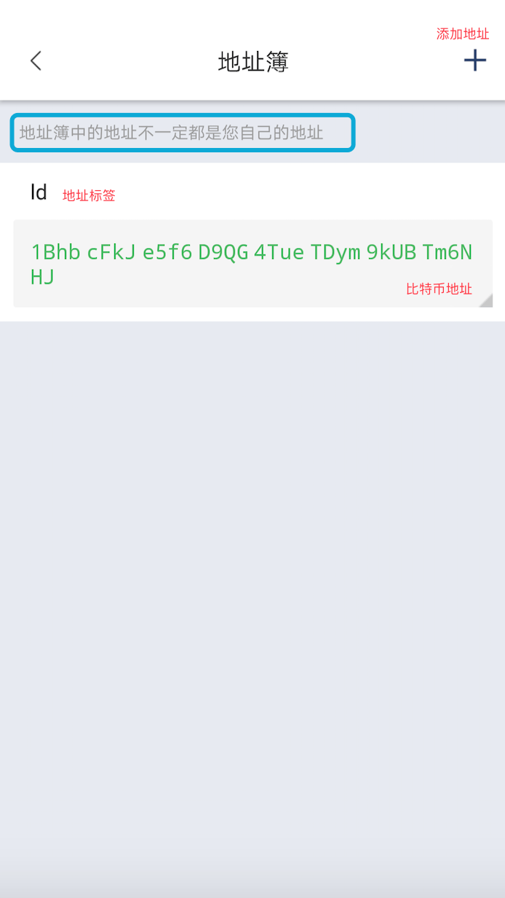
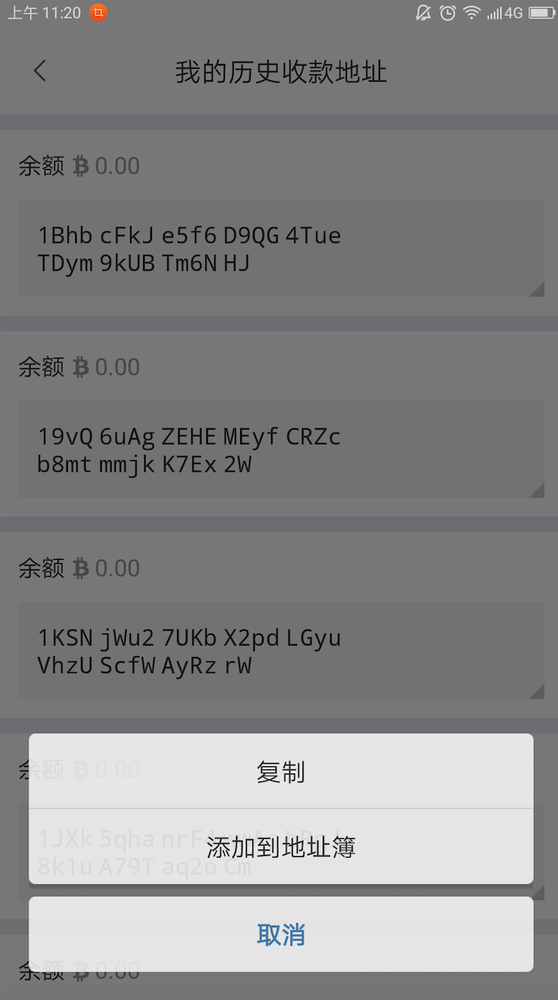
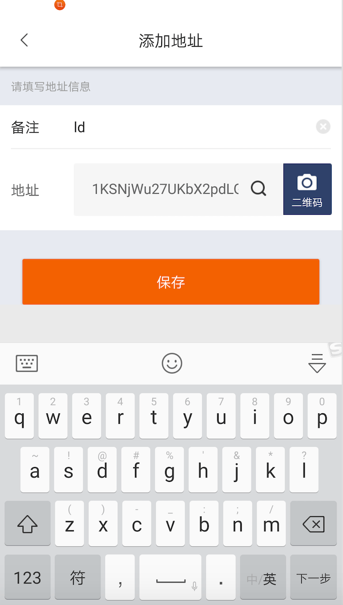
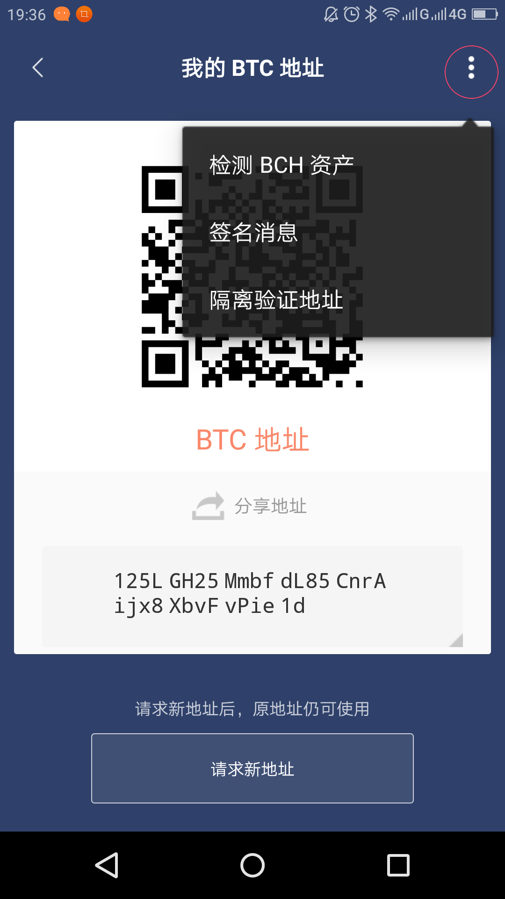
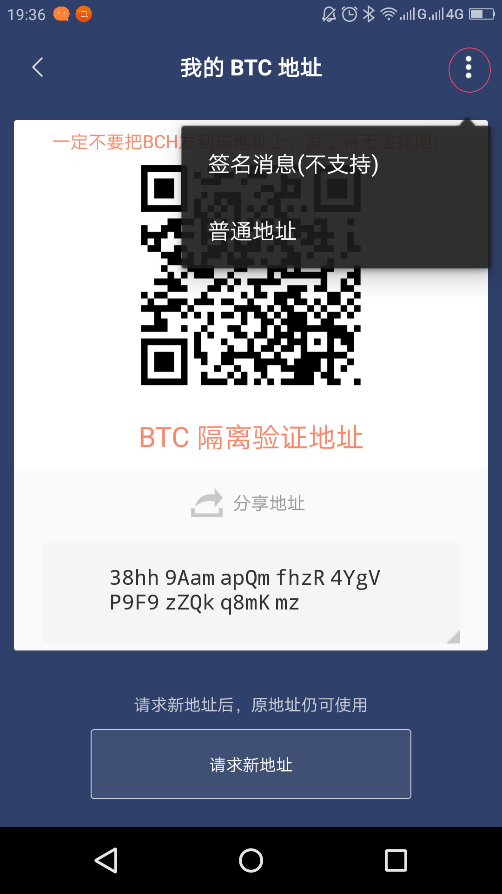

地址簿
===========

概述
----------

管理比特币地址。

地址簿使用方法
-----------------

底部菜单-设置-地址簿。

地址管理
-----------

1. 点击地址标签可对地址进行编辑或删除。点击地址可以对地址进行复制，生成二维码。
2. 这里我们需要知道，你的比特派每次有交易后，你的收款地址是会改变的，旧地址在你的历史地址里可以查到。底部菜单—我的——我的地址—收款地址。可以查到你的旧地址，点击可以添加到地址簿，然后你可以备注下，用来区分。旧地址也是可以正常收币的。

普通地址切换到隔离验证地址
---------------------------------------

一定不要把BCH发到该地址上，发了将无法找回！

右上角三点，选择隔离验证地址

隔离验证地址切换到普通地址
----------------------------------------

右上角三点，选择普通地址

注意事项
-------------

1. 地址簿中的地址不一定都是您自己的地址。

