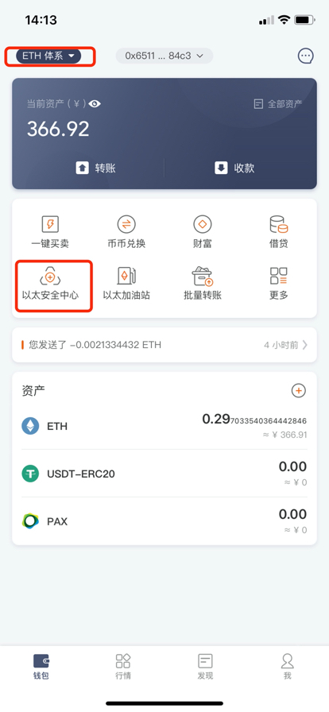
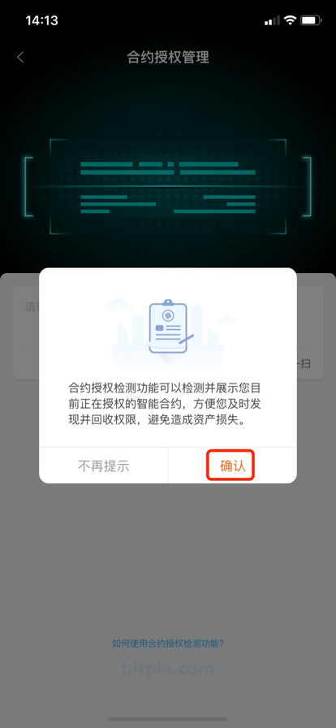
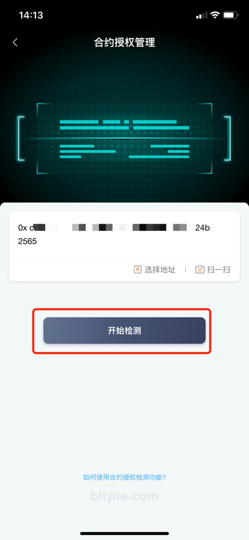
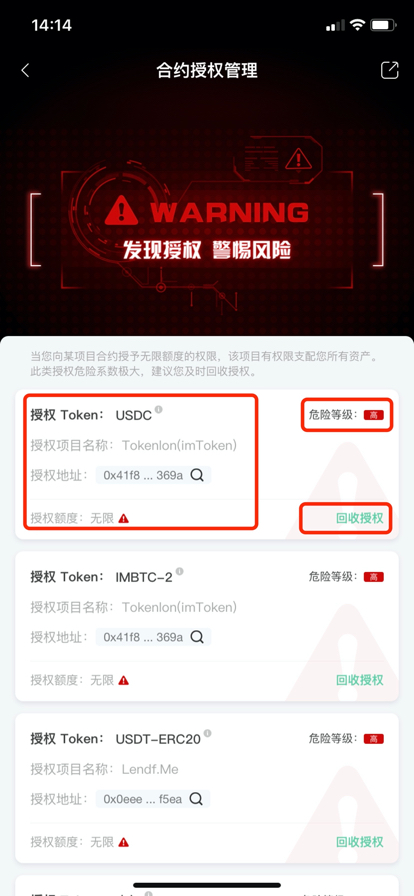
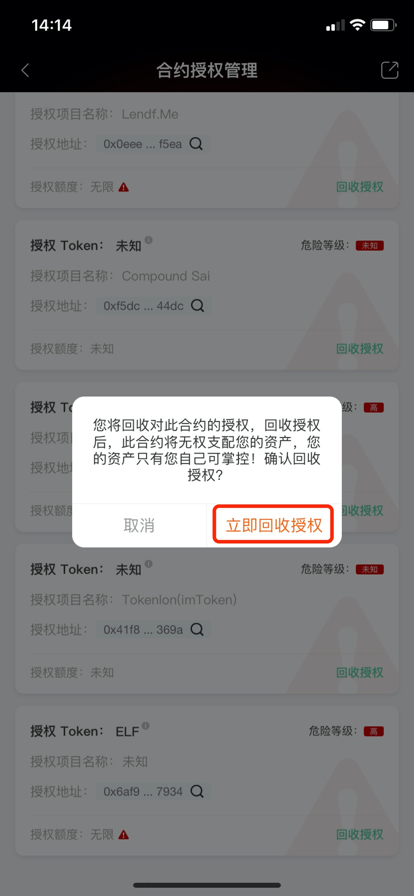
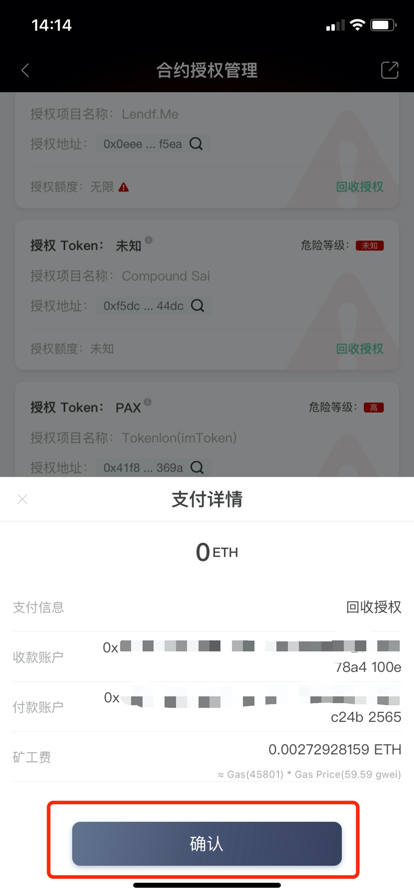
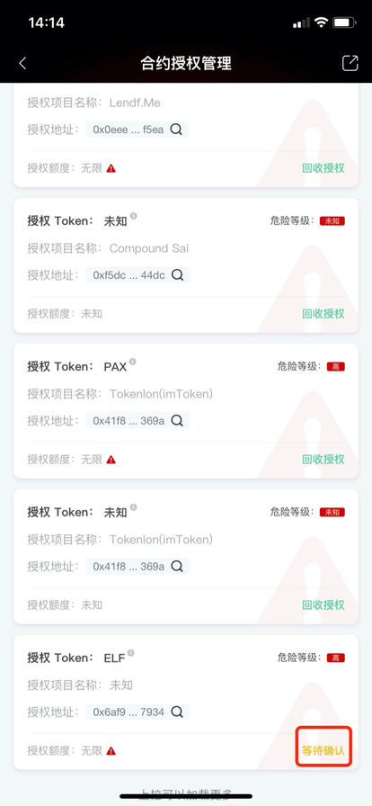
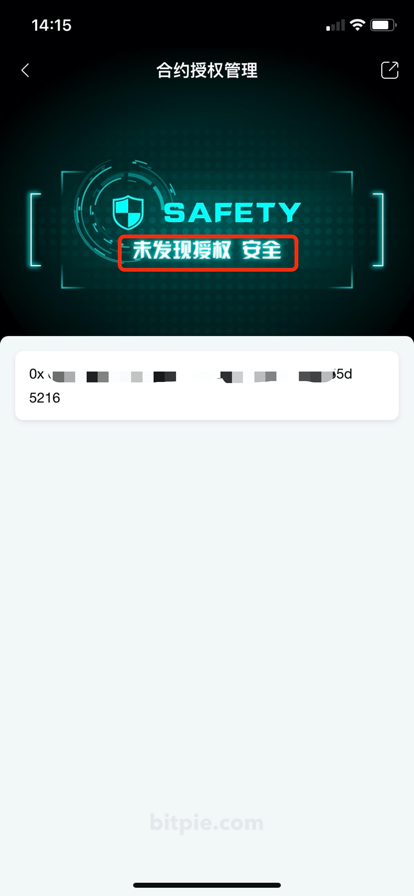

以太安全中心
===================

合约授权检测功能可以检测并展示您目前正在授权的智能合约，方便您及时发现并回收权限，避免造成资产损失。

操作方法
-----------

1、更新比特派 APP 4.8.4 以上版本，切换至 ETH 体系，找到以太安全中心。

2、进入合约授权管理，点击确认。

3、选择或者输入你想检测的以太坊地址，点击开始检测。

4、当系统检测到你的地址在以太坊区块链上有授权行为的时候，系统会发出警告，并会将您的授权列表进行展示。

5、点击回收授权，可以将已经授予对方的权限进行回收。

6、回收授权需要发起一笔金额为0的交易（链上交易会产生一笔矿工费），核对无误后点击确认。

7、等待交易被区块确认后，权限回收成功。

8、当你的权限全部回收后，您的地址将重新变得安全。

