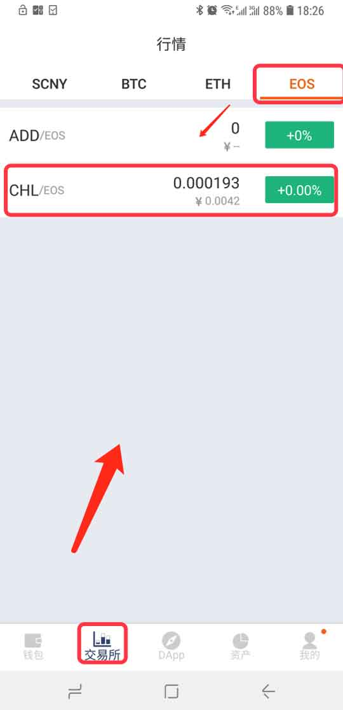
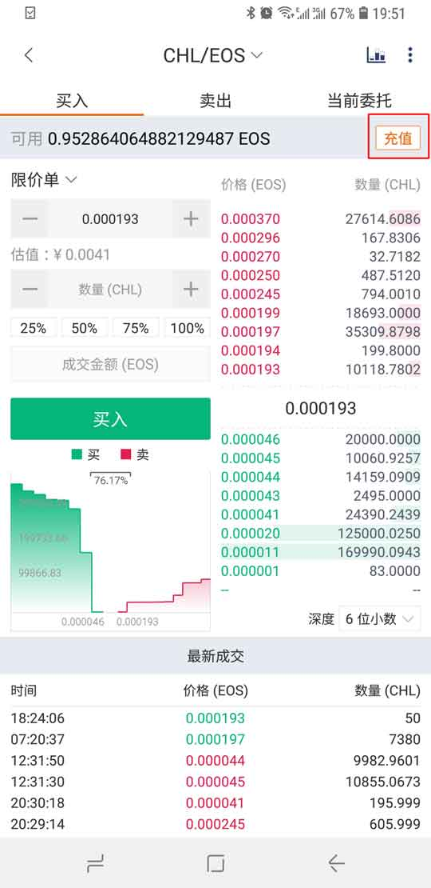
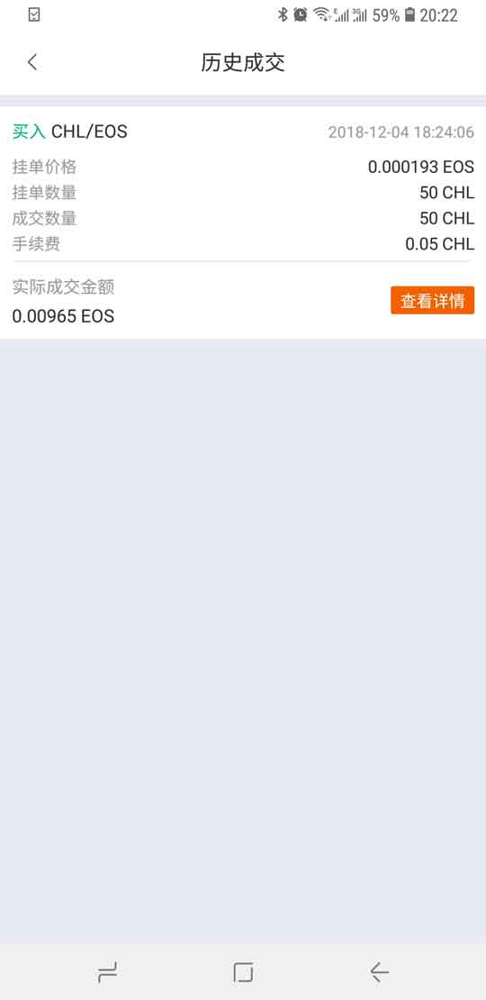
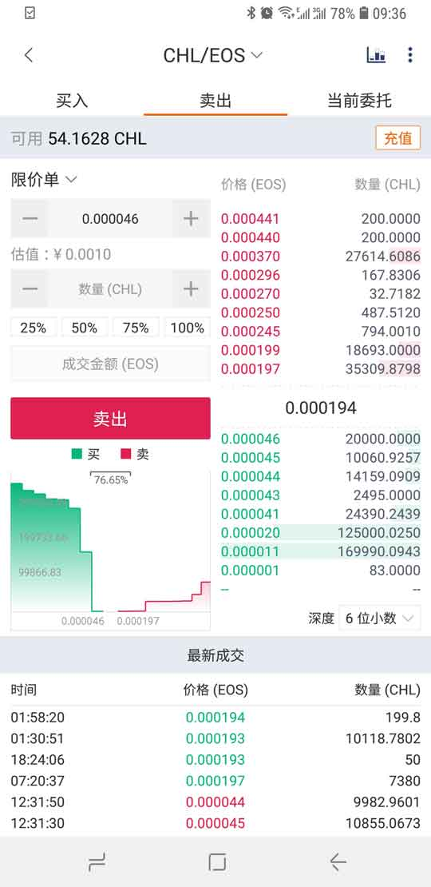

交易所
========================

目前交易所支持基于 USDT、SCNY、BTC、ETH、EOS 交易对。

目前交易所支持 BTC/USDT-OMNI、ETH/USDT-OMNI、EOS/USDT-OMNI、BCHABC/USDT-OMNI、LTC/UDST-OMNI、BTC/SCNY、ETH/SCNY、BCHABC/SCNY、LTC/SCNY、EOS/SCNY、BET/SCNY、POK/SCNY、ETH/BTC、BCHABC/BTC、LTC/BTC、BCD/BTC、ETC/BTC、SAFE/BTC、EOS/ETH、TRX/ETH、ELF/ETH、EOSDAC/ETH、ADD/EOS、CHL/EOS交易对。

将您需要交易的币充值到派银行。

以 CHL/EOS 买卖 为例。

CHL/EOS 买入
----------------------------

1、将 EOS 充值到派银行中，底部菜单－交易所－选择 CHL/EOS 交易对-充值－派银行页面（充值）。

2､ 下单类型：限价单。

3、输入 价格（EOS）、数量（CHL），核对 成交金额（EOS）无误，买入。

图中说明：1、切换交易对。 2、盘口和最新成交。 3､查看历史成交及交易流水。 4､下单类型。5､价格（ EOS）。 6、数量（CHL）。 7、成交金额（EOS）。 8、卖单区。 9、买单区。 10、盘口。11､最新成交。

4、买入之后，可在当前委托查看您买入的订单，等待订单成交。如果买入订单有误（在订单没有成交的情况下）可以在当前委托界面中撤单。

5、订单成交之后，可在右上角三点查看历史成交及交易流水。

CHL/EOS 卖出
---------------------------

1、将 CHL 充值到派银行中，底部菜单－交易所－选择 CHL/EOS 交易对－ 充值－派银行（充值)。

2、下单类型：限价单。

3、输入 价格（EOS）、数量（CHL），核对 数量（CHL），卖出。

4、卖出之后，可在当前当前委托查看您卖出的订单，等待订单成交。如果卖出订单有误（在还没有成交的情况下）可以在当前委托界面中撤单。

5、订单成交之后，可在右上角三点查看历史成交及交易流水。

