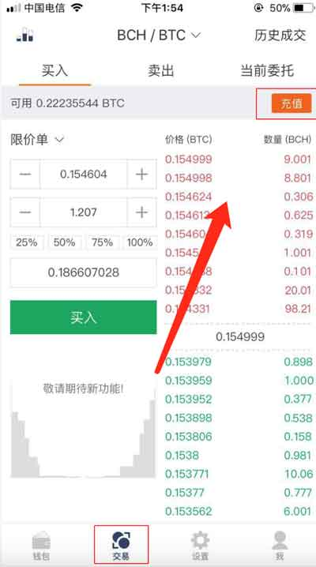
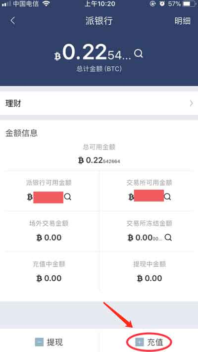
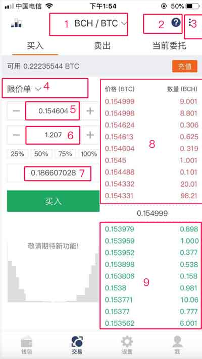
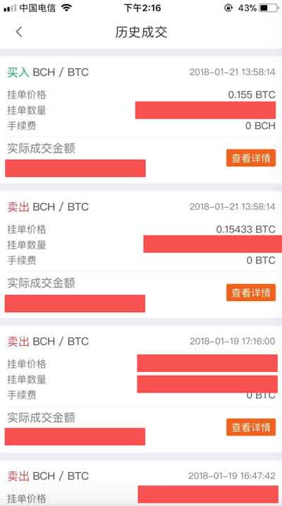
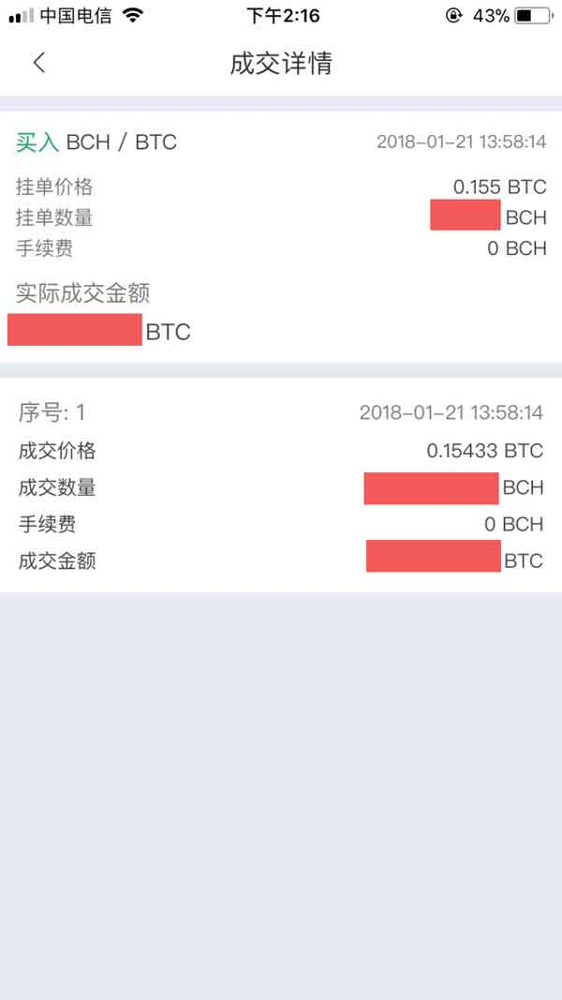
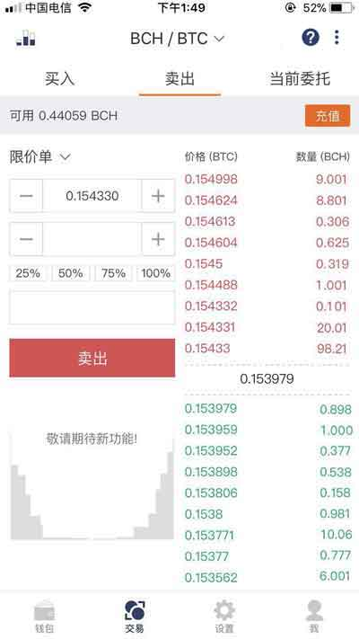

交易所
========================

目前交易所支持基于 SCNY、BTC、ETH 交易对。

目前交易所支持 BTC/SCNY、ETH/SCNY、BCH/SCNY、LTC/SCNY、EOS/SCNY、TRX/SCNY、ELF/SCNY、BTM/SCNY、POK/SCNY、ETH/BTC、BCH/BTC、BTG/BTC、SBTC/BTC、BTW/BTC、BCD/BTC、BTF/BTC、BTP/BTC、BTN/BTC、BTV/BTC、CDY/BTC、LCH/BTC、SAFE/BTC、BBC/BTC、LTC/BTC、ETC/BTC、EOS/ETH、TRX/ETH、ELF/ETH、BTM/ETH 等交易对。

将您需要交易的币充值到派银行。

以 BCH/BTC 买卖 为例。

BCH/BTC 买入
----------------------------

1、将 BTC 充值到派银行中，底部菜单－交易所－充值－派银行（充值）。

2､ 下单类型：限价单。

3、输入 价格（BTC）、数量（BCH），核对 成交金额（BTC）无误，买入。

图中说明：1、切换交易对。 2、EXPIE LIMITED。 3､查看历史成交及交易流水。 4､下单类型。5､价格（BTC）。 6、数量（BCH）。 7、成交金额（BTC）。 8、卖单区。 9、买单区。

4、买入之后，可在当前委托查看您买入的订单，等待订单成交。如果买入订单有误（在还没有成交的情况下）可以在当前委托界面中撤单。

5、订单成交之后，可在右上角三点查看历史成交及交易流水。

BCH/BTC 卖出
---------------------------

1、将 BCH 充值到派银行中，底部菜单－交易所－充值－派银行（充值)。

2、下单类型：限价单。

3、输入 价格（BTC）、数量（BCH），核对 数量（BCH），卖出。

图中说明：1、切换交易对。 2、EXPIE LIMITED。 3､查看历史成交及交易流水。 4､下单类型。5､价格（BTC）。 6、数量（BCH）。 7、成交金额（BTC）。 8、卖单区。 9、买单区。

4、卖出之后，可在当前当前委托查看您卖出的订单，等待订单成交。如果卖出订单有误（在还没有成交的情况下）可以在当前委托界面中撤单。

5、订单成交之后，可在右上角三点查看历史成交及交易流水。

