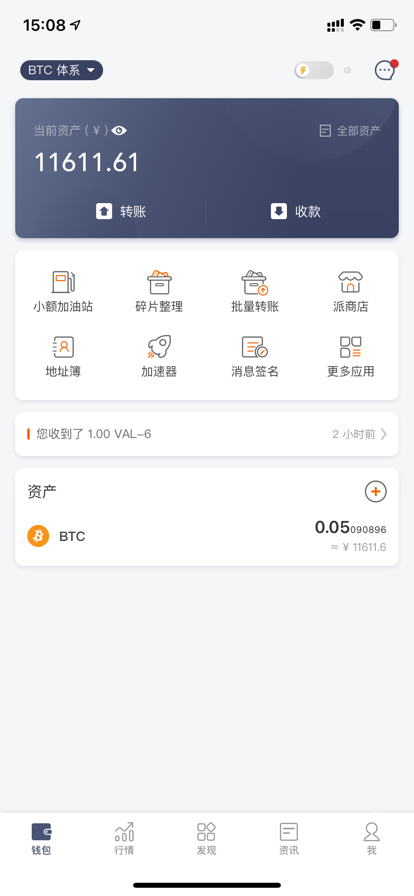
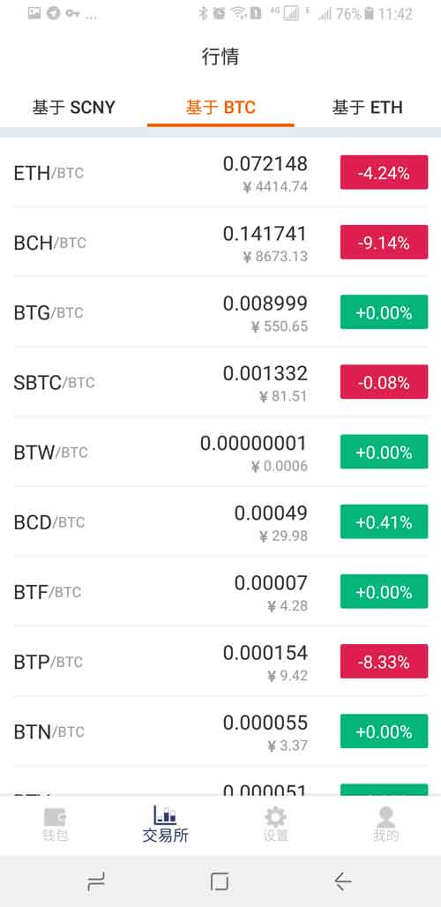
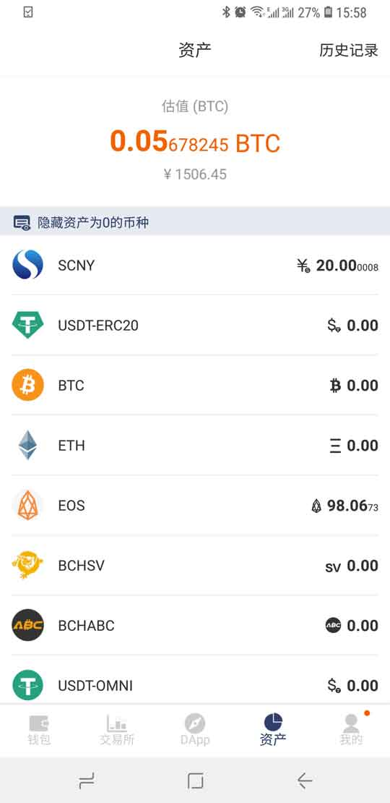
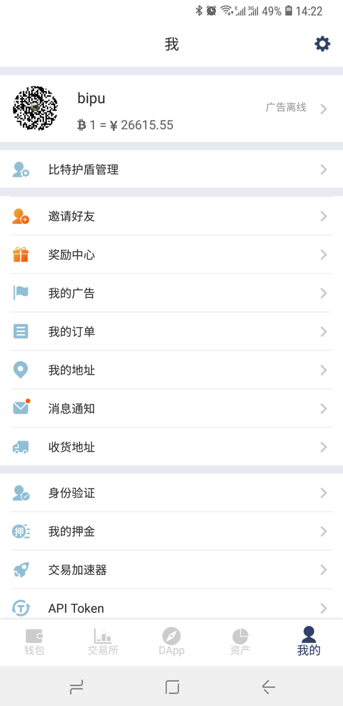

软件功能简述
============

比特派是一款综合化的区块链资产服务产品，主要功能包括：收发、买卖、加速交易、交易所、资讯、DApp 、资产估值等。

首页
------

在主界面（首页）中有如下功能

发币、收币

一键买卖：快捷方便

扫一扫：登录 https://pieotc.com/ 场外交易使用，支持 SimpleWallet 协议。

查看最新记录：显示各个币种的收发币记录。

派银行：配合点对点交易和交易所使用，还支持派理财，查看银行流水。

点对点交易：个人对个人的交易，安全，快捷

币币兑换：可以进行币种之间的兑换，例如使用 BTC 兑换成 EOS。

查看最近交易记录：最近您的所有收发币记录和买卖记录均可进入查看。

首页下方会显示多个币种，您可快速查看余额和切换。

左上角：切换比特派和比特护盾两个账户。

右上角：添加币种。

全部：对应的功能有派银行、派商店、点对点交易、币币兑换、交易记录、加速器、银行卡、身份验证、常用合约、Token工厂、EOS 投票、导入私钥、资源管理、创建 EOS 账户

交易所
--------------

目前支持基于 SCNY、BTC、ETH 的多种交易对。
可以查看行情，选择交易对进入后可进行交易。

DApp
-----------

带您发现更多优质 DApp、DApp工具，可随时查看比特派的热门及最新信息。

资产
--------------

对您在比特派上所有的资产进行估值，还可以查看历史记录(充值、提现、一键买卖)。

我的
--------

个人头像、用户名、当前币种价格，广告状态

账号管理：切换比特派和比特护盾两个账户。

我的广告： 创建点对点的广告。

我的订单：历史交易订单。

我的地址：历史收款地址和找零地址。

消息通知：交易通知，点对点订单通知，聊天通知，订单通知。

收货地址：可新建购买比特护盾的收货地址。

身份验证：KYC A/B/C 验证。

我的押金：场外交易押金管理

交易加速器：可对指定的交易 Hash 进行加速。

默认货币：货币切换。

右上角设置按钮包含以下功能：

修改密码：修改您设置的数字密码

验证种子：用户一定要在验证种子里验证您当前账户的密语备份是否正确。只有备份密语正确才可继续使用账户。

切换到隔离验证地址：可切换 BTC 以3开头的隔离验证地址，或者是 切换 普通地址。

检测余额：如果您在比特派的 ETH 或 ETH 下的 erc20 币种余额不对，可使用此功能。

消息签名、地址簿 ：有专门版块介绍。

BITHD防伪码：比特护盾用户使用此项功能扫描护盾包装盒上刮开的二维码，鉴定护盾真伪。

用户反馈：如果您有问题，随时可以使用用户反馈提交工单提问。

