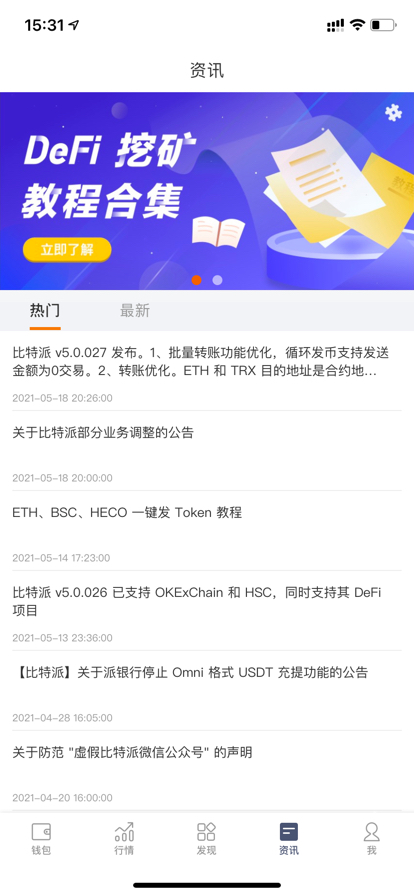

软件功能简述
============

比特派是全球领先的多链钱包，支持 BTC/ETH/TRX/BSC/HECO/EOS/USDT 等多种区块链资产。主要功能包括：收发、买卖、借贷、加速交易、资讯、DeFi 等。

首页
------

在主界面（首页）中有如下功能

转账、收款

借贷：可以快速借入或者贷出资产，享受高额借贷收益

派商店：可以直接到淘宝或者微店购买硬件钱包

加速器：比特币交易未确认时，可以通过该功能让交易快速确认，可对指定的交易哈希进行加速。

左上角：可以切换比特派钱包的币种体系

更多：对应的功能有云钱包、派商店、借贷、交易记录、加速器、消息签名等功能。钱包当前所选币种不同，更多中功能也不尽相同。

行情
--------------

可一览当前主流币种的行情，关注当前币价，投资更便捷。

发现页
-----------

带您发现更多优质 项目、DeFi 工具，可随时查看比特派的热门及最新信息。

资讯
--------------

了解比特派钱包最新资讯

我的
--------

比特护盾管理：用于管理比特护盾硬件钱包。https://bithd.com

Bitpie Cold: 需要和比太冷钱包配合使用，相当于比太的冷钱包的监控钱包。目前支持BTC和USDT-omni两个币种

钱包设置：修改密码、显示助记词、验证助记词、转入资产、默认货币、地址格式选项

交易管理：身份验证（KYC）、收款信息、我的订单、我的 OTC 押金、我的 OTC 广告

关于比特派：可以通过“帮助与反馈”反馈相关问题。如果您有问题，随时可以使用用户反馈提交工单提问。

官方验证通道：可以验证官方工作人员信息，防止不法分子借用比特派名义进行诈骗。

BITHD防伪码：比特护盾用户使用此项功能扫描用户手册上的防伪码，鉴定护盾真伪。

退出登录：退出当前账户后，可以注册新账户。

.. image:: ../img/bitpieme.jpg
    :width: 320px
    :height: 658px
    :scale: 100%
    :align: center

钱包设置相关功能说明：

修改密码：修改您设置的数字PIN码

显示助记词：输入正确的PIN码可以再次查看助记词，核对助记词的额正确性。

验证助记词：用户一定要在验证助记词里验证您当前账户的助记词备份是否正确。只有备份助记词正确才可继续使用账户。

转入资产：您可以将其他钱包的资产通过链上发送的方式，发送至比特派钱包。还可以通过该功能找回误发送的资产。

.. image:: ../img/bitpiesetting.jpg
    :width: 320px
    :height: 658px
    :scale: 100%
    :align: center