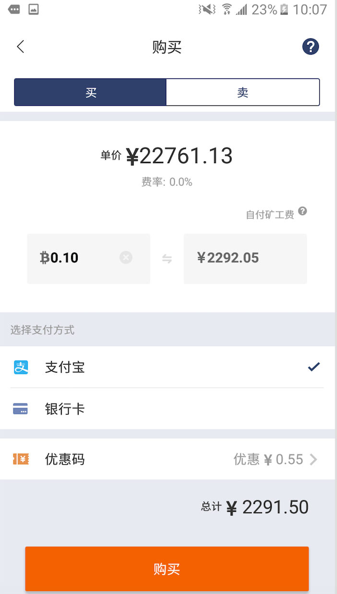
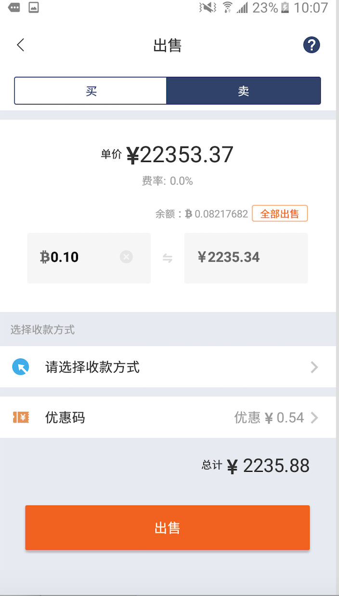

一键买卖
========

(首页，选择一键买卖)一键买卖的购物车：

一键买币
--------

下单
^^^^^^^^^^^^^^^^^^^

1. 买币最小限额是0.1BTC，填写好购买的币数后，可以在最下方看到要付款的金额。
2. 默认支付方式是支付宝，如果需要大额买币的话，建议使用银行卡付款。
3. 矿工费：买币金额小于1BTC，矿工费由用户支付。大于1BTC，矿工费由比特派支付。
4. 优惠码：买卖有优惠。

付款
^^^^^^^^^^^^^^^^^^^

1. 下单后，付款有效时间为十分钟。
2. 付款账户必须是本人账户，支付宝需要实名认证，银行卡开户者必须是本人，否则无法完成交易。
3. 付款时请备注好订单号，点击下订单号后面的数组就复制了，直接粘贴过去就可以了。
4. 备注时候，只要备注订单，其他的文字信息如比特币等不要填写。
5. 付款完成后点击已付款按钮。

收币
^^^^^^^^^^^^^^^^^^^^

交易员确认收到款后，会立刻给您放币的，在首页可以看到收币的记录。

一键卖币
--------

下单
^^^^^^^^^^^^^^^^^^

卖币最小限额是0.1BTC，填写好购买的币数后，可以在最下方看到收款金额。

填写收款信息
^^^^^^^^^^^^^^^^^^

1. 目前支持支付宝和银行卡收款。
2. 收款账户只能是本人的账户，并且确认无误，便于交易员给你付款。
3. 由于需要币确认后才能给你付款，这个过程可能需要几分钟，耐心等下。

确认收款
^^^^^^^^^^^^^^^^^^^

在确认收到款后，点击“我已收款”
