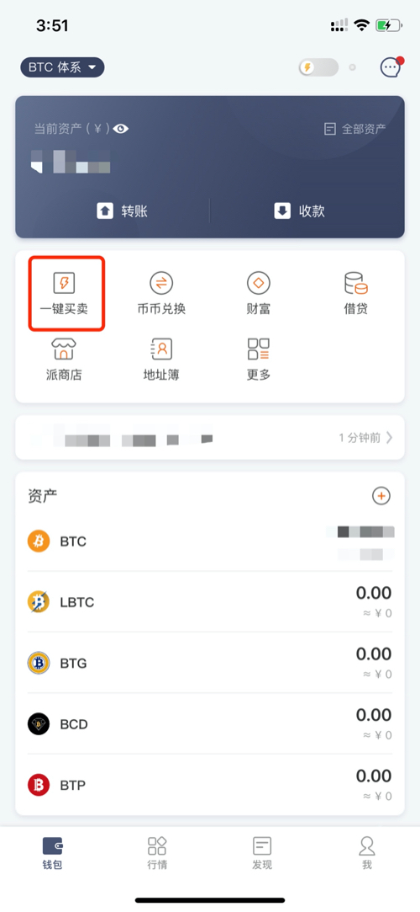
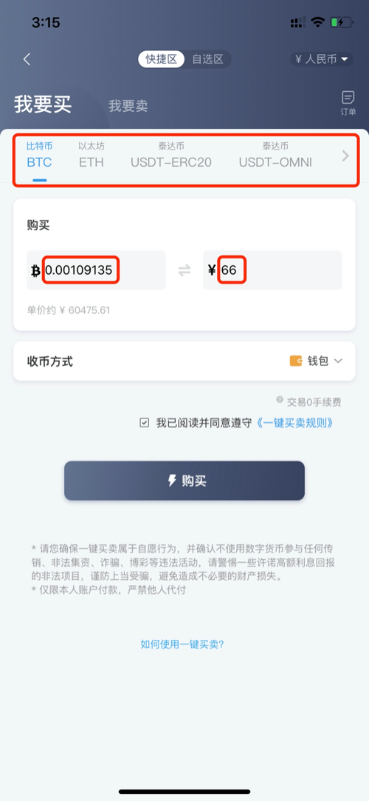
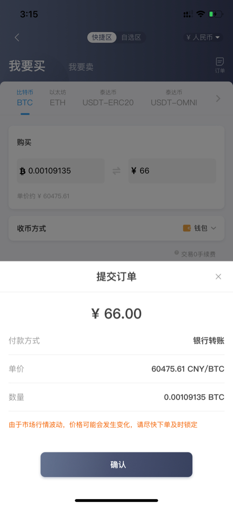
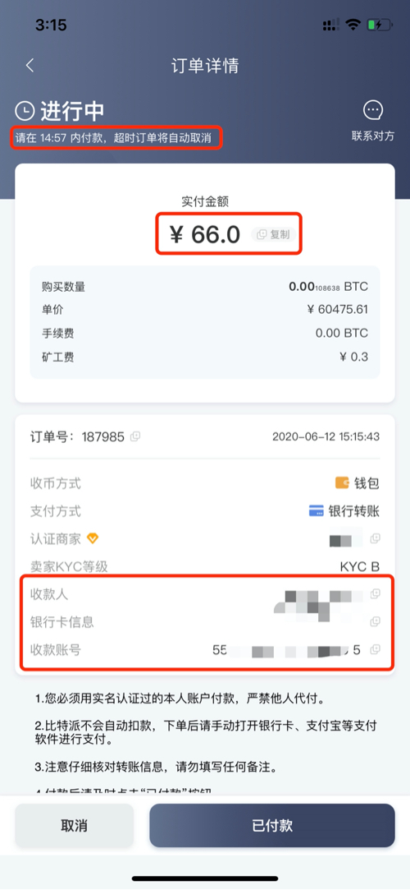
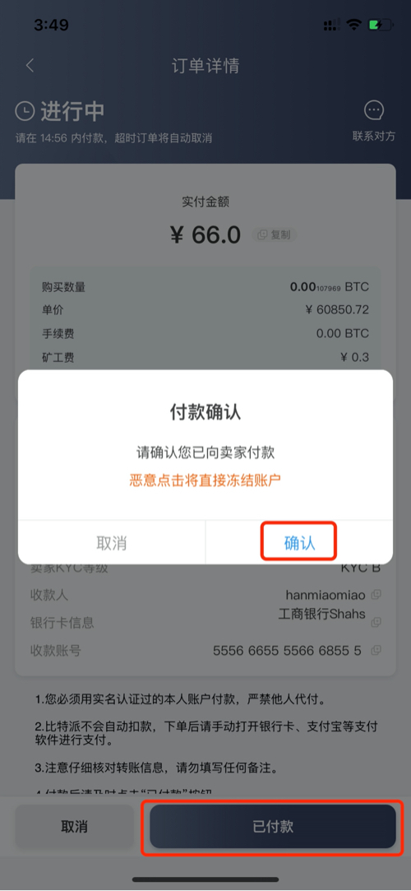
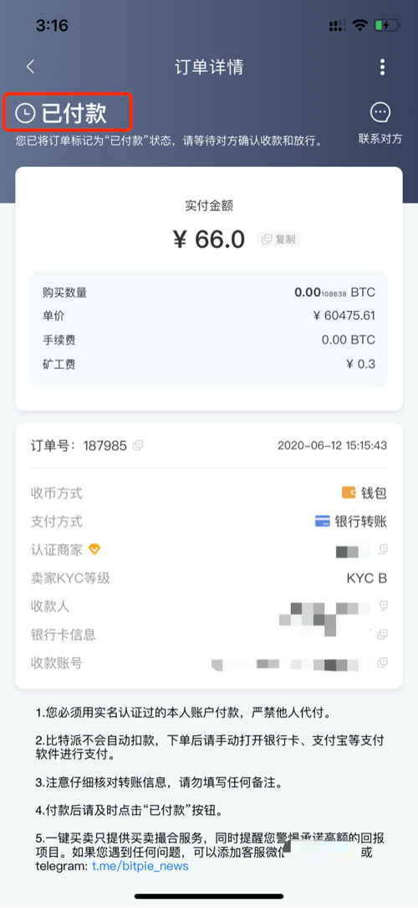
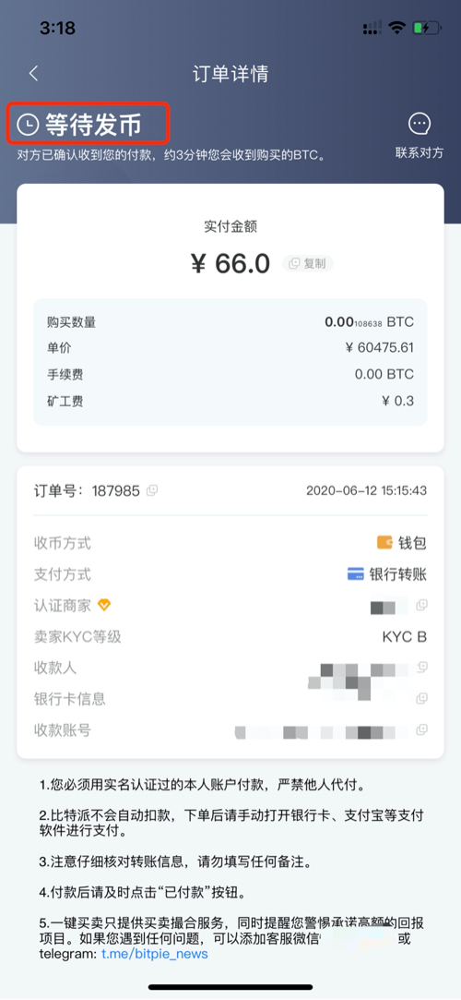
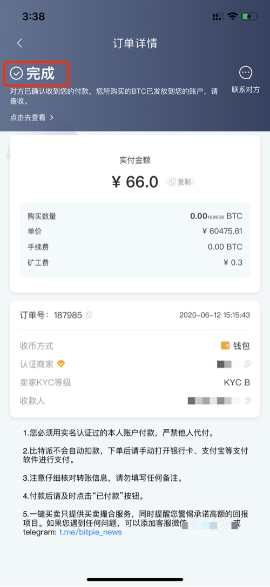
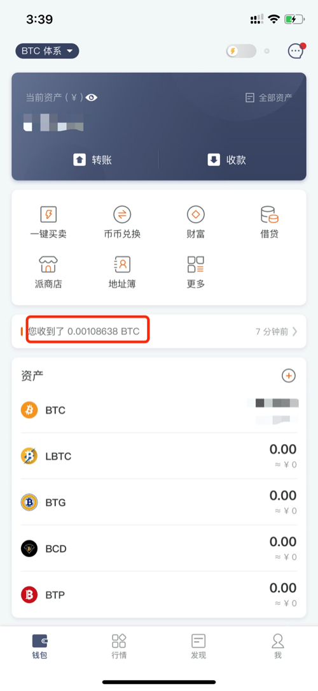

一键买卖
========

如何使用一键买卖买币？
-----------------------

1、打开比特派钱包，点击【一键买卖】按钮。

2、选择“我要买”，然后选择要购买的币种（这里以比特币为例），填写您要购买的数量或者金额，点击“购买”

3、选择您要支付款项的方式。

.. image:: ../img/buysell3.jpg
    :width: 320px
    :height: 520px
    :scale: 100%
    :align: center

4、检查订单信息，核对无误后点击“确认”提交订单。

5、检查订单信息无误后，请根据您的上一步选择，手动打开 支付宝或各大银行的手机银行软件，按照页面内展示的付款信息向商家进行付款。
付款请在15分钟内完成，超时订单将会自动取消。付款前请仔细阅读订单下方的付款注意事项。

6、完成付款后请主动点击“已付款”，不然商家无法向您放币。同时请不要虚假点击，这将会损害您在一键买卖中的信用。

7、点击已支付后，商家会收到您的支付提醒，等待商家确认收款无误后，稍作等待您便可收到您买到的币了。

