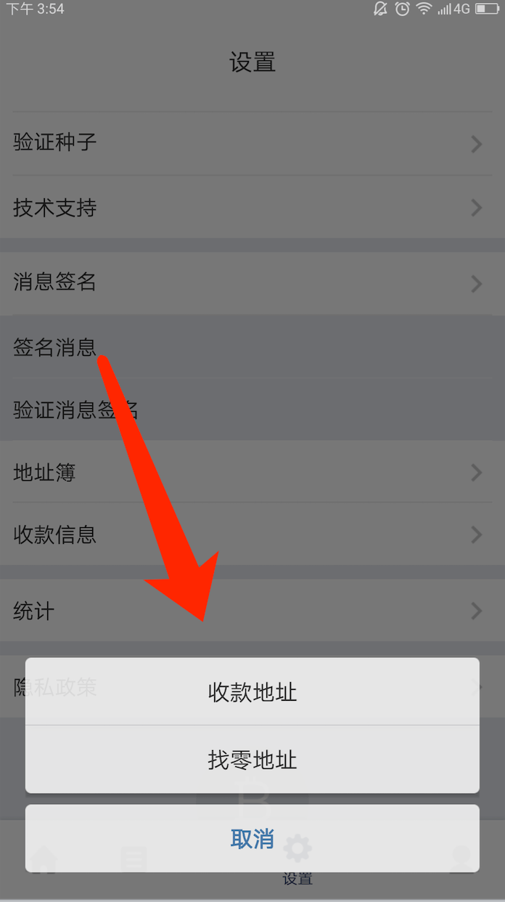
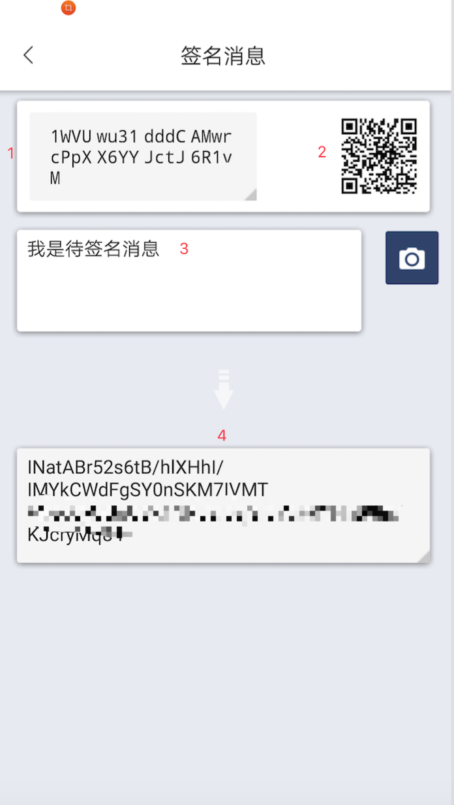
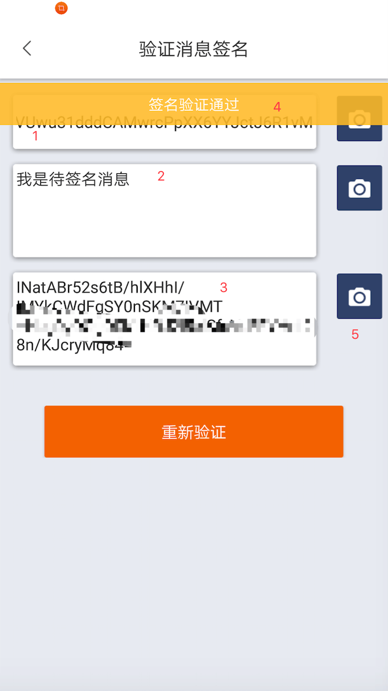

消息签名
================

消息签名就是不需要花钱就能证明你拥有一个地址的私钥。

签名消息
----------

操作入口：我的菜单 - 右上角设置图标 - 消息签名 - 签名消息 或者 切换到对应的币种页面 - 收币 - 右上角三点 - 签名消息

1、 待签名的地址，点击可以复制

2、 待签名的地址二维码

3、 待签名的消息，根据自己需求填写

4、 签名过的签名消息，可进行复制或生成二维码

验证签名消息
------------

操作入口：我的菜单 - 右上角设置图标 - 消息签名 - 验证消息签名

1、 消息签名的地址

2、 待签名消息

3、 签名过的签名消息

4、 点击验证，签名验证通过，说明你掌握该地址的私钥

5、 在验证消息签名界面可以使用相机扫描二维码，更加快捷方便

