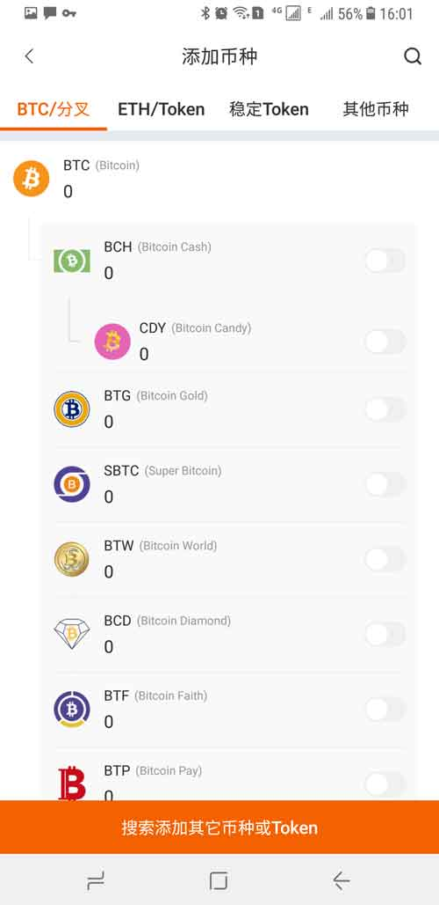
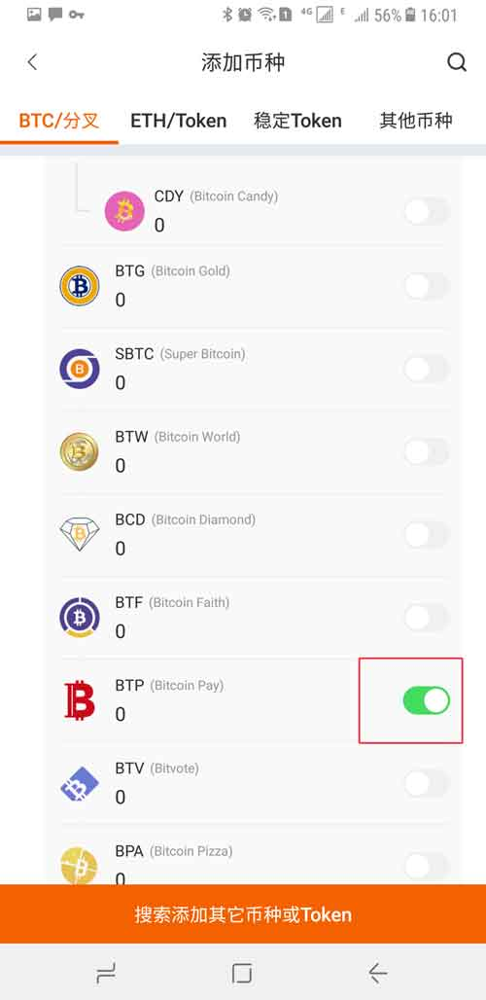
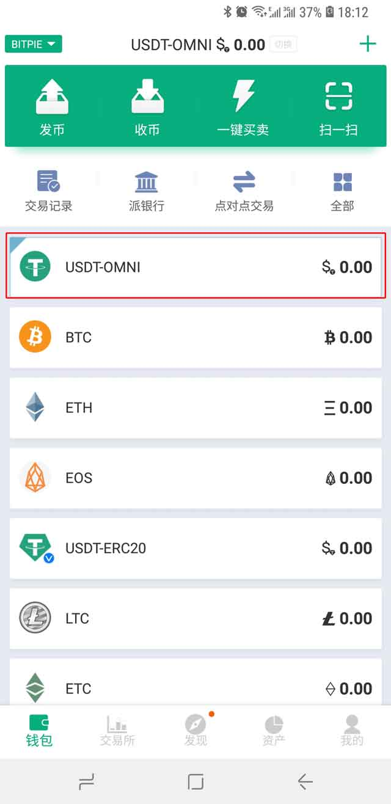

币种管理
================

添加币种
------------------

默认情况下，第一次进入比特派包，进入页面就是添加币种页面。添加币种页面有 BTC/分叉、ETH/Token、稳定 Token、其他币种。

1、在这里以 BTP 为例 ，在 BTC/分叉列表中打到 BTP。

2、点击 BTP 右侧的灰色开关，当开关变成绿色，说明 BTP 已打开。钱包首页的币种列表中就会显示 BTP。

币种切换
------------------

钱包首页，选择要切换的币种，点击即可。

