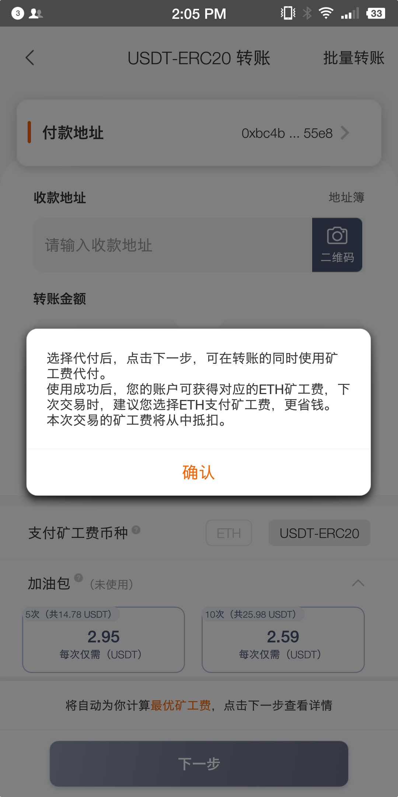
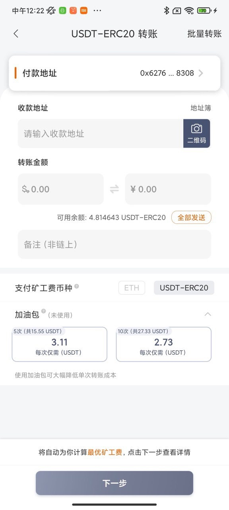

USDT 矿工费代付功能
========

USDT 是由 Tether 发行的基于美元的稳定币代币（Token），当前主要活跃在如下几条公链上：

- 以太坊（ETH）：  USDT-ERC20
- 波场（TRX）   ：  USDT-TRC20
- 比特币（BTC）：  USDT-Omni

由于区块链的特性，在各条链上发送 USDT 时，都需要支付小额的 ETH/TRX/BTC 作为矿工费，这对于小白用户来说理解和使用门槛都很高。

为了方便用户的使用，比特派专门设计了矿工费代付功能，在用户发币时自动的完成矿工费的代付，让用户无需理解 ETH/TRX/BTC 就能轻松发送 USDT，这样用户钱包里只要有 USDT 就能发送了，无需再额外准备 ETH/TRX/BTC 等数字货币，发送时会自动扣除 USDT 作为矿工费，用户理解起来会非常容易。

该功能的实现方式是比特派会从官方矿工费支付地址将 ETH/TRX/BTC 发送到用户地址，然后用户会将作为矿工费的 USDT 发送到比特派官方 USDT 接收地址，然后再将要发送的 USDT 发送给目的地址，这些步骤都是自动完成的，对于用户来说看起来就是只做了一笔发送 USDT 的操作。

由于该功能需要构造多笔交易，因此耗费的矿工费会高于直接用 ETH/TRX/BTC 作为矿工费的成本，针对这种情况，我们还设计了加油包的功能，用户可以在发币时选择代付一笔交易的矿工费，还是代付多笔交易的矿工费，代付多笔时相关成本就能平摊，平均成本就能降低到比较合理的水平。
矿工费代付功能及加油包选项的钱包界面截图参见图1和图2。

