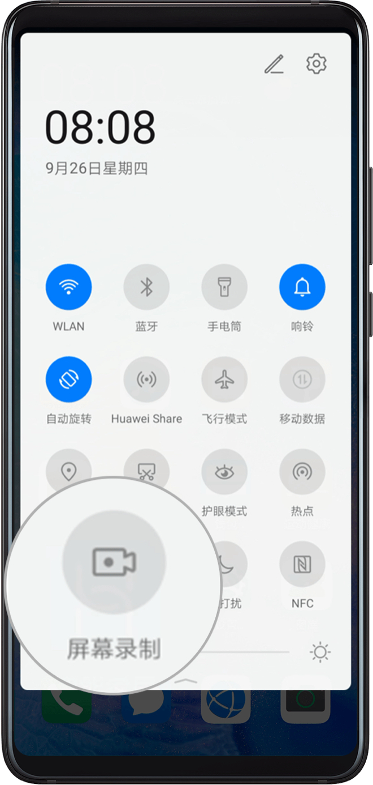

如何使用纯净买卖？
==============

交易前须知
---------------------

目前市场中混有大量问题资金，导致场外交易时银行卡冻结情况十分严重，为保护所有纯净买卖用户的权益，纯净买卖将会采用最严格的准入机制，以确保只撮合最干净的交易，以此避免冻卡情况的发生。

纯净买卖模式属于在行业艰难阶段的探索，我们十分欢迎大家向我们提出任何建议，以此来优化我们的纯净买卖服务，同时希望我们行业可以越来越好。

比特派邮箱 support@bitpie.com

*纯净买卖为排队撮合模型，因市场上纯净资金为稀缺资源，系统会按照订单发布时间依次撮合符合条件的订单，若您想尽快成交，建议提早挂单。

*因撮合模型限制，为避免币种价格波动带来的成交率下降，当前纯净买卖只支持波动较小的USDT（ERC20版本）交易，如有其他币种交易需求，用户可使用比特派内置的币币兑换功能将USDT与其他币种互换。（派银行内的币币兑换将随后上线）

交易前准备
---------------------

完成纯净买卖 KYC
---------------------
打开比特派APP「我」—「交易管理」—「身份验证（KYC）」

你需要完成以下KYC：

1. 完成KYC A ：添加你的姓名、身份证

2. 完成KYC B ：人脸识别

3. 完成KYC C：录制认证视频

4. 完成纯净KYC：使用录屏功能录制视频并上传

录制视频内容：
（1）需安装支付宝APP，录制支付宝个人信息页以及芝麻信用分

.. image:: ../img/pureotc_zhimacredit.jpg
    :width: 864px
    :height: 583px
    :scale: 80%
    :align: center

（2）需安装手机运营商的APP，录制个人手机号码相关信息页

联通用户 下载手机营业厅APP

.. image:: ../img/pureotc_CUCC.jpg
    :width: 648px
    :height: 442px
    :scale: 100%
    :align: center

移动用户 下载中国移动（手机营业厅）

.. image:: ../img/pureotc_CMCC.jpg
    :width: 648px
    :height: 442px
    :scale: 100%
    :align: center

电信用户  下载电信营业厅APP

.. image:: ../img/pureotc_CTCC.jpg
    :width: 648px
    :height: 442px
    :scale: 100%
    :align: center

（3）需安装任意常见网购APP如淘宝、京东等，录屏您最近的3笔订单，视频内容需体现出收件人与收件地址及收件号码

.. image:: ../img/pureotc_taobao.jpg
    :width: 648px
    :height: 442px
    :scale: 100%
    :align: center

添加用于交易的银行卡
---------------------

添加付款卡、收款卡
---------------------

添加付款卡：

打开比特派APP「我」—「交易管理」—「 纯净买卖收付款信息」—「添加」—「付款银行卡」——选择卡片类型

按银行卡的收入来源来划分，您可以分别添加以「工资」「理财」「股票」「借贷」为主要入账来源的银行卡。

「工资」卡片要求：

1. 工资卡内必须拥有不少于6个月的同一公司的工资入账记录，并且近31天内仍有工资款入账。
2. 工资入账流水必须经由机构账户转账
3. 最近6个月内，银行卡中不含有其他任何私人入账记录

「理财」卡片要求：

1. 理财入账流水必须经由机构账户转账
2. 最近6个月内，银行卡中不含有其他任何私人入账记录

「股票」卡片要求：

1. 股票入账流水必须经由机构账户转账
2. 最近6个月内，银行卡中不含有其他任何私人入账记录

「借贷」卡片要求：

1. 理财入账流水必须经由机构账户转账
2. 最近6个月内，银行卡中不含有其他任何私人入账记录

因为市场上资金存在多样性，如果您的卡片不符合以上要求，但您有强有力的证明材料可以证明资金的合法与纯净度，您可以点击「其他」上传您的相关流水及证明。

选择您要添加的卡片类型及添加完银行卡的
录制视频内容中必须包含：

1. 能体现银行卡卡号的页面
2. 能体现银行卡主人姓名的页面
3. 清晰完整的流水记录

*不同银行的界面布局会有所不同，部分APP还会隐藏用户的部分卡号、姓名等信息，此情况下，用户需将卡号、姓名等未隐藏部分录制清楚即可。录屏时请勿过快滑动，视频内容不清晰将无法通过审核。录屏时长尽量控制在5分钟之内

.. image:: ../img/pureotc_bankcard.jpg
    :width: 864px
    :height: 530px
    :scale: 100%
    :align: center

**添加收款卡：**

打开比特派APP「我」—「交易管理」—「 纯净买卖收付款信息」—「添加」

收款卡要求：必须为一张新的银行卡。

在您添加收款卡之前，您可以选择以下三种验证方式来提升自己的身份可信度。

1. 「工资卡认证」
2. 「电子社保卡认证」
3. 「矿工认证」

「工资卡认证」

要求：

工资卡内必须拥有不少于6个月的同一公司的工资入账记录，并且近31天内仍有工资款入账。

录制视频验证要求：

1. 能体现银行卡卡号的页面
2. 能体现银行卡主人姓名的页面
3. 能体现6个月内的清晰的流水

.. image:: ../img/pureotc_bankcard.jpg
    :width: 864px
    :height: 530px
    :scale: 100%
    :align: center

「电子社保卡认证」要求：

您必须拥有一张电子社保卡。

录制视频验证要求：

完整体现社保卡的姓名、号码、照片等信息

.. image:: ../img/pureotc_socialsecurity.jpg
    :width: 648px
    :height: 442px
    :scale: 100%
    :align: center

「矿工认证」要求：

您必须是加入主流矿池的矿工身份。

验证要求：
填写您用来接收挖矿币的比特派钱包地址。

提供相关算力证明的视频录制。

进行交易
---------------------

使用纯净买卖 买币
---------------------

1、点击「纯净买卖」—「我要买」— 输入要您购买的USDT数量—选择付款银行卡（若未添加银行卡，请参考上方添加银行卡教程）——确认无误后，点击「购买」

.. image:: ../img/pureotc_buy1.jpg
    :width: 660px
    :height: 1100px
    :scale: 70%
    :align: center

2、点击去验证，验证通过的订单才会生效。

.. image:: ../img/pureotc_buy2.jpg
    :width: 660px
    :height: 1100px
    :scale: 70%
    :align: center

3、按要求完成身份验证。

.. image:: ../img/pureotc_buy3.jpg
    :width: 660px
    :height: 1100px
    :scale: 70%
    :align: center

4、按要求上传审核资料后，耐心等待审核完成

.. image:: ../img/pureotc_buy4.jpg
    :width: 660px
    :height: 1100px
    :scale: 70%
    :align: center

5、审核完成的订单状态会变为「进行中」，点击此订单按要求进行操作

.. image:: ../img/pureotc_buy5.jpg
    :width: 660px
    :height: 1100px
    :scale: 70%
    :align: center

6、请在规定时间内，按页面提示信息向对方进行转账。转账完成后，请主动点击「已付款」

.. image:: ../img/pureotc_buy6.jpg
    :width: 660px
    :height: 1100px
    :scale: 70%
    :align: center

7、完成付款后，需要您上传付款银行卡的流水进行审核，上传完成后，请点击「下一步」，并耐心等待审核通过。

.. image:: ../img/pureotc_buy7.jpg
    :width: 660px
    :height: 1100px
    :scale: 70%
    :align: center

.. image:: ../img/pureotc_buy8.jpg
    :width: 660px
    :height: 1100px
    :scale: 70%
    :align: center

.. image:: ../img/pureotc_buy9.jpg
    :width: 660px
    :height: 1100px
    :scale: 70%
    :align: center

8、等待审核通过后，此笔订单将完成，请注意前往派银行查收币的余额。

.. image:: ../img/pureotc_buy10.jpg
    :width: 660px
    :height: 1100px
    :scale: 70%
    :align: center

.. image:: ../img/pureotc_buy11.jpg
    :width: 660px
    :height: 1100px
    :scale: 70%
    :align: center

使用纯净买卖 卖币
---------------------

1、点击「纯净买卖」—「我要卖」— 输入要您出售的USDT数量—选择收款银行卡（若未添加银行卡，请参考上方添加银行卡教程）——确认无误后，点击「出售」

.. image:: ../img/pureotc_sell1.jpg
    :width: 660px
    :height: 1100px
    :scale: 70%
    :align: center

2、点击去验证，验证通过的订单才会生效。

.. image:: ../img/pureotc_sell2.jpg
    :width: 660px
    :height: 1100px
    :scale: 70%
    :align: center

3、按要求完成身份验证。

.. image:: ../img/pureotc_sell3.jpg
    :width: 660px
    :height: 1100px
    :scale: 70%
    :align: center

4、按要求上传审核资料后，耐心等待审核完成

.. image:: ../img/pureotc_sell4.jpg
    :width: 660px
    :height: 1100px
    :scale: 70%
    :align: center

5、审核完成的订单状态会变为「待成交」如果有人与您的订单匹配成功，您的订单状态会变为「进行中」，点击此订单按要求进行操作

.. image:: ../img/pureotc_sell5.jpg
    :width: 660px
    :height: 1100px
    :scale: 70%
    :align: center

.. image:: ../img/pureotc_sell5-1.jpg
    :width: 660px
    :height: 1100px
    :scale: 70%
    :align: center

6、等待买家向您进行转账，你也可以主动联系对方进行沟通。若在规定时间内，买家未进行转账，您可取消此订单。

.. image:: ../img/pureotc_sell6.jpg
    :width: 660px
    :height: 1100px
    :scale: 70%
    :align: center

7、对方向您标记付款后，您需要检查您的账户是否已成功收款，当确认收款数量无误，同时对方使用的付款账户为通过认证的账户时，您可点击「确认收款」，当有任何异议时可请求仲裁。

.. image:: ../img/pureotc_sell7.jpg
    :width: 660px
    :height: 1100px
    :scale: 70%
    :align: center

.. image:: ../img/pureotc_sell7-1.jpg
    :width: 660px
    :height: 1100px
    :scale: 70%
    :align: center

8、当您确认收款无误后， 系统会对买家的最近银行流水进行审核，当对方流水干净无异常时，此笔订单将完成。

.. image:: ../img/pureotc_sell8.jpg
    :width: 660px
    :height: 1100px
    :scale: 70%
    :align: center

.. image:: ../img/pureotc_sell9.jpg
    :width: 660px
    :height: 1100px
    :scale: 70%
    :align: center

附：手机录屏教程
---------------------

iPhone录制屏幕方式
------------------

1. 前往“设置”>“控制中心”>“自定控制”，然后轻点“屏幕录制”旁边的 + 。
2. 从任意屏幕的底部向上轻扫。在装有 iOS 12 或更高版本 iPhone，从屏幕右上角向下轻扫。
3. 用力按压⭕️，轻点“开始录制”，然后等待三秒倒计时。
4. 打开“控制中心”，然后轻点⭕️。或者，轻点屏幕顶部的红色状态栏，然后轻点“停止”。
5. 前往“照片”App 可以查看您的屏幕录制。

.. image:: ../img/screenrecord.gif
    :width: 660px
    :height: 1100px
    :scale: 50%
    :align: center

安卓录制屏幕方式（以华为手机为例）
---------------------------

1. 从顶部状态栏向下滑出通知面板，继续向下滑出整个菜单。
2. 点亮屏幕录制，启动录屏。
3. 点击屏幕上方的红色计时按钮，结束录屏。
4. 进入图库查看录屏结果。

