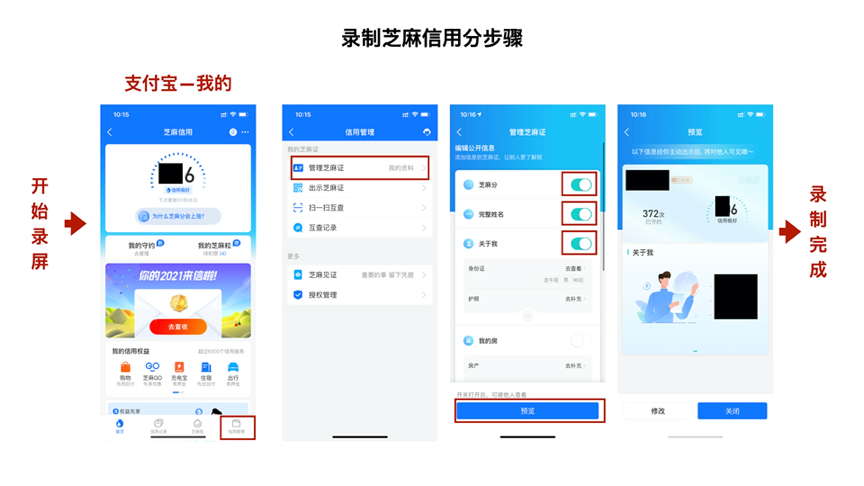
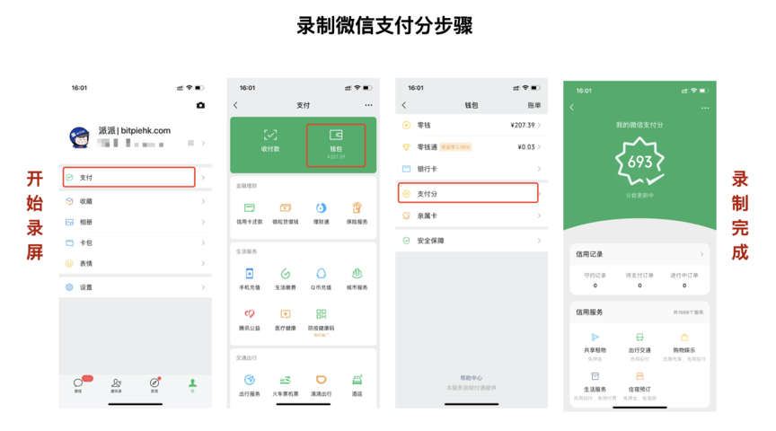

完成纯净KYC：使用录屏功能录制视频并上传
===================================

录制视频内容：（二选一）
（1）支付宝个人信息页以及芝麻信用分
（2）微信个人信息页以及微信支付分

附：手机录屏教程
---------------------

iPhone录制屏幕方式
------------------

1、前往“设置”>“控制中心”>“自定控制”，然后轻点“屏幕录制”旁边的 + 。
2、从任意屏幕的底部向上轻扫。在装有 iOS 12 或更高版本 iPhone，从屏幕右上角向下轻扫。
3、用力按压⭕️，轻点“开始录制”，然后等待三秒倒计时。
4、打开“控制中心”，然后轻点⭕️。或者，轻点屏幕顶部的红色状态栏，然后轻点“停止”。
5、前往“照片”App 可以查看您的屏幕录制。

.. image:: ../img/screenrecord.gif
    :width: 660px
    :height: 1100px
    :scale: 100%
    :align: center

安卓录制屏幕方式（以华为手机为例）
---------------------------
1、从顶部状态栏向下滑出通知面板，继续向下滑出整个菜单。
2、点亮屏幕录制，启动录屏。
3、点击屏幕上方的红色计时按钮，结束录屏。
4、进入图库查看录屏结果。

.. image:: ../img/screenrecord_android.jpg
    :width: 660px
    :height: 1100px
    :scale: 100%
    :align: center
