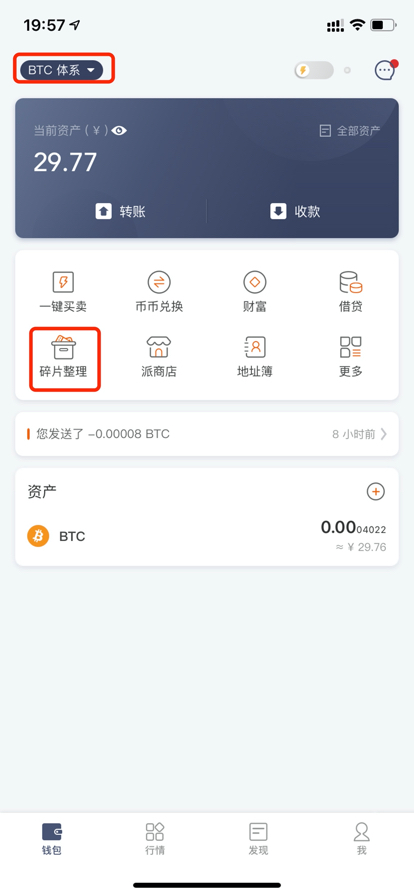
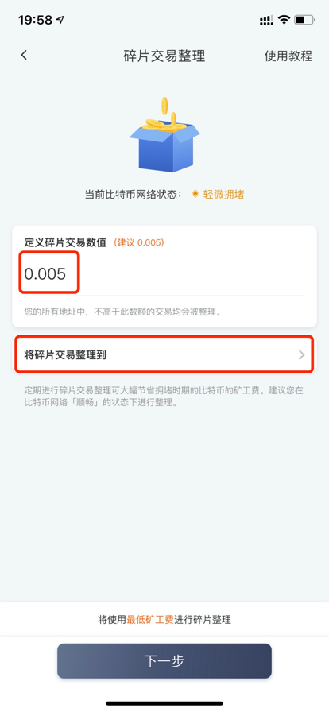
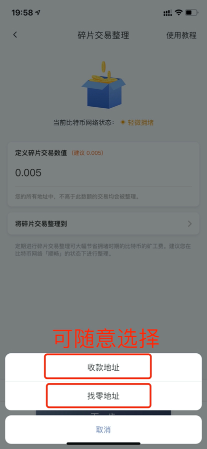
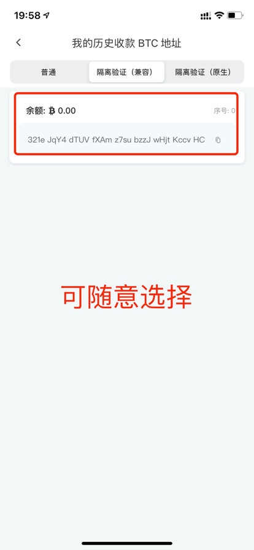
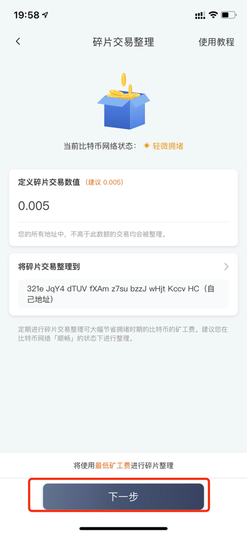
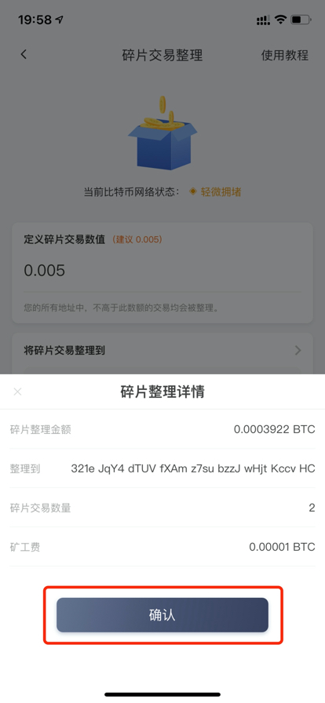
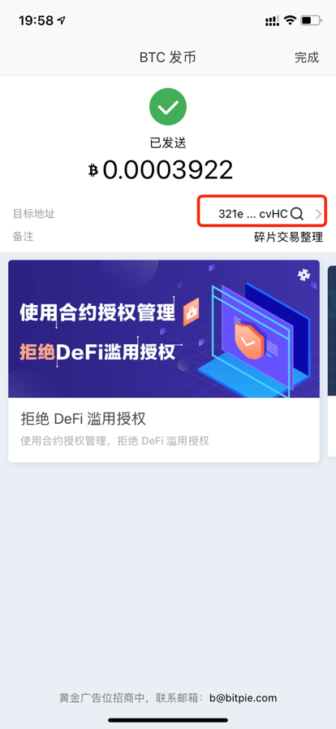
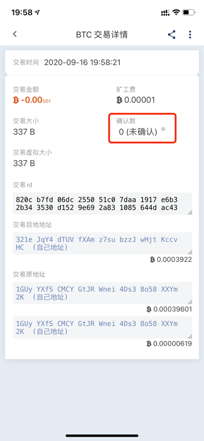

碎片交易整理
===================

什么是碎片交易整理？
-----------

碎片交易整理功能可以将您指定的小额 UTXO 整理到指定地址上。

为什么要进行碎片交易整理？
-----------

如果一个地址上有过多的碎交易会导致矿工费越来越高，定期整理碎片交易可以有效节省拥堵来临时的矿工费。

进行碎片交易整理时有哪些注意事项？
-----------

因为碎片交易整理会默认使用最低矿工费，因此建议在比特币网络顺畅的状态下进行，否则有可能会长时间无法完成。

如何进行比特币碎片交易整理？
-----------

1、打开比特派 APP4.9.5 以上版本——切换 BTC 体系——选择「碎片整理」

2、定义碎片交易数值，系统会把你地址上小于此值的交易都作为碎片交易整理。然后点击「将碎片交易整理到」选择您用来接收交易的地址。（这里可以选择的地址都是你的钱包地址，可以放心选择。）

3、选择地址完成后，可以点击「下一步」

4、在弹窗的对话框里核对相关信息，确认信息无误后点击「确认」将开始执行碎片交易整理

5、点击此处可以查看随便交易整理进度，当此交易被区块链确认（即确认数大于1时）碎片交易整理完成。

