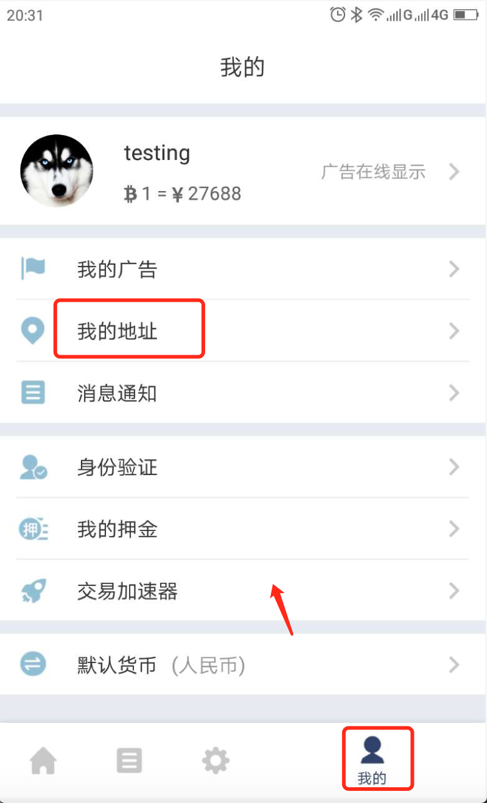
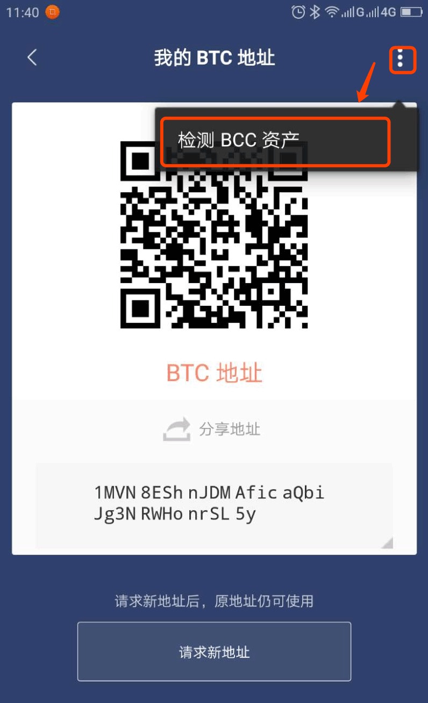
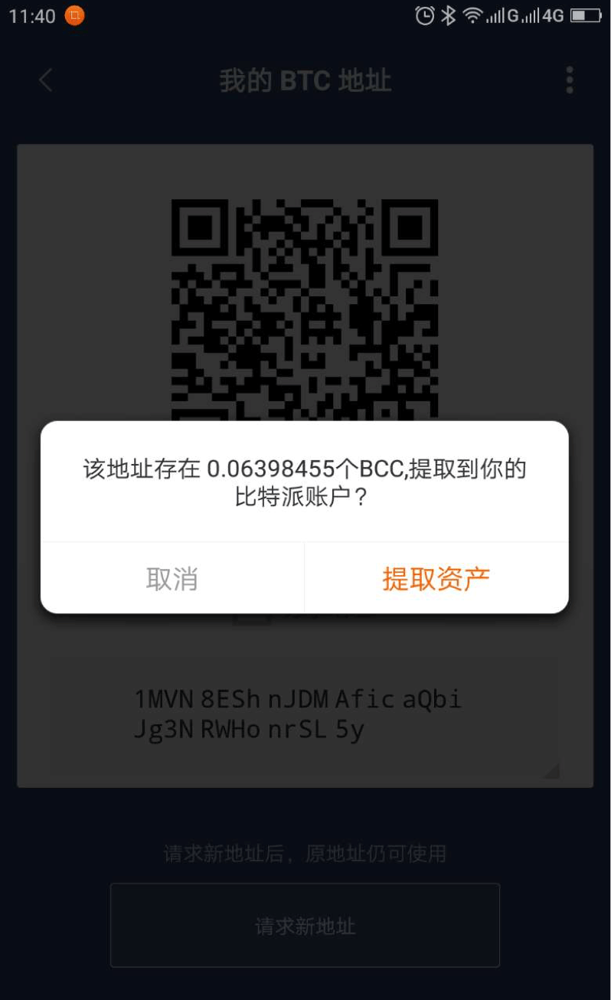

帮您提取转错的币
===========================

1､更新比特派最新版本，版本号 >= 3.7.7 。

2､比特派支持提取转错的地址列表：在 BTC 地址上提取：BCHABC、SBTC、BCD、BTV；在 BCHABC 地址上提取：BTC、SBTC、BCD、BTV；在 SBTC 地址上提取：BTC、BCHABC、BCD、BTV；在 BCD 地址上提取：BTC、BCHABC、SBTC、BTV；在 BTV 地址上提取：BTC、BCHABC、SBTC、BCD；在 ETH 地址上提取：ETC；在 ETC 地址上提取：ETH、ERC20-Token；

3､按照以提取转错的 BCHABC 为例，其它转错的币参考此文档。

提取转错的 BCHABC
--------------------

注:如果误将 BCHABC 发到隔离验证的地址上，将造成 BCHABC 损失，无法找回。

1、如果误将 BCHABC 发到了 BTC 地址上，请切换到 BTC 界面。

2、选择我的-我的地址－收款地址-在我的历史收款 BTC 地址中'选择误发的地址'-检测 BCHABC 资产。

.. image:: ../img/checkBcc.png
    :width: 320px
    :height: 520px
    :scale: 100%
    :align: center

如果没有找到 BTC 地址(误发的地址)，请切换到 BTC 界面。选择收币-我的 BTC 地址-检测 BCHABC 资产(右上角三点)。

3、提取 BCHABC，提取 BCHABC 地址就是你的收币地址。

