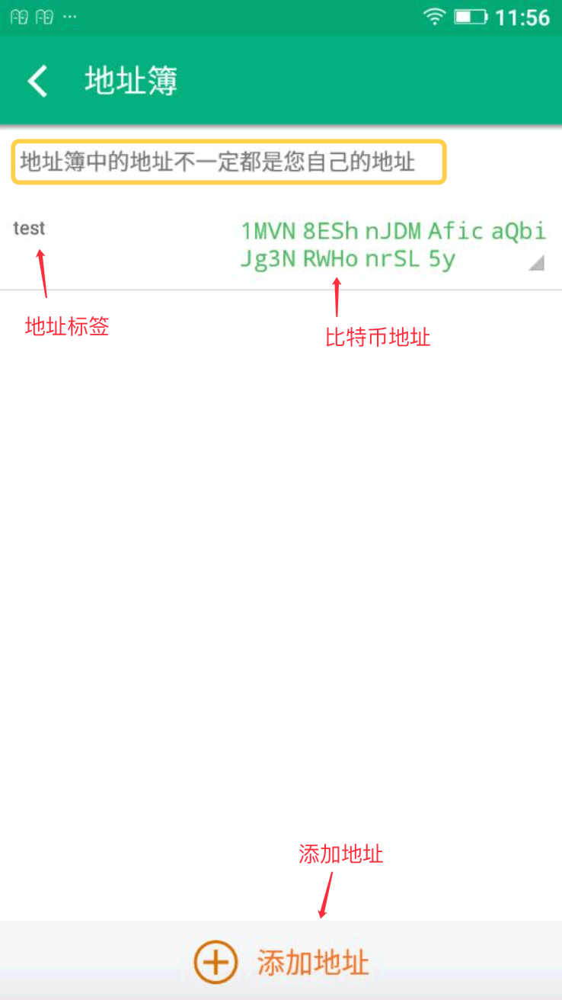

地址簿
===========

概述
----------

管理比特币地址。

地址簿使用方法
-----------------

左边菜单-设置-地址簿。

地址管理
-----------

1. 长按地址标签可对地址进行编辑或删除。长按地址可以对地址进行复制，生成二维码。
2. 在比特派首页上方区域有个二维码，点击后可以看到你的地址以及地址二维码。同样，点击右下角加号，接收，也可以弹出你的地址以及地址二维码。

..  image:: ../img/36.png
    :width: 320px
    :height: 520px
    :scale: 100%
    :align: center

注意事项
-------------

1. 地址簿中的地址不一定都是您自己的地址。
2. 这里我们需要知道，你的比特派每次有交易后，你的收款地址是会改变的，旧地址在你的历史地址里可以查到。左边菜单—我的地址—收款地址。可以查到你的旧地址，长按可以添加到地址簿，然后你可以备注下，用来区分。旧地址也是可以正常收币的。

