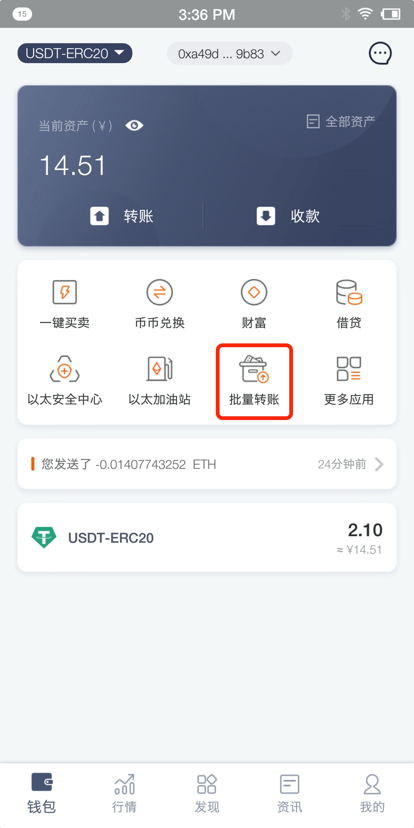
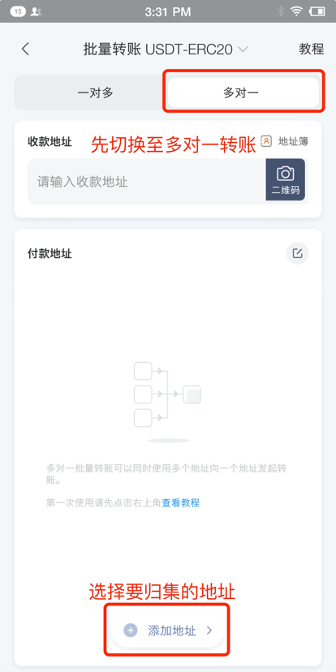
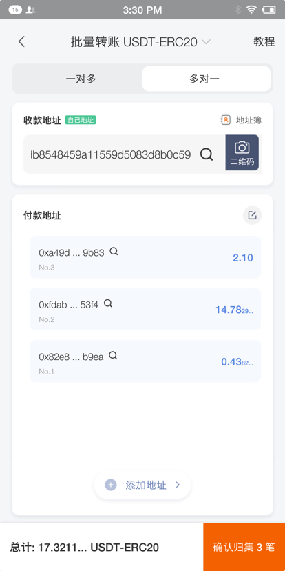
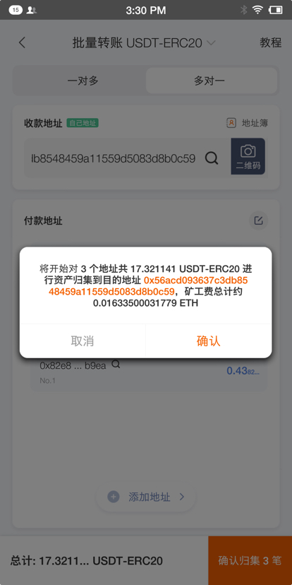
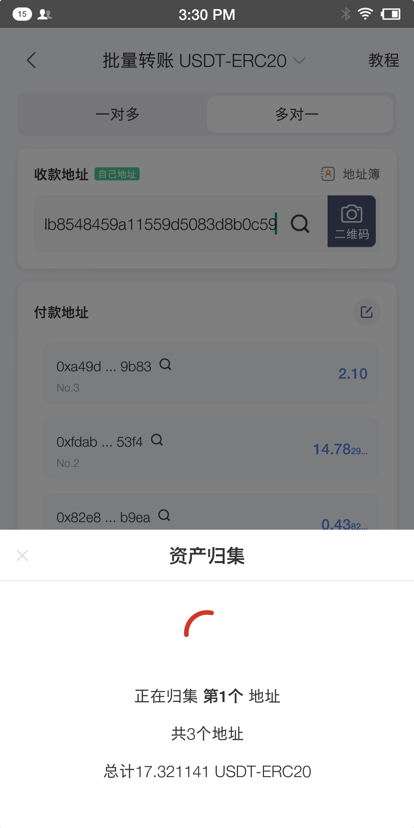
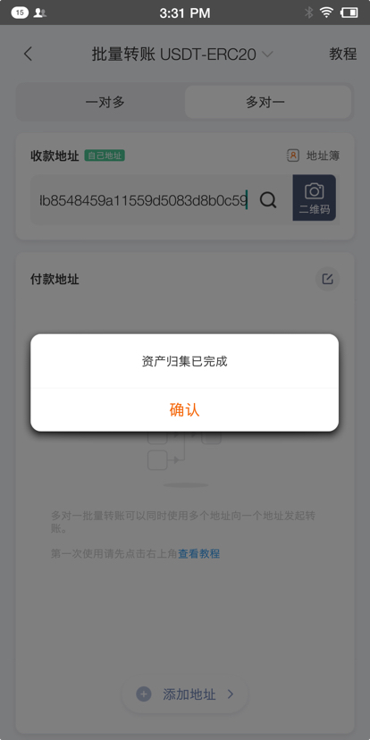

批量转账教程多对一
================

功能简介：
----

比特派的批量转账归集功能可以将你的多个 ETH 或 ERC20 的 TOKEN 同时归集到一个地址（最多支持1000个账户内地址+1000个导入地址）。

操作教程：
----

1、打开比特派，在左上角切换到“ETH/USDT体系”点击 “批量转账”

2、切换至“多对一”，然后点击“添加地址”选择需要归集的地址。注意：如需归集ERC20token，需确保每个地址都有一定数量的ETH作为矿工费。

3、填写收币地址，确认归集交易数量，金额。

4、地址信息添加完成并确认无误后，点击确认转账，核对好相关信息后点击确认，即可发出。

5、如归集的交易数目较多，请耐心等待。

