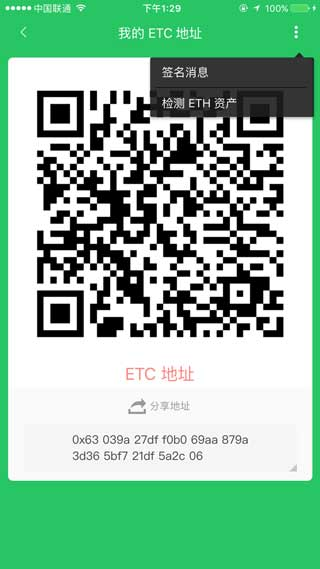
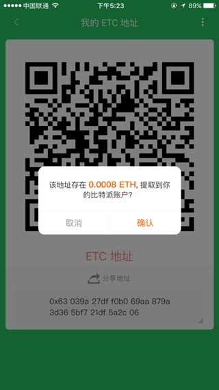
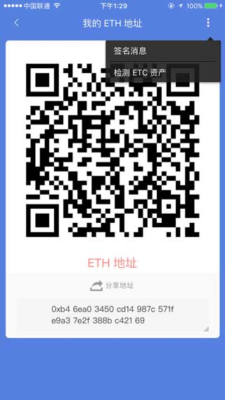

帮您提取转错的币
===========================

更新比特派最新版本。

提取转错的BCH
--------------------

注:如果误将BCH发到隔离验证的地址上，将造成BCH损失，无法找回。

1.如果误将BCH发到了BTC地址上，请切换到BTC界面。

2.选择我的-我的地址－收款地址-在我的历史收款BTC地址中'选择误发的地址'-检测BCH资产。

.. image:: ../img/my_address.png
    :width: 320px
    :height: 520px
    :scale: 100%
    :align: center

.. image:: ../img/checkBcc.png
    :width: 320px
    :height: 520px
    :scale: 100%
    :align: center

如果没有找到BTC地址(误发的地址)，请切换到BTC界面。选择收币-我的BTC地址-检测BCH资产(右上角三点)。

.. image:: ../img/addCheckBcc.png
    :width: 320px
    :height: 520px
    :scale: 100%
    :align: center

3.提取BCH，提取BCH地址就是你的收币地址。

.. image:: ../img/checkResult.png
    :width: 320px
    :height: 520px
    :scale: 100%
    :align: center

提取转错的BTC
-----------------------

1.如果误将BTC发到BCH地址上，请切换到BCH界面。

2.选择我的-我的地址－收款地址-在我的历史收款BCH地址中'选择误发的地址'-检测BTC资产。

.. image:: ../img/checkBtc.png
    :width: 320px
    :height: 520px
    :scale: 100%
    :align: center

如果没有找到BCH地址(误发的地址)，请切换到BCH界面。选择收币-我的BCH地址-检测BTC资产(右上角三点)。

.. image:: ../img/addCheckBtc.png
    :width: 320px
    :height: 520px
    :scale: 100%
    :align: center

3.提取BTC，提取BTC地址就是你的收币地址。

.. image:: ../img/extractBtc.png
    :width: 320px
    :height: 520px
    :scale: 100%
    :align: center

提取转错的ETH
---------------------------------

1.如果误将ETH发到ETC地址上，请切换ETC界面。

2.选择收币,检测ETH资产(右上角三点)。

提取转错的ETC
-------------------------------

1.如果误将ETC发到ETH地址上，请切换ETH界面。

2.选择收币,检测ETC资产(右上角三点)。

.. image:: ../img/DetectETCAssets.jpg
    :width: 320px
    :height: 520px
    :scale: 100%
    :align: center

