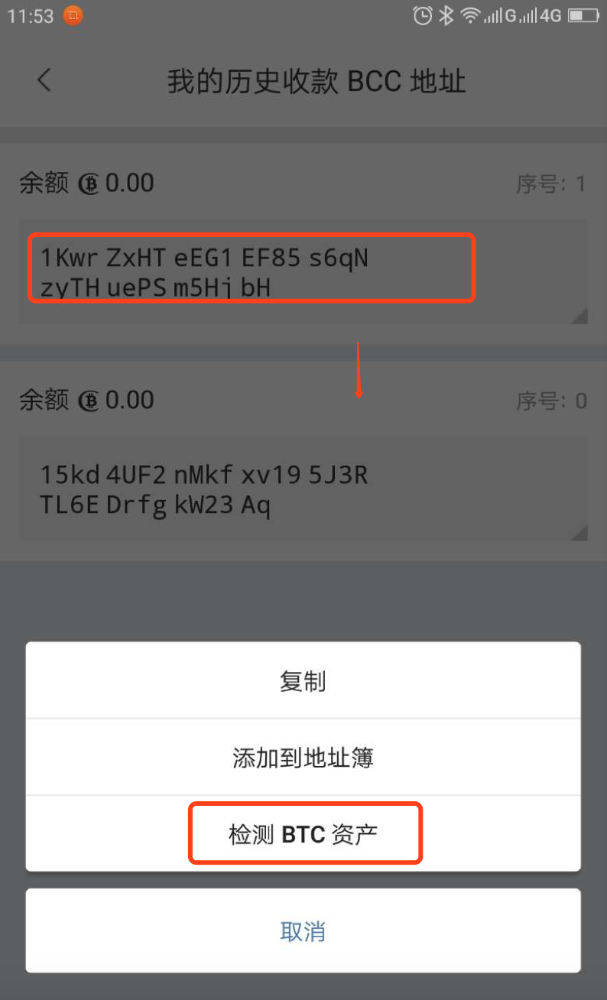

帮您提取转错的币
===========================

更新比特派最新版本。

提取转错的BCC
--------------------

1.如果误将BCC发到了BTC地址上，请切换到BTC界面。

2.选择我的-我的地址－收款地址-在我的历史收款BTC地址中'选择误发的地址'-检测BCC资产。

.. image:: ../img/my_address.png
    :width: 320px
    :height: 520px
    :scale: 100%
    :align: center

.. image:: ../img/checkBcc.png
    :width: 320px
    :height: 520px
    :scale: 100%
    :align: center

如果没有找到BTC地址(误发的地址)，请切换到BTC界面。选择收币-我的BTC地址-检测BCC资产(右上角三点)。

.. image:: ../img/addCheckBcc.png
    :width: 320px
    :height: 520px
    :scale: 100%
    :align: center

3.提取BCC，提取BCC地址就是你的收币地址。

.. image:: ../img/checkResult.png
    :width: 320px
    :height: 520px
    :scale: 100%
    :align: center

提取转错的BTC
-----------------------

1.如果误将BTC发到BCC地址上，请切换到BCC界面。

2.选择我的-我的地址－收款地址-在我的历史收款BCC地址中'选择误发的地址'-检测BTC资产。

如果没有找到BCC地址(误发的地址)，请切换到BCC界面。选择收币-我的BCC地址-检测BTC资产(右上角三点)。

.. image:: ../img/addCheckBtc.png
    :width: 320px
    :height: 520px
    :scale: 100%
    :align: center

3.提取BTC，提取BTC地址就是你的收币地址。

.. image:: ../img/extractBtc.png
    :width: 320px
    :height: 520px
    :scale: 100%
    :align: center

