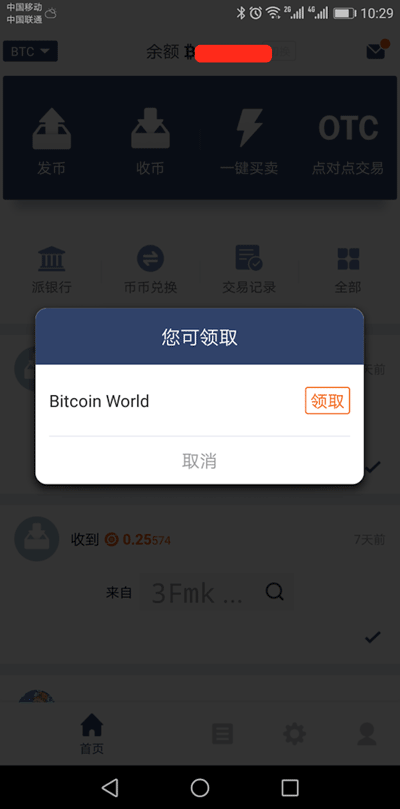
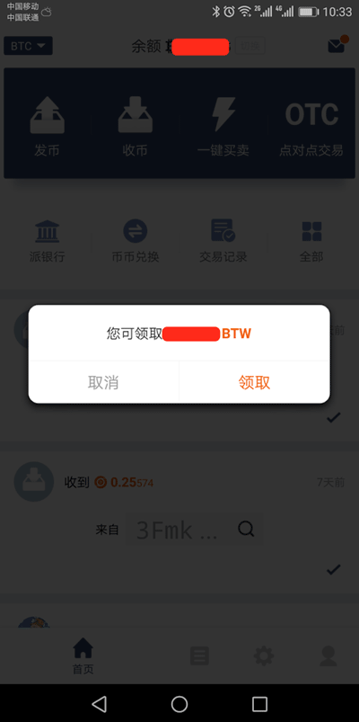
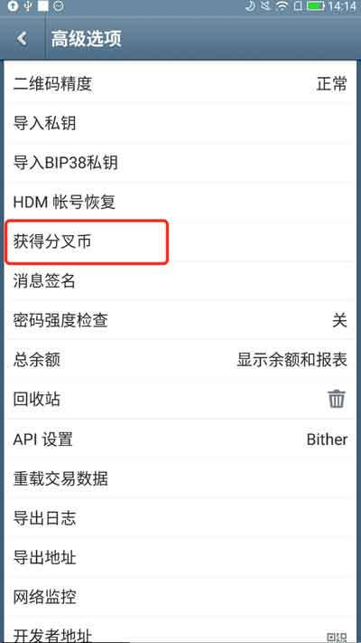
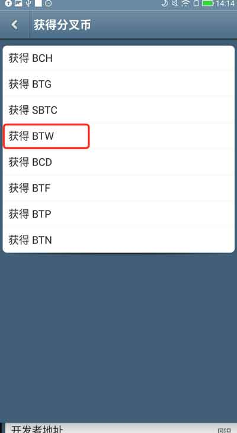
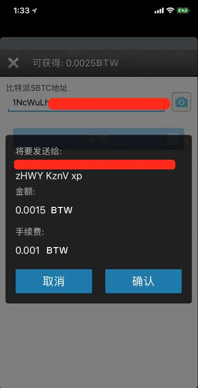
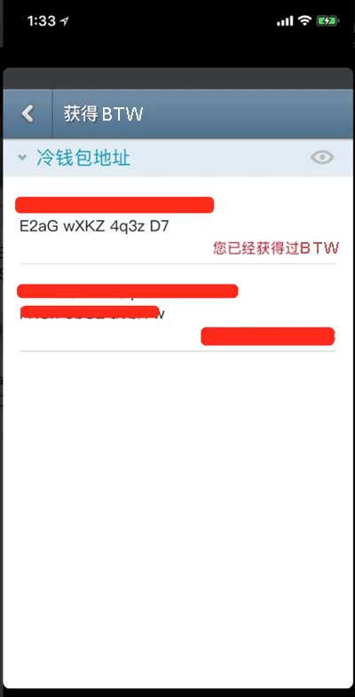
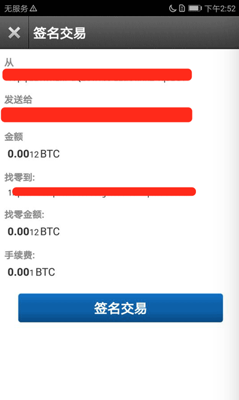

分叉币领取
=============

1、按照分叉币 BTW 为例，其他分叉币的领取参考此文档。

2､ 目前可以领取的分叉币包括 BCH、BTG、SBTC、BTW 、BCD 、BTF 、BTP、BTN、CDY、SAFE、LCH。

3､ 需要在分叉块高度，您的比特派/比太钱包地址里有币，或者比特派的派银行里有币，符合领取条件才可以领取分叉币。分叉币的详细信息请参考： http://pieifo.com 。

比特派钱包获取分叉币
------------------------

1、更新到最新版本，版本号 >= 2.4.3 ，设置底部查看版本号并且可以“检查新版本”。

2、打开比特派会自动提示'您可领取 Bitcoin World ，领取'。如果没有提示，下拉刷新试下。

3、选择领取。

比太钱包获取分叉币
----------------------------------



比太钱包支持相同BIP规范的私钥或者密语导入，您如果使用其他比特币钱包软件，可以将私钥导入比太钱包，获取 BTW。

教程：http://docs.bitpie.com/zh_CN/latest/bitherImportPrivateKeyToken/index.html

1、更新到最新版本，版本号 >= 1.7.9 ，通过比太热钱包进行操作。



2、设置-高级选项-获取分叉币-获得 BTW 。




3、选择相对应的账户地址，输入比特派 BTW 地址及密码。



如果是比太热钱包监控冷钱包，获得确认之后需要进行签名交易。

1、选择相对应的账户地址。

.. image:: ../img/coldBtwAddress.jpg
    :width: 320px
    :height: 520px
    :scale: 100%
    :align: center

2、输入比特派 BTW 地址。

3、用冷钱包扫描热钱包待签名交易。使用包含此地址私钥的冷钱包扫描。

.. image:: ../img/sign.png
    :width: 320px
    :height: 520px
    :scale: 100%
    :align: center

4、用热钱包扫描冷钱包已签名的交易。

.. image:: ../img/sign.png
    :width: 320px
    :height: 520px
    :scale: 100%
    :align: center

