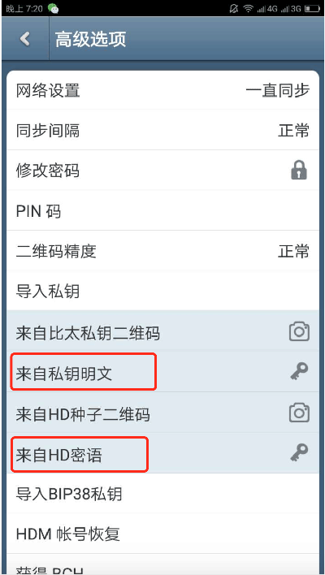

其他钱包私钥或者密语导入比太钱包
=====================================

1、下载比太钱包。因为比太只支持导入一个HD账户，如果比太钱包已经有HD账户，建议再找一台手机下载安装比太钱包。

   下载安装步骤：使用浏览器打开以下网址。

   安卓：https://bither.net/

   iOS：https://bither.net/ios/

2、将您的私钥导入比太钱包。路径：设置－高级选项－导入私钥。如果您是普通的私钥，使用—来自私钥明文即可。如果您是HD账户密语，使用—来自HD密语。

3、如果您的私钥是未压缩格式，导入成功后会提示您选择压缩还是未压缩格式，您一个一个试下即可。

4､ 导入成功后，检查地址是否正确，并且查看是否显示以往的交易记录，只有同步到最新块儿才会显示交易记录，余额等信息的哈。导入成功后即可按照步骤领取分叉币。

