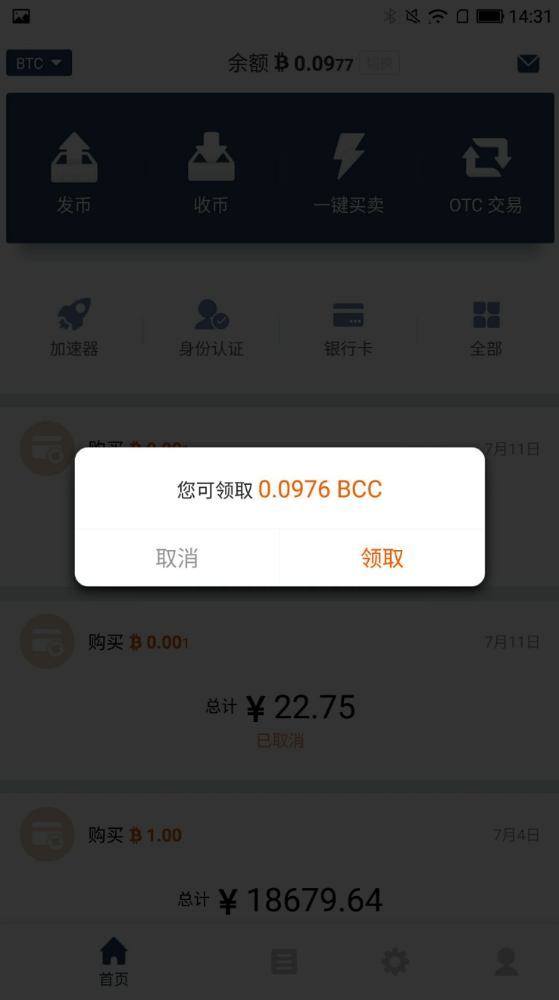
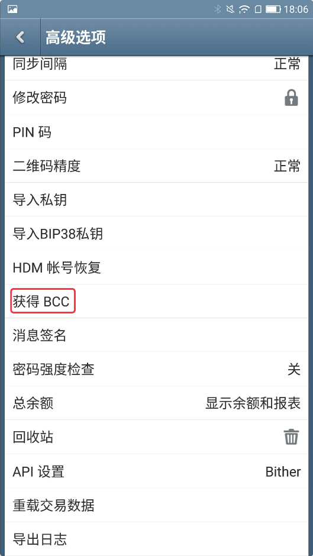
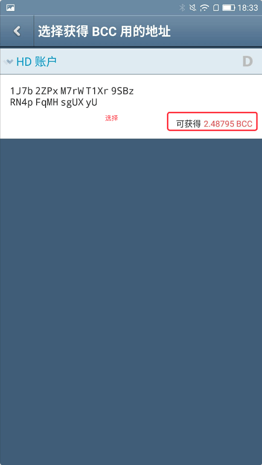
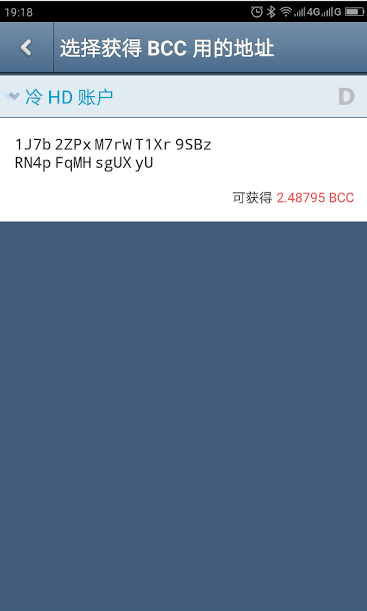
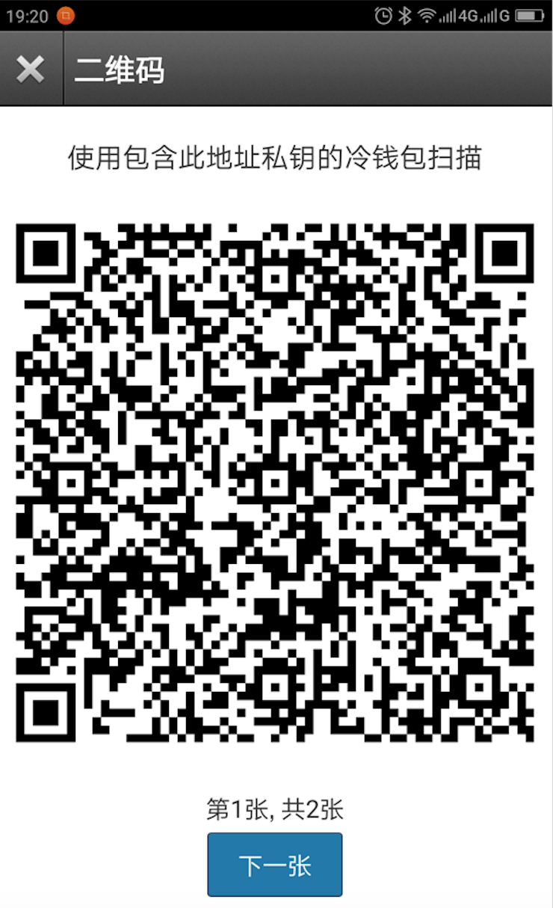

获取BCH
=============

比特派钱包获取BCH
------------------------

1.更新比特派最新版本。

2.打开比特派会自动提示'您有Bitcoin Cash可领取，立即领取？'。

.. image:: ../img/BitcoinCash.png
    :width: 320px
    :height: 520px
    :scale: 100%
    :align: center

3.选择领取。

4.领取成功之后会自动切换到BCH界面；可对BCH进行发币、收币等操作。

比太钱包获取BCH
------------------------------

1.更新比太钱包，通过比太热钱包进行操作。

2.设置-高级选项-获取BCH。

3.选择相对应的账户地址，输入比特派BCH地址及密码。

.. image:: ../img/getBcc.png
    :width: 320px
    :height: 520px
    :scale: 100%
    :align: center

备注:因为BTC与BCH的地址现在没有区分，为了能成功获取到BCH，不丢币，所以我们规定使用比特派上的BCH地址。其它钱包的密钥导入比太，也可以领取BCH。

如果是比太热钱包监控冷钱包，这时需要进行签名交易。

