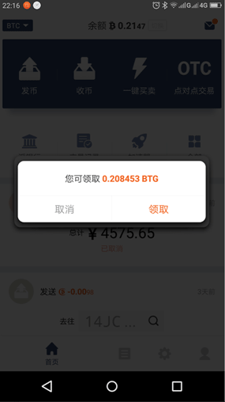
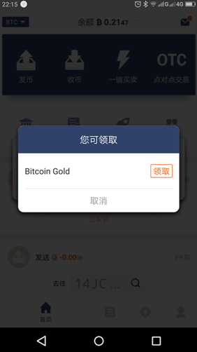
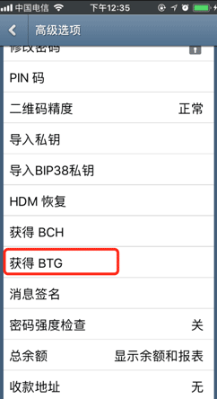
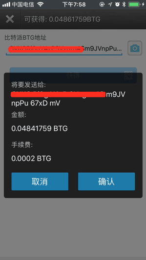
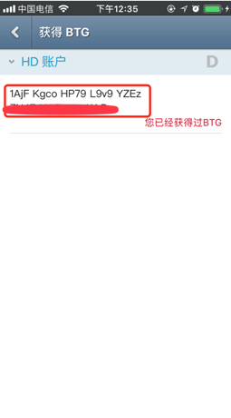

获取BTG
=============

比特派钱包获取BTG
------------------------

1.更新比特派最新版本。

2.打开比特派会自动提示'您可领取Bitcoin Gold，领取？'。

3.选择领取。

比太钱包获取BTG
------------------------------
1.更新比太钱包，通过比太热钱包进行操作。

2.设置-高级选项-获取BTG。

3.选择相对应的账户地址，输入比特派BTG地址及密码。

如果是比太热钱包监控冷钱包，这时需要进行签名交易。

.. image:: ../img/sign.png
    :width: 320px
    :height: 520px
    :scale: 100%
    :align: center

