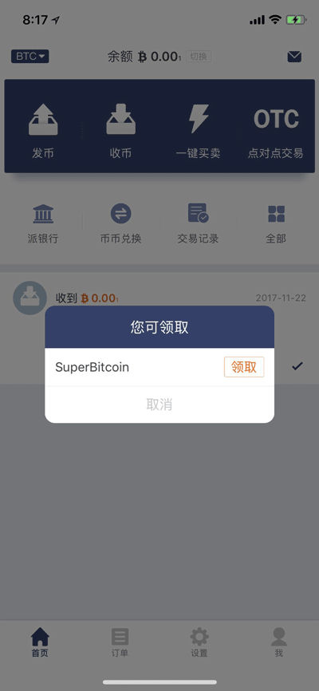
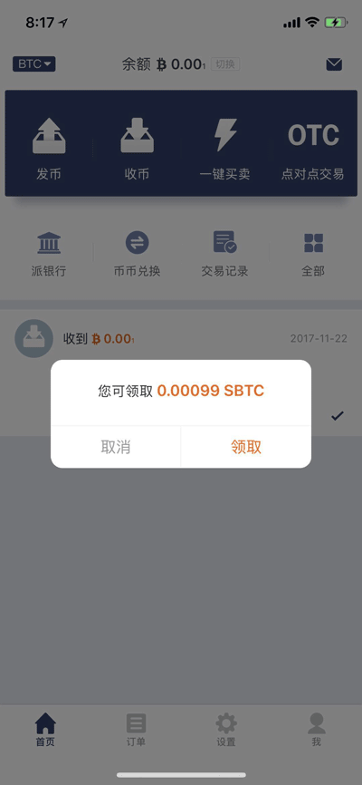
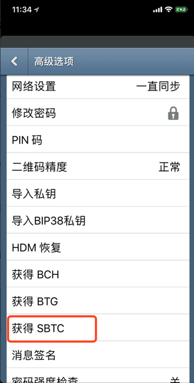
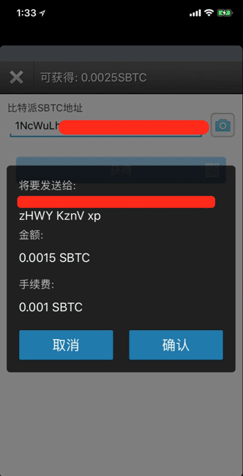
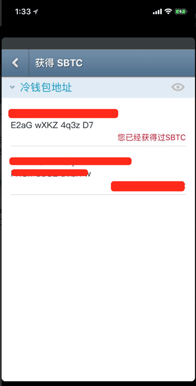
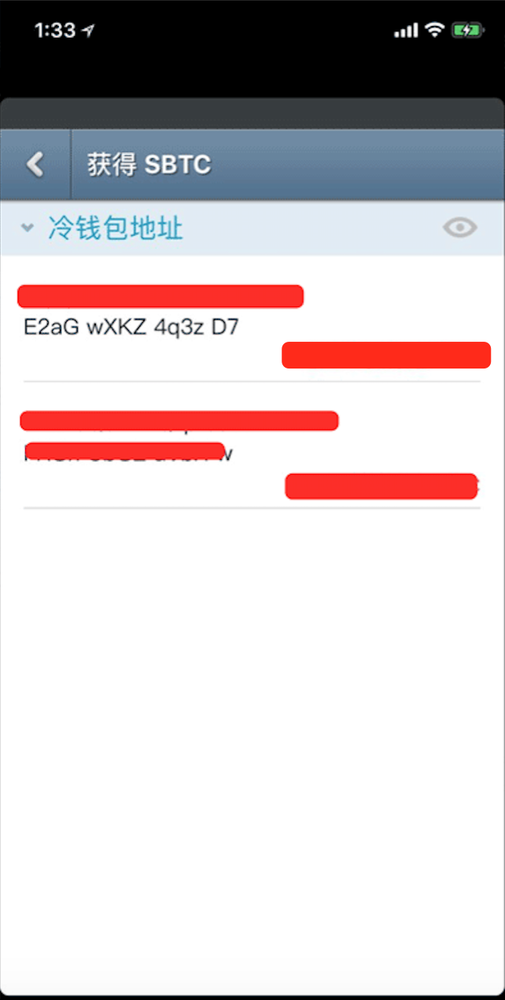

获取SBTC
=============

比特派钱包获取 SBTC
------------------------

1、更新到最新版本，版本号 >= 2.4.0 ，设置底部查看版本号并且可以“检查新版本”。

2、打开比特派会自动提示'您可领取 SuperBitcoin，领取'。

3、选择领取。

比太钱包获取 SBTC
----------------------------------



比太钱包支持相同BIP规范的私钥或者密语导入，您如果使用其他比特币钱包软件，可以将私钥导入比太钱包，获取SBTC。

教程：http://docs.bitpie.com/zh_CN/latest/bitherImportPrivateKeyToken/index.html

1、更新比太钱包 v1.7.8 ，通过比太热钱包进行操作。



2、设置-高级选项-获取 SBTC。




3、选择相对应的账户地址，输入比特派 SBTC 地址及密码。



如果是比太热钱包监控冷钱包，获得确认之后需要进行签名交易。

1、选择相对应的账户地址。

2、输入比特派 SBTC 地址。

3、用冷钱包扫描热钱包待签名交易。使用包含此地址私钥的冷钱包扫描。

.. image:: ../img/sign.png
    :width: 320px
    :height: 520px
    :scale: 100%
    :align: center

4、用热钱包扫描冷钱包已签名的交易。

.. image:: ../img/hotsing.png
    :width: 320px
    :height: 520px
    :scale: 100%
    :align: center

.. image:: ../img/sign.png
    :width: 320px
    :height: 520px
    :scale: 100%
    :align: center

