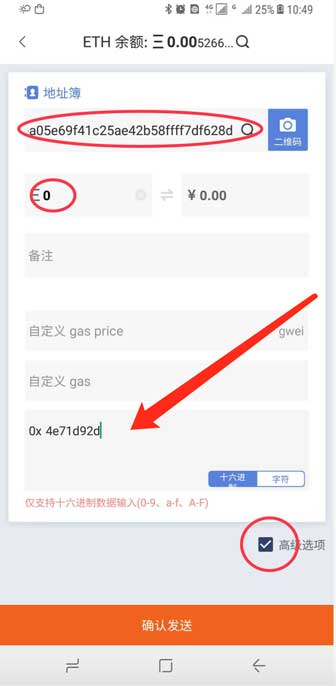
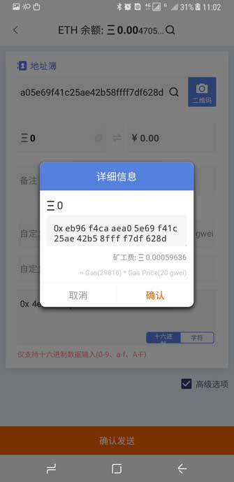

Claim 领取空投币 EON
=====================================

 
EON 将对持有100个以上 EOS 的用户进行1:1空投，快照时间为香港时间2018年6月1日12:00:00，空投时间预计为6月上旬，用户至少需要持有大于100个EOS才能参与本次空投活动。 EON 根据EOS ERC20 token在香港时间6月1日12点快照，EOS 数量大于100的用户可以通过 claim 的方法获得空投，官方网站（http://eon.org/#/）。

 
根据 EON 项目方空投要求在香港时间2018年6月1日12:00:00之前做好 Claim 操作，确保你的钱包中存有100个以上 EOS。比特派 Claim 领取空投币 EON 方法如下

 
安卓用户领取方法（比特派APP版本大于 3.2.5）
 

方法一：
 
1、确认您的 EOS 币数大于 100个以上，是否符合 EON 官方空投规则 。
 
2、向 EON 的 token 合约地址 0xeb96f4caaea05e69f41c25ae42b58ffff7df628d 发送指令 0x4e71d92d 即可。发送指令需要少量的 ETH 作为矿工费。
 
在 ETH 发币页面，地址输入：0xeb96f4caaea05e69f41c25ae42b58ffff7df628d，币数输入0，选中高级选项 ，将指令 0x4e71d92d 复制到 "0x" 输入框。（注意自定义 gas price，自定义 gas 不要填写，默认即可）

 
方法二：
 
将您的 EOS 充值到派银行，待派银行收到空投后，将会统一安排发放。
 
 
 
苹果IOS用户领取方法
 
将您的 EOS 充值到派银行，待派银行收到空投后，将会统一安排发放。