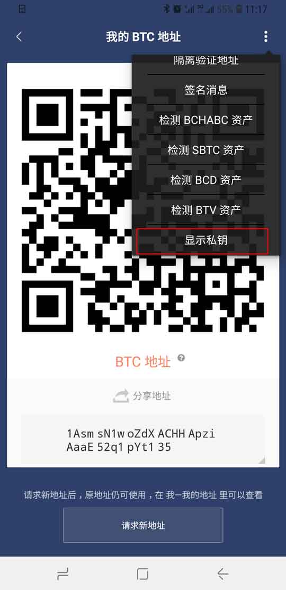

显示私钥
=================

因普通用户不具备安全保管私钥的能力，我们强烈不建议您使用该功能！为了保证您资产安全，请保管好您的12个密语。如需做一些导入私钥领取糖果风险性很大的操作，建议您在比特派应用内领取。

比特派支持的币种都支持私钥导出，不支持复制操作。

操作方法
------------

以 BTC 为例

切换到 BTC ，选择收币，选择右上角三点，选择显示私钥，选择对应（压缩WIF、未压缩WIF、HEX）格式的私钥。

