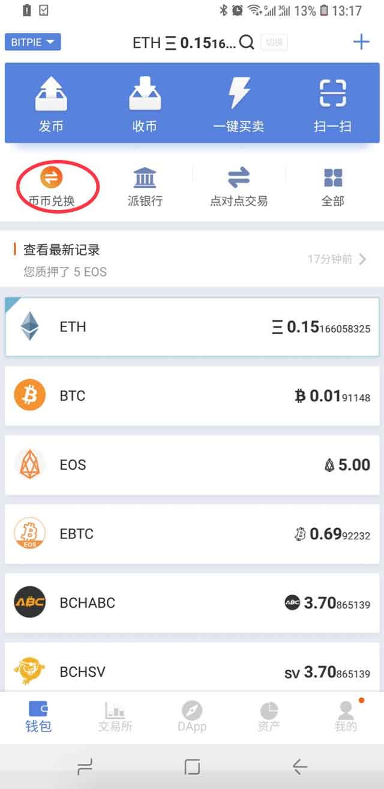
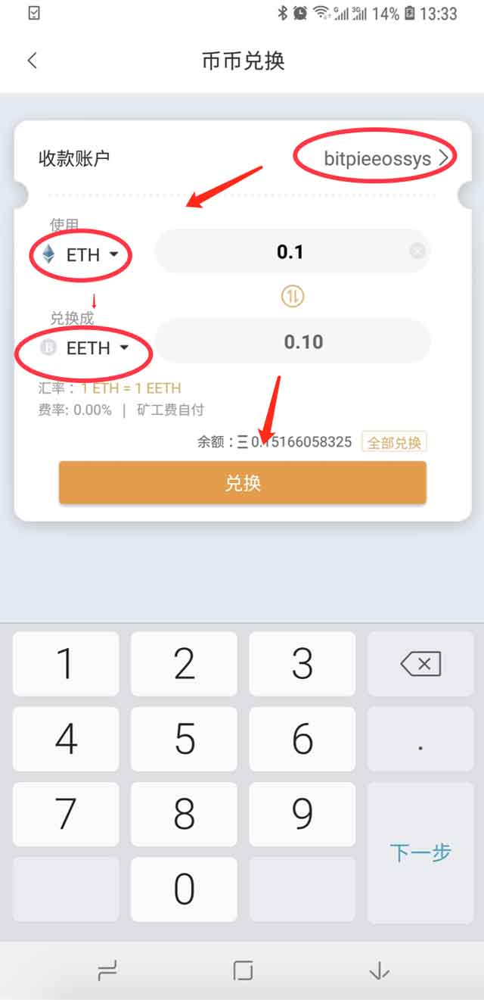

兑换 EOS 稳定币 EBTC,EUSD,EETH
===============================

比特派目前支持 BTC 兑换 EBTC, ETH 兑换 EETH, USDT 兑换 USDT。都是 1:1 兑换，矿工费自付。

1、检查比特派的版本是否大于 3.7.9。

2､ 准备一个 EOS 账户。

3､ 将需要兑换的 BTC 或者 ETH 或者 USDT 发送到比特派的钱包上面，对应的币种在区块链上确认了才可以兑换。

4､ 在这里以 ETH 兑换为例。

5､ 切换到钱包首页，选择币币兑换。

6､ 选择准备好的 EOS 账户，并选择使用 ETH 兑换成 EETH。确认好兑换数量之后，选择兑换。

7､ 会弹出确认框，是否兑换相对应数量的稳定币种，确认无误，选择确认，输入您的钱包 PIN 码。

8､ 输入 PIN 码之后，会进入兑换详情页面。注意查看系统给您发送的信息 "请耐心等待交易确认，10个确认后会为您进行发币"。耐心等待链上确认即可。

9､ 在钱包首页中，查看兑换记录。

