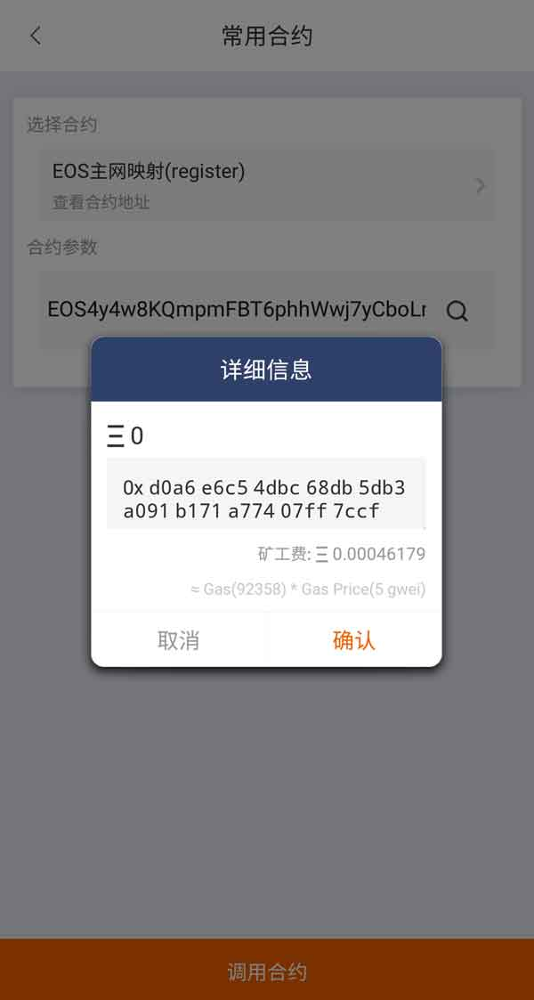

常用合约
===================

EOS主网映射(register)
--------------------------------

目前 EOS 是 ERC20 代币，可以理解为 "临时 EOS"。如果不进行 EOS 主网映射，将无法在 EOS 主网上获得相对应的 "真 EOS"。因此映射一定要做（截至时间为北京时间2018年6月2日6:59:59），不止要做，而且建议大家尽量使用钱包自己来做。 比特派支持两种方法进行 EOS 映射。

方法一：

1、Bitpie APP 版本大于 3.1.2 。

2、钱包首页-全部-常用合约-选择合约-选择"EOS主网映射(register)"。

3、选择调用合约，输入PIN 码。

4、执行合约需要消耗矿工费的，当执行合约的交易确认之后，就说明已经 EOS 主网映射成功了。

方法二：

将 EOS 充值到比特派钱包，然后再充值到派银行。比特派会在 EOS 主网上线前，统一帮大家完成映射。

