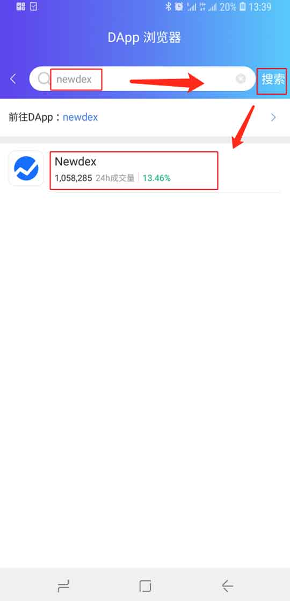

DApp 浏览器
===================

更新比特派版本大于 3.7.8 。

在 DApp 浏览器中输入 DApp 名称或网址，点击搜索。即可进入对应的 DApp 应用。

操作方法
-----------

1､点击比特派底部菜单中的 DApp，点击比特派 DApp 页面中部的搜索框。

2､在 DApp 浏览器页面的输入框中输入"DApp 名称或网址"，选择搜索。在这里输入"newdex"，点击搜索，点击 newdex 即可进入此 DApp。

