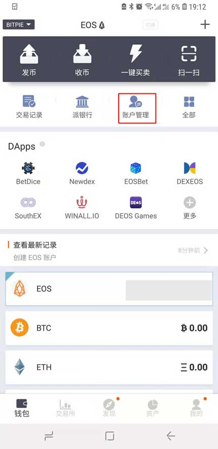
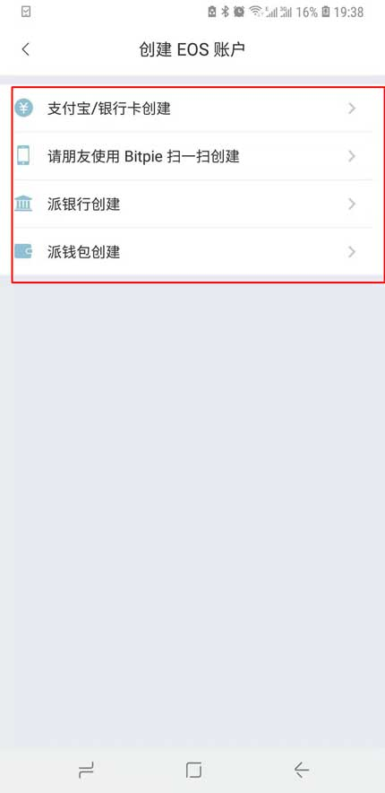
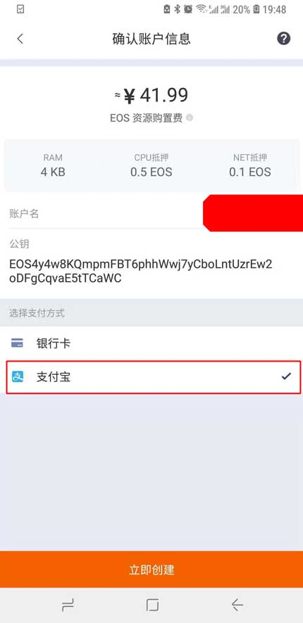
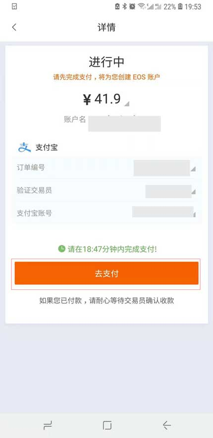
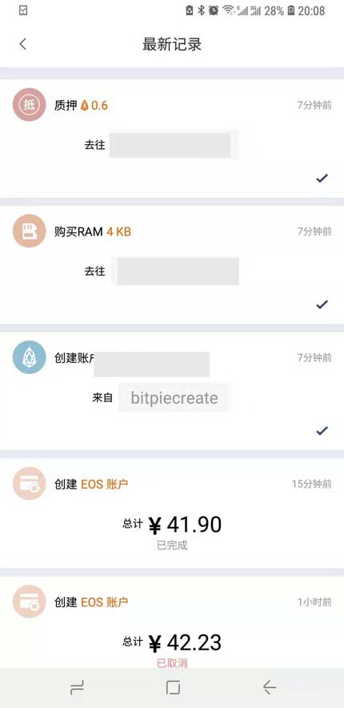

EOS 账户创建
===================

更新比特派最新版本，版本号大于 3.7.5 ，比特派支持 EOS 账户创建方法：支付宝/银行卡创建、使用其它币种创建（目前支持 BTC、ETH 开户）、请朋友使用 Bitpie 扫一扫创建、使用派银行余额创建、使用派钱包余额创建。

这里使用支付宝创建 EOS 账号为例：

1､ 切换到 EOS 币种界面，选择账户管理，选择创建 EOS 账户。

2､ 选择支付宝/银行卡创建。

3、进入 EOS 账户页面。输入 EOS 账户，选择下一步。

    备注：账户名只支持数字1-5，小写字母a-z，长度12位。并且账户名不能被占用。

4、进入确认账户信息页面。选择支付方式。在这里选择支付宝。选择立即创建。

5､ 输入 PIN 码，在详细页面，选择去支付按钮，会自动跳入支付宝付款页面，在付款时请备注订单号。请您在规定的时间内完成支付，如果您已付款，请耐心等待交易员确认收款。

6、待交易员确认之后，就会进入账户创建中页面，创建账户大约需要5分钟。您也可以切换到 EOS 币种页面，点击查看最新记录（可以查看 创建 EOS 账户、购买 RAM、质押）。

.. image:: ../img/eos_createing.jpg
    :width: 320px
    :height: 658px
    :scale: 100%
    :align: center

说明：

1､ 如果您选择的是 派银行创建的方式 ，您的派银行必须有 EOS 余额，如果您的派银行没有余额也没有关系，可以通过派钱包的交易所进行兑换（基于 EOS/ETH 、EOS/SCNY 交易对）。

交易所交易教程：http://docs.bitpie.com/zh_CN/latest/Expie/index.html

2､ 如果您的朋友有 EOS ，可以选择 请朋友使用 Bitpie 扫一扫创建，将生成的二维以图片的形式转发给您的朋友。然后通过扫一扫即可进行发送 EOS 进行创建 。

3、如果您想通过派钱包创建 ，您的派钱包必须有 EOS 账户，并且 EOS 账户余额必须大于2。
