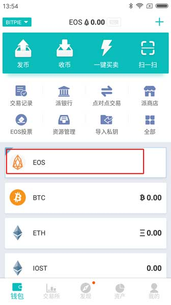
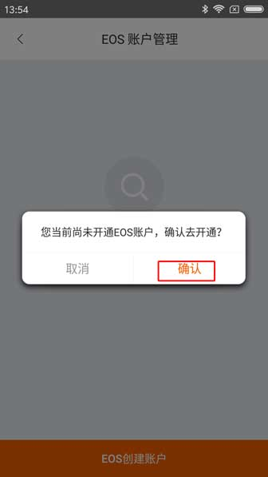
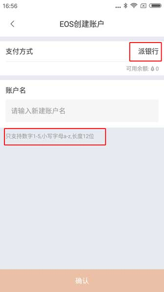
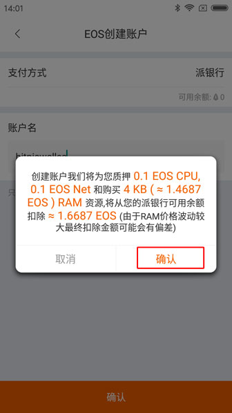

EOS 账户创建
===================

1、更新比特派最新版本，版本号大于 3.4.1。

2、您的派银行必须有 EOS 余额，如果您的派银行没有余额也没有关系，可以通过派钱包的交易所进行兑换（基于 EOS/ETH 、EOS/SCNY 交易对）。

交易所交易教程：http://docs.bitpie.com/zh_CN/latest/Expie/index.html

3､ 如果您还没有添加 EOS 币种，先添加 EOS 币种（钱包首页－右上角'＋'号－添加币种页面选择其它币种－选择 EOS 币种右侧的灰色按钮即可）。

添加币种教程：http://docs.bitpie.com/zh_CN/latest/MultiCurrency/index.html

4、选择 EOS 币种，提示 '您当前尚未开通 EOS 账户，确定开通'，选择确认。

5、进入 EOS 创建账户页面。支付方式为派银行；账户名：只支持数字1-5，小写字母a-z，长度12位。输入12位账户名。

6、选择确认，会检测您的账户是否重名，如果没有重合，会弹出提示框 '创建账户我们将为您质押0.1 EOS CPU，0.1 EOS Net 和购买 4KB (约 1.4687 EOS) RAM 资源，将从您的派银行可用余额扣除约 1.6687 EOS (由于 RAM 价格波动较大最终和扣除金额可能会有偏差)'，选择确认。

