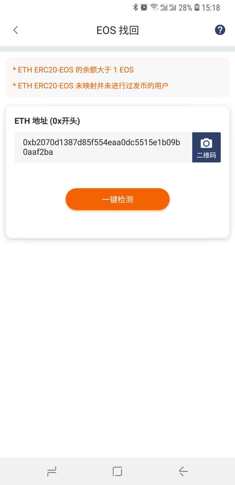

EOS 找回
=======================

注：此功能由 EOS Authority 节点提供。

只要符合以下两个条件的用户可找回 EOS。

1、ETH ERC20-EOS 的余额大于 1EOS。

2、ETH ERC20-EOS 未映射并未进行过发币的用户。

操作方法：

1、钱包首页 - 我的菜单 - 右上角设置 - EOS找回

2、在 ETH 地址(0x开头) 输入要找回的 ETH 地址，点击一键检测。如果检测可以找回，需要进行用私钥进行签名消息。

