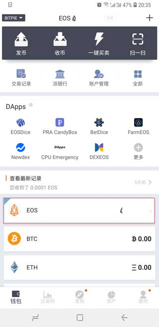
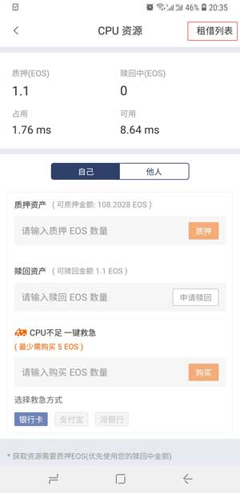
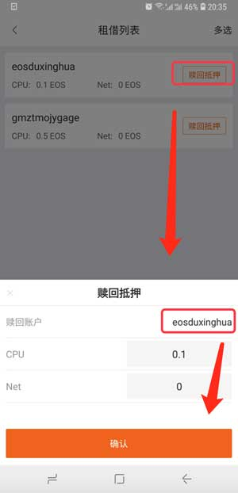

EOS 租借列表
===================

如果您为他人质押过 EOS 资源，可在租借列表中选择对应的账户赎回抵押，比特派版本大于或等于3.7.0。

1、切换到 EOS 币种页面，再次选择 EOS 币种，默认进入第一个账户首页。

2、在资源管理器选择为他人质押过的 EOS 资源。例：选择 CPU 资源。

.. image:: ../img/eos_cpu.jpg
    :width: 300px
    :height: 617px
    :scale: 100%
    :align: center

3、在 CPU 资源页面中，选择右上角的租借列表。

4、在租借列表的页面中，选择要赎回抵押的账户。

