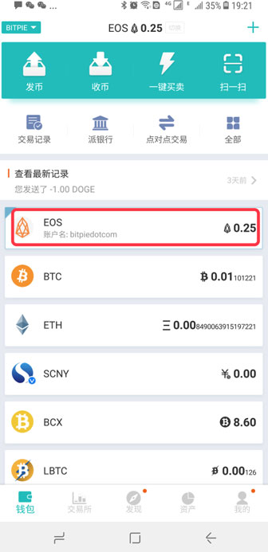
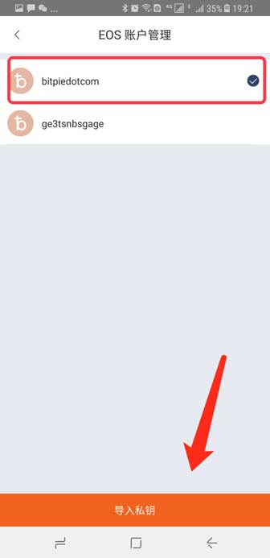
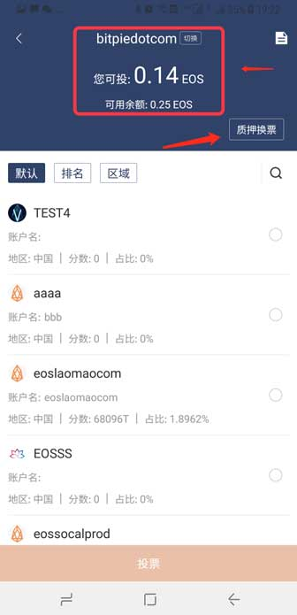
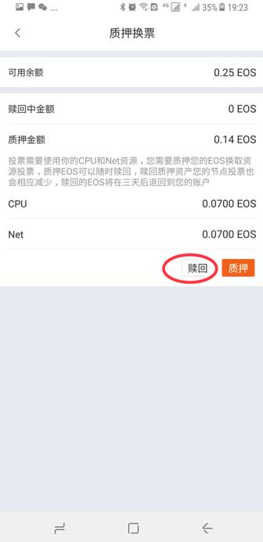
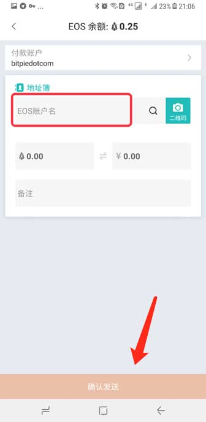
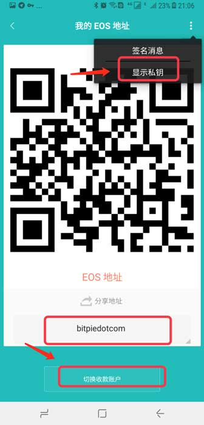

EOS
===================

1、更新到比特派最新版，版本大于3.3.3。

2、钱包首页 - 选择 EOS 币种 - 点击 EOS 主网创建好的账户 - 即可进入 EOS 页面。关于钱包的 EOS 主网数量不对，可以看一下 比特派钱包首页 - 全部 - EOS投票 - 选择 EOS 账户 （进入对应的投票页面，选择对应的 EOS 账户）。如果您不想质押，可以在投票页面选择 质押换票，赎回（不能全部赎回，需要质押一点 EOS ）即可。

提示：

EOS.IO 规定：在快照时期, 所有持有 EOS 数量( ERC-20代币 ) 少于 1 的账户, 即使用户做了映射, 也没有进行快照。所以无法导入 EOS 钱包, 之前持有的 EOS 代币无法正常迁移至主网。

比特派已支持 EOS 主网，根据以上的规则，目前比特派只支持 EOS 数量（ERC-20 代币）大于1 的用户并做过 EOS 映射（比特派支持 EOS 主网已创建好的 EOS 账户），或者将 EOS 私钥导入比特派。如果您在比特派上没有 EOS  也不用着急，我们即将支持创建EOS账户。

EOS 发币
--------------

在 EOS 账户名输入框中输入对方的 EOS 账户名，输入 EOS 数量，然后选择发送。发送 EOS 不需要矿工费。

EOS 收币
--------------

EOS 收币地址就是自己的 EOS 账户名，如果您有多个 EOS 账户可以切换收款账户。另外 EOS 私钥在收币页面右上角三点的，显示私钥。

