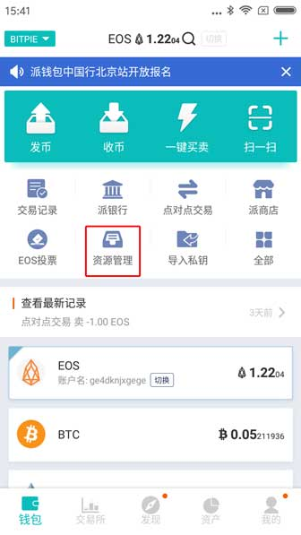
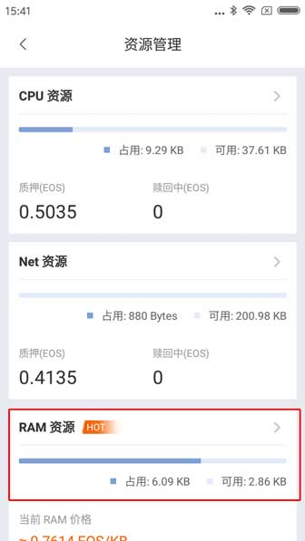
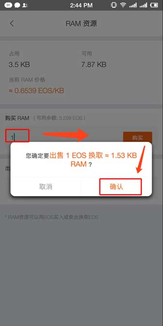

EOS 资源管理
======================

EOS 有三大资源：CPU、NET、RAM。

CPU、 NET：赎回无法提出的币，就是作为CPU、NET 资源质押的。

RAM：总量有限，但可扩容。Dapp 开发需要 RAM 资源、创建账户需要 RAM。合约规定 RAM 买卖 EOS 主网系统会收取0.5%的手续费。RAM 不可转让，也就是说只能够和系统交易。

买卖 RAM
---------------------

备注：保证自己有 EOS 账户，账户中有可用 EOS 资产方可购买。若您的比特派钱包中没有 EOS 账户，可通过导入私钥的方式导入 EOS 账户，进行 RAM 买卖！导入币种选择 EOS 即可。

导入教程：http://docs.bitpie.com/zh_CN/latest/privateKeyImport/index.html

1、比特派版本大于等于 V3.3.6。

2、切换到 EOS 币种下 - 资源管理 - RAM 资源。

3、(买 RAM )在购买 RAM 一栏的输入框中输入 EOS 数量，选择购买。选择购买之后会弹出信息 "您确定要出售多少 EOS 换取约等于 多少 Bytes RAM"，选择确认，输入钱包 PIN 码。

4、(卖 RAM )在出售 RAM 一栏的输入框中输入 RAM bytes 数量，选择出售。选择出售之后会弹出信息 "您确定要购卖多少 bytes RAM 换取约等于 多少的 EOS"，选择确认，输入钱包 PIN 码。