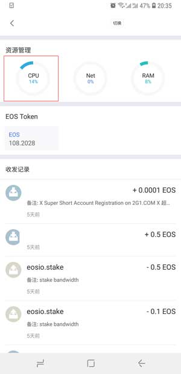
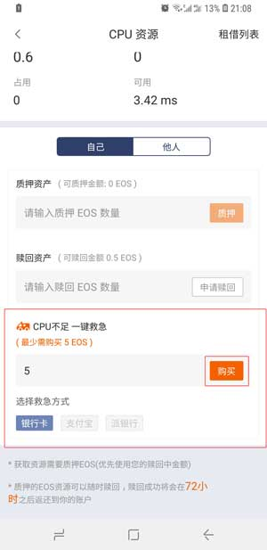
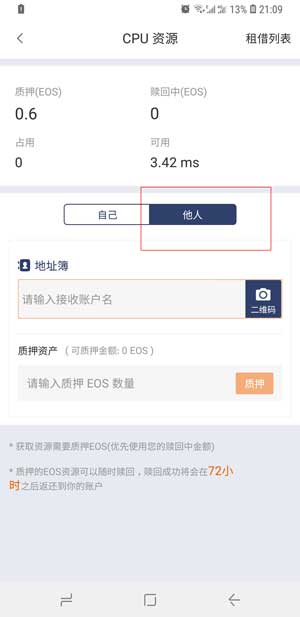

EOS 资源频繁出现不足怎么办？
==========================

比特派支持 EOS 资源（CPU/NET/RAM) 一键救急。比特派版本大于或等于3.7.0

以下两种方法都以 CPU 资源不足为例 。

方法一：CPU 一键救急。

1、打开 EOS 账号首页，在资源管理器中选择 CPU 资源。

2、在 "CPU 不足一键救急" 一栏中输入购买 买 EOS 数量，选择救急方式银行卡、支付宝、派银行，然后选择购买即可。

方法二：找他人帮你质押 CPU 资源。他人帮你质押的 CPU 资源你只能临时使用。他人可在租借列表中赎回。

您可以找朋友帮你质押 CPU 资源。操作方法：您朋友使用比特派在 CPU 资源的他人一栏中输入您的 EOS 账户及质押资产。

