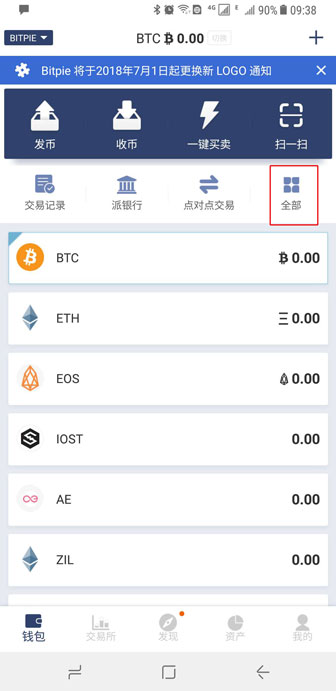
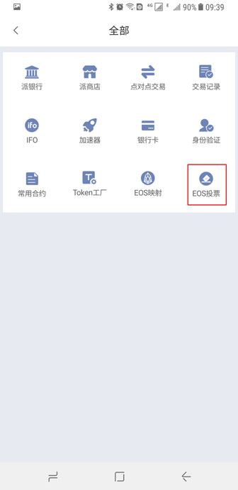
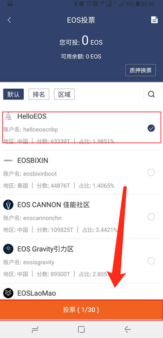

EOS 投票
===================

1、升级比特派最新版，版本大于 3.2.9。

2、打开钱包首页 - 首页 - 全部 - EOS投票。

3、在节点列表中，选择要投票的节点（最多可选30个）。EOS节点信息选择好之后，选择投票。

备注：

快照规则：

EOS.IO 规定：在快照时期, 所有持有 EOS 数量( ERC-20代币 ) 少于 1 的账户, 即使用户做了映射, 也没有进行快照。所以无法导入 EOS 钱包, 之前持有的 EOS 代币无法正常迁移至主网。

质押换票规则：

EOS 主网上线之后, 根据你之前钱包持有的 EOS ( ERC-20代币 ) 数量不同, 钱包里剩余的 EOS ( EOS主网代币 ) 数量也是不一样的, 具体规则为:

原持有 EOS （ ERC-20 代币) ≥ 1 且≤ 3 个, 钱包剩余 0.1 个 EOS 主网币, 其余全部自动置为质押金额

原持有 EOS （ ERC-20 代币）＞3个且≤ 11 个, 钱包剩余 2 个 EOS 主网币, 其余全部自动置为质押金额

原持有 EOS （ ERC-20 代币）＞ 11 个, 钱包剩余 10 个 EOS 主网币, 其余全部自动置为质押金额

赎回规则：

EOS 代币发行总量是 10 亿枚, 但是主网上线之后, 所有持有 EOS 的用户, 需要投出 1.5 亿 票, 主网才能正式启动。 在主网正式启动投满 1.5 亿票前, 质押金额是无法赎回的。比如你的钱包里本来应该有 10000 个 EOS, 但是实际上只有 10 个 EOS 在你的钱包账户里显示, 其余的 9990 个 EOS 将被自动置为质押金额, 且在主网正式启动之前, 无法赎回; 只要投票超过 1.5 亿, 用户便可做赎回操作, 并在 72 小时之后到账。

比特派投票需知：

目前只有您的 EOS (ERC20 代币) 在比特派钱包才可以进行投票。

您持有的EOS 主网代币数量 = 钱包 EOS 余额 + 已质押金额。

