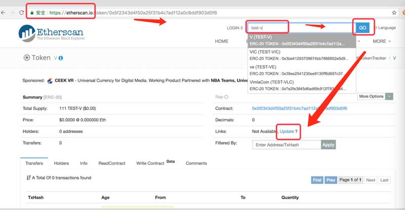
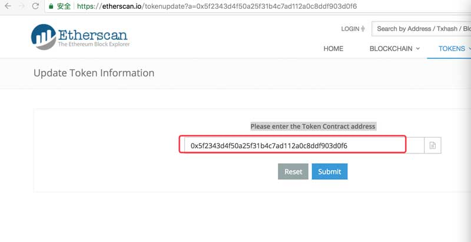
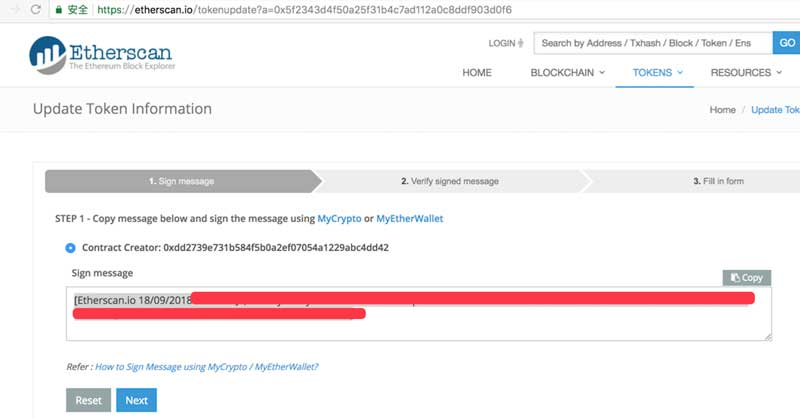
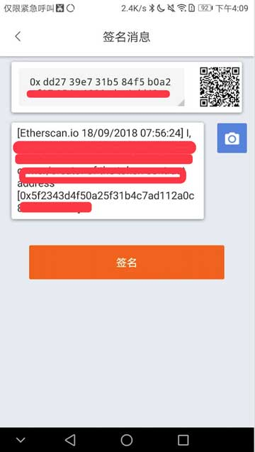
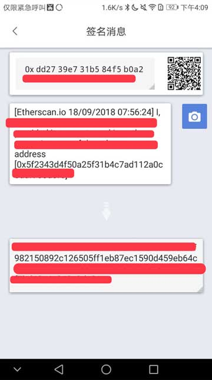
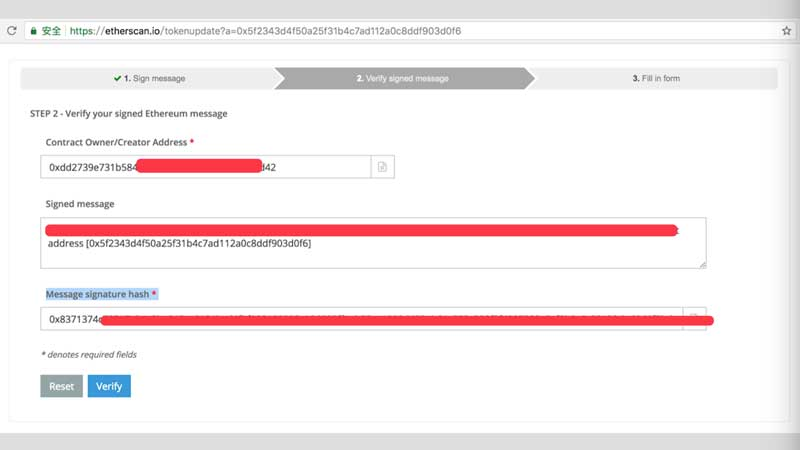
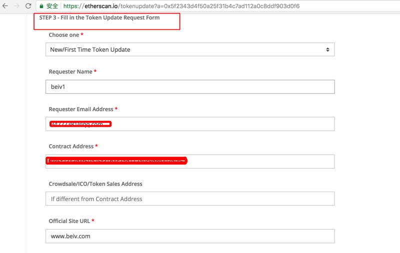

Etherscan Token 信息更新教程
===============================

备注：比特派版本大于 3.5.6

1、打开 Etherscan 官网 https://etherscan.io/ ，输入 token ，点击按钮 GO，点击 update。

2、确认 token 的合约地址，选择 Submit 。

3、复制网页中的签名信息，复制，选择 Next 。（选择 Next 之后，不要刷新此页面，耐心等待加载，否则会出现签名信息更改）

4、打开比特派，切换到 ETH 币种界面，选择收币，右上角三点，消息签名。将刚刚复制的签名信息复制到输入框中，选择签名。

5、输入比特派 PIN 码，点击最终的签名字符串复制

6、将复制的签名粘贴到 Message signature hash * 下方的输入框中，然后选择 Verify 。

7、只有签名信息验证通过之后，才会到 Etherscan 官网 token 更新的 STEP 3 - Fill in the Token Update Request Form。

8、输入完信息之后，点击 Send Message 。

