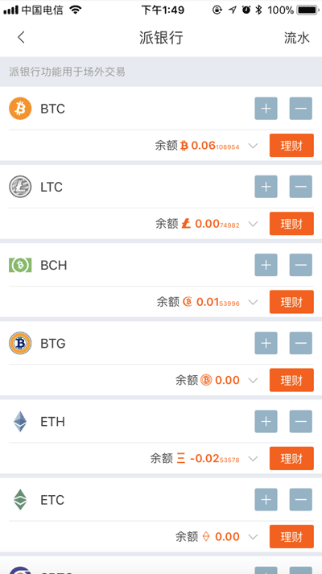
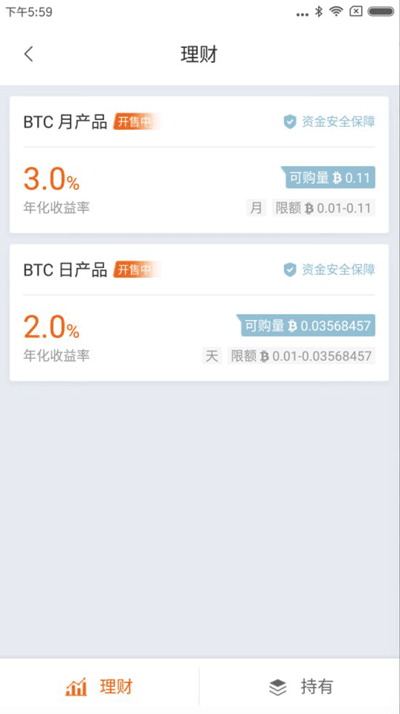
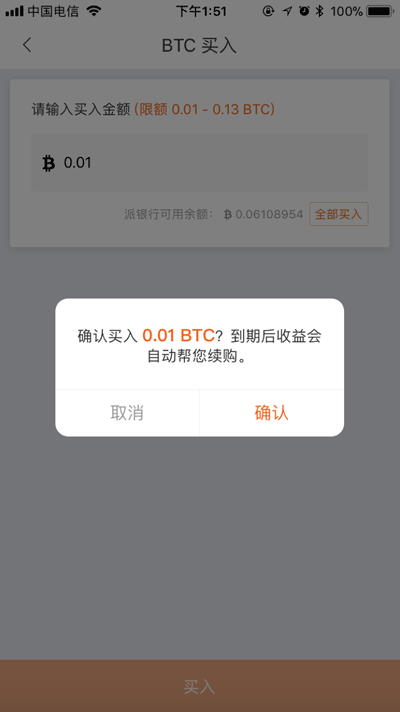
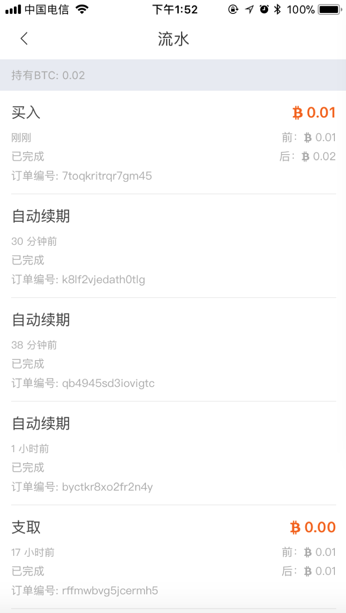
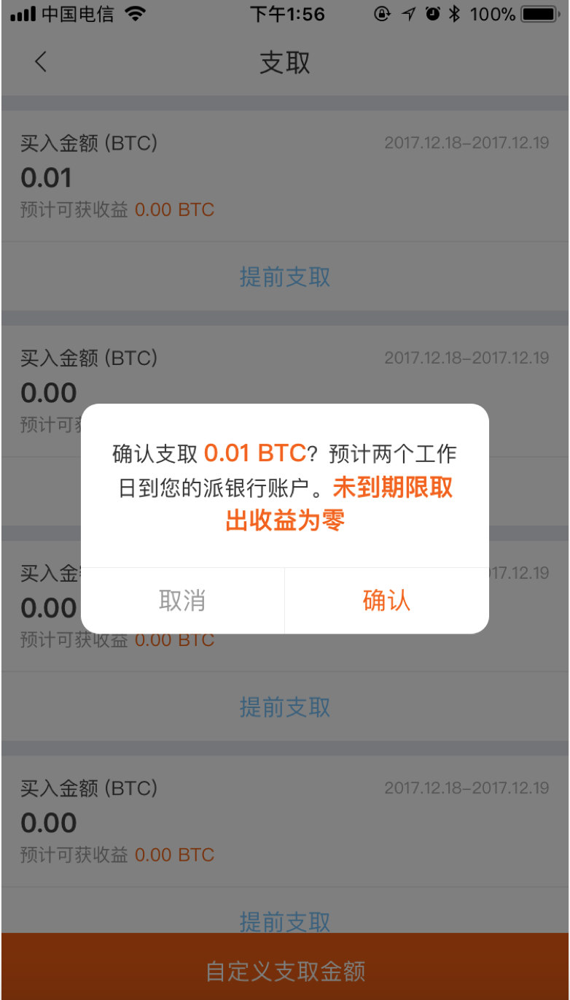

理财
=============

买入
------------------------

1、更新比特派钱包最新版 (版本大于v3.1.7) 。

2、派银行 - 理财（选择对应的币种理财）。

3、选择理财，这里以BTC理财为例。选择理财类型（月，天），选择月。

4、买入。

5、买入成功之后，可看流水。

支取
--------------------------

1、选择持有，选择理财类型（月，天）。

2、选择支取。（可以支取买入的BTC,也可以自定义支取金额）。

3、支取成功之后，可看流水。

