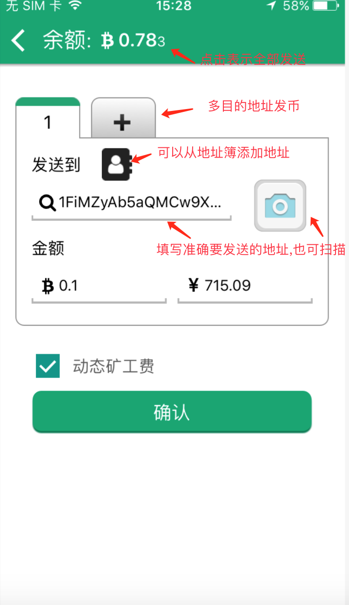
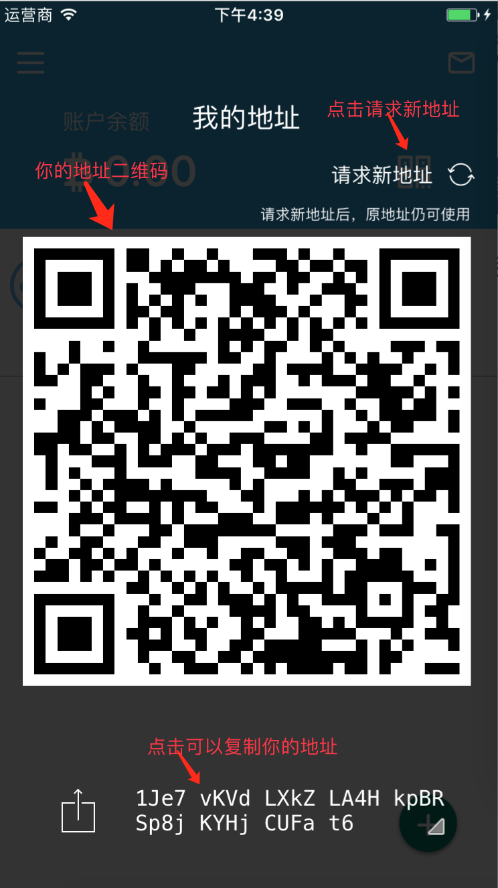
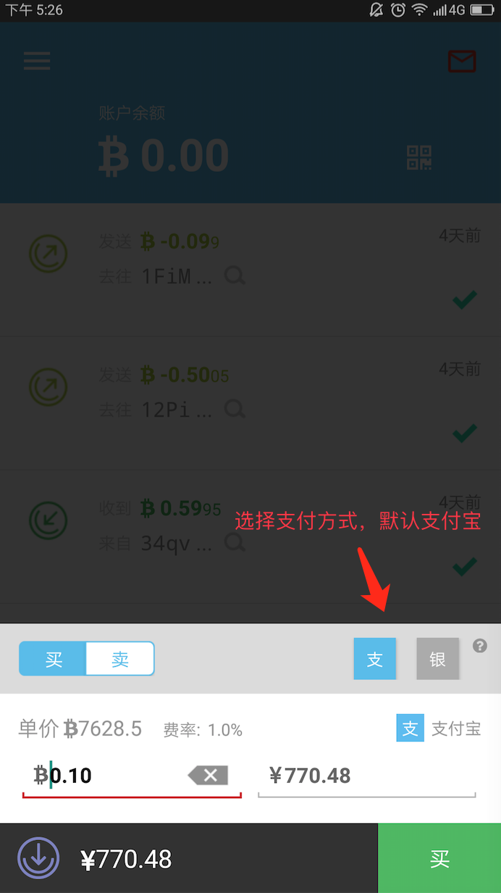
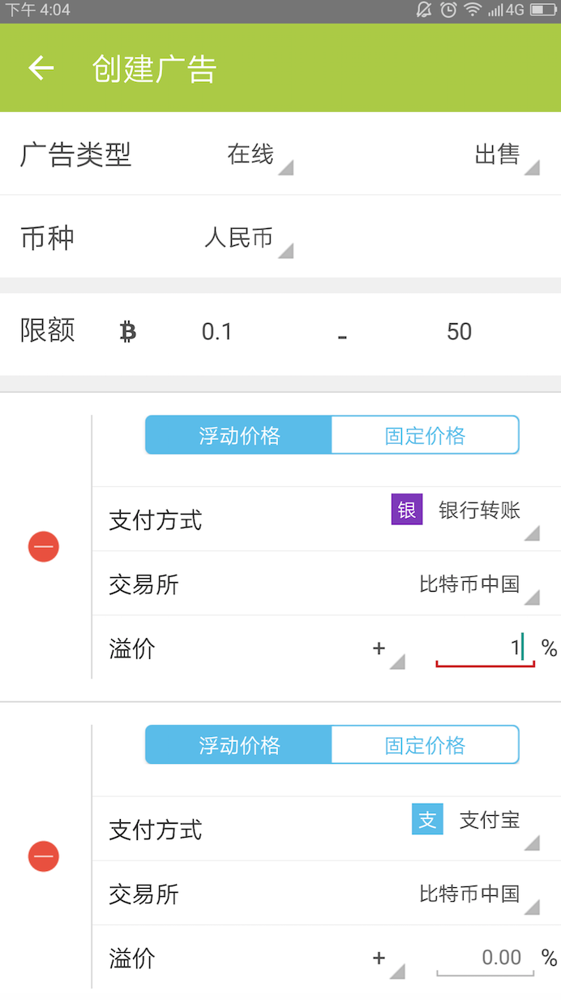
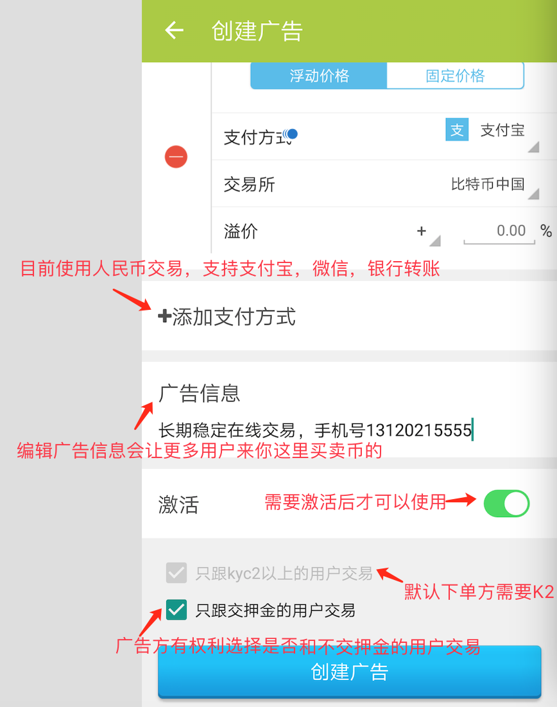
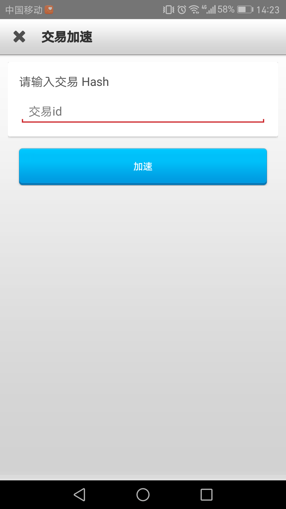

# 概述

​	比特派是由比太团队研发的比特币钱包，让你轻松安全的使用比特币，您可以在比特派上发送和接收比特币,还能方便的进行比特币交易。从比太钱包在业内的良好口碑来看，比特派注定是以后比特币钱包的主流。下载网址安卓（http://bitpie.com）苹果（http://bitpie.com/ios），此外谷歌商店和苹果商店（美）都支持下载比特派。赶紧下载安装后，跟我一起使用吧。

# 使用说明

## 下载安装

1.浏览器打开http://bitpie.com (安卓)   http://bitpie.com/ios(苹果)，按照提示下载安装即可。

## 注册恢复

- 保存种子

  单词密语相当于你的私钥，请你妥善保管，请勿泄露给他人。首次打开比特派后，你将会看到这个界面

  

  认真阅读”特别提示“后，点击”开始使用“按钮

  

  1） 请按顺序抄下这些单词，点击”我已抄好“按钮，在新页面通过选择输入抄写的单词.

  2）大家在使用时，要详细认真阅读比特派的相关提示，尤其是像注册时候要备份种子（12个单词或汉字），不要随意卸载比特派或者将手机恢复出厂设置等高危行为。

  3）如果条件允许，可以点左上方开启打印模式，打印一份你的种子。或者也可以认真抄写你的种子，建议抄写后认证核对两三遍，确保没有抄写错误。如果确定已经抄写好种子了，点击“我已抄好”，进入下一步。为了验证你是否抄写正确，比特派专门设计了验证种子这一步，按照刚才备份好的种子，从左到右，从上到下，依次选择对应的汉字（单词）。

- 恢复种子

  1）恢复种子就是恢复你之前注册过的比特派账户，这时候需要用到之前备份好的种子（12个单词或汉字）。从左到右，从上到下，一个一个输入哦，如果输入某个字输入错误了，不用着急，点击那个字就可以删除或者替换了。

  

  ​	在注册或者恢复完成之后，接下来你会看到让你设置密码的界面，这是PIN码,就像你手机的密码一样，让钱包更加安全。要牢记并且设置好四位数的密码，因为你在使用比特派的时候会经常用到的。设置好PIN码，现在开始进入比特派。

## 主界面

​	比特派主要功能就是收发买卖，在右下角加号菜单中，有发送，接收，一键买卖和OTC交易。此外，在左边菜单还有我的订单，广告，地址，身份认证，和设置，切换币种。

## 发送

​	比特派支持多目的地址发币，像发送交易频繁的用户，使用起来更方便。目的地址你可以通过复制粘贴上去，从地址簿添加上去，或者使用相机扫描目的地址二维码多种方式填写。输入对金额和目的地址后，确认没问题，点击确认。

​	为了保证你的资金安全，会再次让你核实下，发送交易是否有问题，你可以看到你要发送的这笔交易的目的地址，发送的金额，矿工费。这里详细解释下矿工费：矿工费是你发送这笔交易，是需要矿工把你的这个交易做到区块儿链中，矿工会收取一定的费用，比特派的发送和接收两个功能是不收任何手续费的。此外，由于区块儿有时会出现拥堵等情况，比特派专门设置了动态矿工费，这个动态矿工费是根据你发送的这笔交易的大小计算出来的最合适的矿工费费用。所以，我建议大家使用动态矿工费，防止交易长时间不确认等特殊情况。经常有用户反映，我钱包里有0.1个币啊，为什么我发送0.1个币却发送提示余额不够呢？应该考虑矿工费的，矿工费是从你余额里扣的，所以，尽量留足够的矿工费。

##  接收

​	左下角加号—接收，你会发现出来一个这种界面，这就是你的钱包地址。如果要是接收比特币，就发送到你的账户上的地址就可以了。请求新地址每次可以请求十个地址，同时，旧地址也可以使用的。在左边菜单，我的地址里可以查到。此外，你还可以把你的旧地址长按，添加到地址簿，并且做好备注，方便下次使用。

## 一键买卖

首先，需要进行下身份认证。左边菜单—身份认证，里面介绍的很详细了。大家可以仔细看看。

主要讲下认证KYC5，部分用户认证几次都无法通过，就是没仔细看提示。下面我总结了一些视频认证无法通过的原因。

1）照片不正确  可能原因是身份证正反面照片拍摄不全，上传上去的照片只显示一半。或者没按照要求拍摄。

2）照片不清晰  可能原因是身份证正反面照片拍摄不清晰，手持身份证照片尽量要让身份证证件号码足够清晰，否则无法通过。

3）视频不正确，可能原因,读错内容或者没拿身份证拍摄，要求是：拿身份证读到（我是***，我在比特派上一键买卖比特币，我承诺资金来源合法，不会用于非法用途，并且对自己的行为负责），尤其是点击开始录制后，再开始读，往往有用户没录上到第一句话，此外，第二句话，我在比特派上不要读到我在比特币上，这句话特别容易读错。

这是一键买卖的购物车：

使用一键买的时候，需要注意以下几点

1）现在买的最小限额是0.1BTC。当核对好下单信息后，直接点买就可以下单了。

2）在下单前，看看自己想用哪种支付方式，因为十分钟内需要付款完成，所以在下单前尽量做好准备。默认支付方式是支付宝，如果需要大额买币的话，建议使用银行卡付款。

3）下单成功后，你会进入到订单详情界面，因为一键买卖的交易员都是经过认证的，所以按照小秘书的提示放心付款就可以了

4）如果支付宝付款的话，要用实名认证过的本人的支付宝账号。

5）不管是支付宝付款还是银行卡付款，都要备注好订单号，点击下订单号就复制了，粘贴过去即可。（另外，提示下，比特派中所有的右下家带小三角的地方，都可以点击复制的）

6）备注时候，只要备注订单，其他的文字信息如比特币等不要填写。

7）支付时候，要再三核对交易员账号，确保付款正确，另外，下单后要在10分钟内付款。

8）如果你付款完成了，点击下已付款按钮，等交易员那边儿核对付款信息后，会立刻给你放币的。

二：使用一键卖的时候，需要注意以下几点，

1）现在卖的最小限额是0.1BTC。

2）当核对好下单信息后，直接点卖，此时，需要你提供下你的收款方式，切记，收款方式要核对无误。

3）交易员核实交易已确认后，会立刻给你付款的，在收到款并且确认无误后，点下已收款，就像淘宝似的。

## OTC交易

​	OTC交易也可以叫做P2P交易或者托管交易。简单来说就是个人对个人的比特币交易，在交易过程中（交易确认后），币是处于托管状态，买家如约付款后，卖家释放托管中的币给买家，交易完成。

​	在OTC交易中，你可以选择做广告方，也可以选择做下单方。广告方可以发布购买比特币或者出售比特币的广告，设置广告激活并且设置在线后，其他用户进入OTC交易里就会看到你的广告了，如果想跟你进行交易的话，就会下单。如果要是下单方的话，就比较简单，直接右下角—加号—OTC交易，进入后可以买币或者卖币，直接下单按照小秘书提示操作就可以了。

1）发布广告  需要哪些资料？

如果你要是想在OTC上发布广告的话，是需要进行一些准备的，下图是开通广告准备流程和操作。几分钟搞定的事情，不难也不麻烦的。

​	如果新用户刚注册比特派，你的默认用户名是noname- 开头的，这样很难便于区分，所以，到个人资料里设置下自己的用户名和头像吧。身份认证上面已经详细说明如何认证了，这里不再细说哈。关于充值押金方面，如果是在之前开通过OTC广告权限，你就不用交押金了，之前的开通费将会自动转为押金。如果之前没开通的话，需要存入 100元人民币 或 0.01 BTC 的押金。

2）广告方如何开通广告？

​	把开通广告要求的流程走完后，可以开通广告了，开通广告在：左边菜单—我的广告—创建广告

​	广告类型设置成在线，目前不支持现金交易。可以选择购买还是出售。币种目前选择人民币，虽然有老外操作，国人还是使用人民币交易比较多。限额就是别人来你这里购买或者出售的最小最大额度。当你广告挂出去后，在OTC广告列表里是可以看到你的限额的。浮动价格就是根据交易所价格，你设置一个溢价，根据交易所价格的变动，你的价格也随着变动。固定价格就是你手动设置一个价格。不过固定价格需要注意的是当行情有大的波动的时候，要及时修改你的固定价格。否则，你的广告有可能被刷爆。

​	目前使用人民币交易的话，支持银行转账，支付宝转账，和微信转账。可以在广告信息处填写你的一些联系方式，或者给自己打个广告。吸引更多的人和你交易。默认是和KYC2以上的用户进行加交易，这可以有效的保护广告方的资金安全。另外可以选择和是否交押金的用户进行交易。

​	创建完成后，如果想要把广告挂出去的话，设置下激活。

​	点最下方按钮创建广告，广告创建完毕。另外，左边菜单，需要设置在线，别人才能看到你的广告。记住，如果不交易的话，状态要改成离线，设置为离线后，其他用户就暂时看不到你的广告信息了，等下次使用的时候再选择为在线。

3）下单方需要如何操作？

​	如果你只是想在OTC交易中做下单方，只需要简单的一两步就可以了。首先你需要看下身份认证中KYC2是否通过，如果通过了，那恭喜你，可以直接下单了。如果没通过，可能原因是你的认证手机号在支付宝中没实名认证或者设置了隐私保护，这些有可能是影响你认证KYC2不通过的原因。另外，下单方可以选择是否缴纳押金，缴纳押金的话（预先存入 50元人民币 或 0.005 BTC 的押金），可以和任意广告放进行交易，不缴纳押金的话，只能和不带（押）字的广告方交易。上图是介绍如何在OTC交易界面和广告方进行交易。

4）如何进行OTC交易？

​	我们举个栗子，下单方如何通过OTC交易从广告方这里买币的。

​	下单方到OTC订单列表里，找到和合适的卖家下单方，感觉价格靠谱点击聊天按钮，和卖家进行沟通，比如，是否有币，是否可以在线完成交易。如果双方感觉合适的话，买家就可以点击购买下单了，确定购买金额，付款方式都没问题，点购买下单。

​	1：下单成功后买家看到的是等待接收。（等卖家决定是否接收订单），如果卖家长时间不回复的话，可以取消此订单，找其他人下单。

​     	卖家此时可以接收或者拒绝订单。

​	2：卖家接收订单后，双方看到的是等待交易确认，（因为OTC交易是链上的比特币交易，这里的等待交易确认的意思是，卖家将币发送到托管状态，这个过程是需要网络确认的，就是等矿工把这笔交易做到区块儿里，就会有确认了），这个时间不确定，可能几分钟，也可能会时间稍微长些。买家卖家需要耐心等等。

​	3： 交易确认后，表示币已经被托管成功了，现在，卖家可以提供收款信息，大额的话建议使用银行卡收款。（像建设银行之类的转账或者叫接收比较慢的尽量不要使用哈，本人推荐招商银行，转账确认很快的。），买家按照卖家提供的付款方式，核对无误后可以给卖家付款，在留言或者备注中，填写下订单号，这样方便买卖双方进行交易。买家付款后，点击已付款。买家剩下的就是等待对方放币了。

​	4：卖家在收到款后，并且核对无误后，点击释放托管中的比特币，把币释放给买家。

​	5：此订单完成。

5）交易需要注意事项！

​	1：进行OTC交易，必须等币成功被托管了，双方才能进行法币的操作。就是“交易已经确认”这个状态之后，买家再付款。

​	2：广告放尽量需要下单方缴纳押金才可以下单，这样可以提高你的订单成功率。

​	3：不管是下单方还是广告方，都要保证订单创建后，尽可能的在线哈，建议不要把手机调成静音，当交易确认了，比特派是会有通知消息的，并隔断时间看下自己的订单是否已确认。

​	4：不管和对方交易多少次，一定要在OTC上进行交易，不能因为熟悉了就私下交易哈。

​	5：如果发生纠纷，可以申请仲裁。

6）申请仲裁流程：

​	如果出现纠纷比如买家没付款，买卖双方有一方长时间不回复，付款后卖家没放币，或者其他原因，都可以申请仲裁的。申请仲裁后，仲裁相关人员会尽快通过小秘书的形式来通知买卖双方如何操作。申请仲裁后，双方也是可以继续交易的，可能是因为一些小小的误会或者误操作，一方发起了仲裁。如果双方还想继续交易的话，另一方也申请仲裁，买家正常付款给卖家，卖家确认收到款后，点同意放币，释放币给买家。这样，即使申请仲裁了，也可以继续交易的。

## 交易加速器使用

​	如果交易长时间没确认，可以根据情况，使用加速器加速的。

​	首先需要购买些加速器，在设置—派商店—加速器。你可以购买加速器。购买加速器后可以在设置—个人资料—加速器 看到自己的这个账户当前拥有多少加速器。

​	你的收发比特币在比特派的首页都能看到的，如果交易没确认的话，这个交易的右边儿显示的圆圈是灰色的，此时想加速的话可以点下右边儿有个小火箭，加速一次就可以了，加速器只能对一笔交易加速一次。此外，普及下，加速器是针对未确认的交易进行加速的，一个加速器对应一个未确认交易，如果你的依赖交易比较多，可能不止需要一个加速器的。除啦上面的加速方法可以给比特派上的交易加速外，你也可以给自己的不在比特派上的交易进行加速，你可以把交易id复制粘贴过来，左边儿菜单—设置—交易加速器—右上角点击进去—复制粘贴交易Id—加速。

在“交易加速器”页面可以查看“待加速”的交易和“已加速”的交易。在“待加速”列表中选择要一项加速的交易，点击“加速”按钮进行加速。

点击右上角“tx id”,打开“交易加速”页面，在该页面可加速非本应用平台的交易，输入交易id后，点击“加速”按钮进行加速交易。

## 地址簿使用

​	首先说下比特派上的地址：在首页上方区域有个二维码，点击后可以看到你的地址以及地址二维码。同样，点击右下角加号，接收，也可以弹出你的地址以及地址二维码。这里我们需要知道，你的比特派每次有交易后，你的收款地址是会改变的，旧地址在你的历史地址里可以查到。左边菜单—我的地址—历史地址。可以查到你的旧地址，长按可以添加到地址簿，然后你可以备注下，用来区分。旧地址也是可以正常收币的。

​	找零地址：找零地址就是你发送比特币出去后，为了找零给你而生成的地址，就叫找零地址。

​	比特币交易的规则：将用户有权使用的若干比特币汇款地址上的之前交易的输出金额作为一次交易的输入，若干比特币收款地址上增加的交易金额作为本次交易的输出。输入金额必须大于等于输出金额，超出部分作为本次交易的手续费。手续费没有输出地址，奖励给将本次交易记账成功的矿工。

​	因为有时作为输出的金额超过了用户想要支付的金额。在这种情况下，比特币客户端会创建一个新的比特币地址，并把差额发送回这个地址，这就是比特币的找零机制。

## 添加收款方式

在设置—收款信息 点击进去可以添加收款方式。目前默认货币是人民币的话可以添加银行卡，支付宝，微信三种。

## 如何升级版本

在设置里可以看到当前比特派的版本号，如果不是最新版的话，就点击检测新版本，然后会提示你更新的，下载安装覆盖就可以了。一定要经常关注比特派官方网站和比特派官方群，如果有更新或者维护的通知，会提前有公告的。

