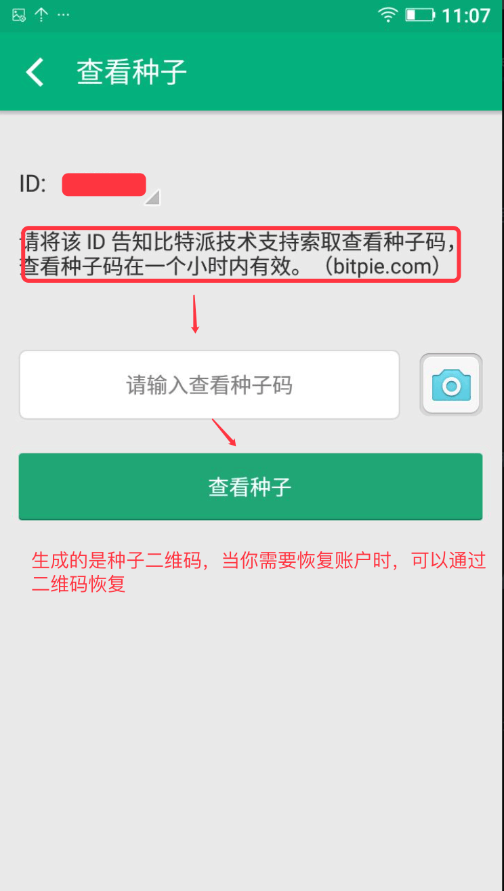

种子管理
========

概述
---------------

为了更好的保护比特派用户的财产安全，增强用户体验。比特派提供验证种子功能（比特派种子密语验证，比特派二维码），显示种子密码功能，查看种子。

比特派种子密语
---------------------

比特派采用HD钱包技术，12个汉字（单词）密语相当于你的私钥，要妥善保管好，不要泄露给他人。

比特派种子密语验证
------------------------------

帮助用户再次确认种子密语是否正确，避免种子密语记错。

显示种子密语功能
-----------------------------

此功能是为了帮助比特派用户第一次进入软件，没有抄写种子密语而设置。只能显示一次种子密语，帮助比特派用户强化记忆。

我已抄好－输入种子密语验证

查看种子
---------------------

通过ID告知比特派技术支持索取种子码。通过此功能，用户可以通过种子码生成种子二维码。可用于账户恢复。

保存种子
-----------------

1.首次打开比特派后，你将会看到如下界面

..  image:: ../img/2.png
    :width: 320px
    :height: 520px
    :scale: 100%
    :align: center

2.认真阅读”特别提示“后，点击”开始使用“按钮

..  image:: ../img/3.png
    :width: 320px
    :height: 520px
    :scale: 100%
    :align: center

3.请按顺序抄下这些单词，如果条件允许，可以点左上方开启打印模式，打印（复印）一份你的种子。或者也可以认真抄写你的种子。
点击”我已抄好“按钮，在新页面通过选择输入抄写的汉字（单词）.为了验证你是否抄写正确，进入比特派后，可以到设置——验证种子，输入备份的汉字，检验是否抄写正确。

大家在使用时，要认真阅读比特派的操作提示，尤其是像注册时候要备份种子（12个单词或汉字），不要出现卸载比特派或者恢复出厂设置等高危行为。

点击“我已抄好”按钮，进入下一步。

恢复种子
---------------------

1.通过抄写的种子进行恢复。

恢复种子就是恢复你之前已注册的比特派钱包和账户，需要使用之前备份好的种子（12个单词或汉字）。从左到右，从上到下，一个一个输入哦，如果输入某个字错误，点击那个字可删除或替换。

..  image:: ../img/4.png
    :width: 320px
    :height: 520px
    :scale: 100%
    :align: center

在注册或者恢复完成之后，接下来你会看到让你设置（重置）pin密码的界面，像你手机的密码一样，让钱包更加安全。要牢记并且设置好pin密码，因为你在使用比特派的时候会经常用到的。每次重新恢复钱包后，可以重置一次新的pin密码。

2.通过二维码进行恢复种子。