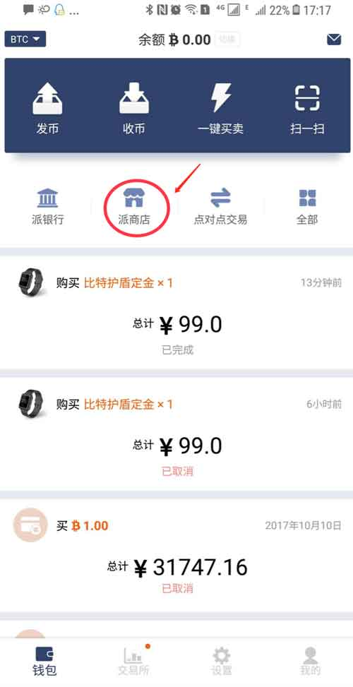
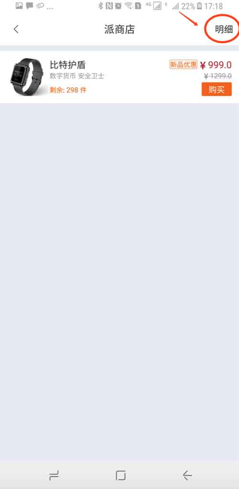
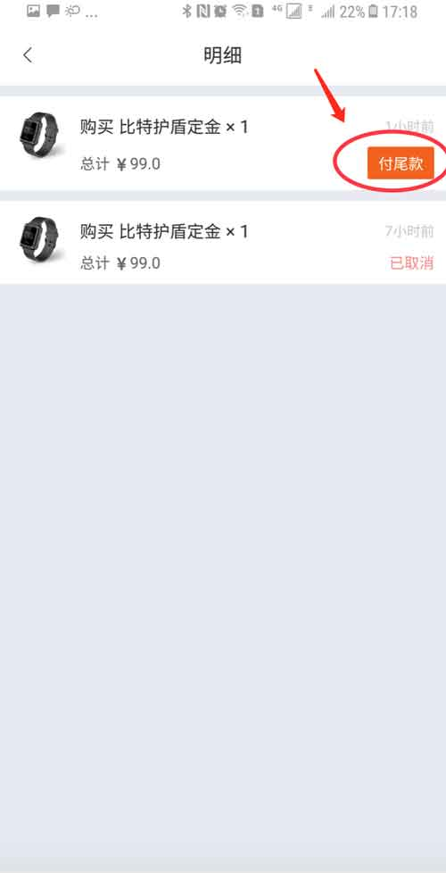
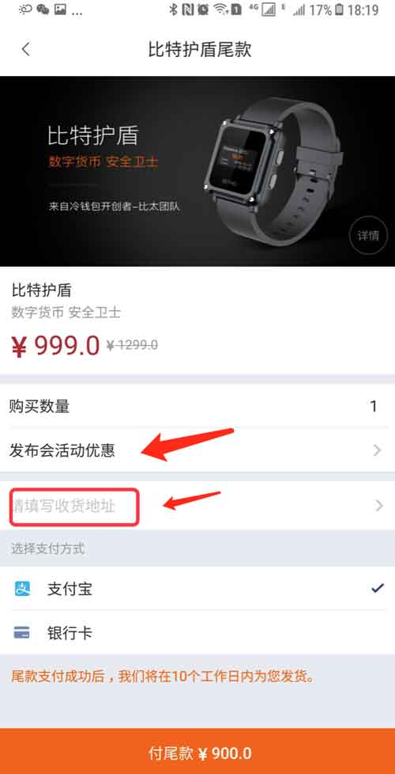
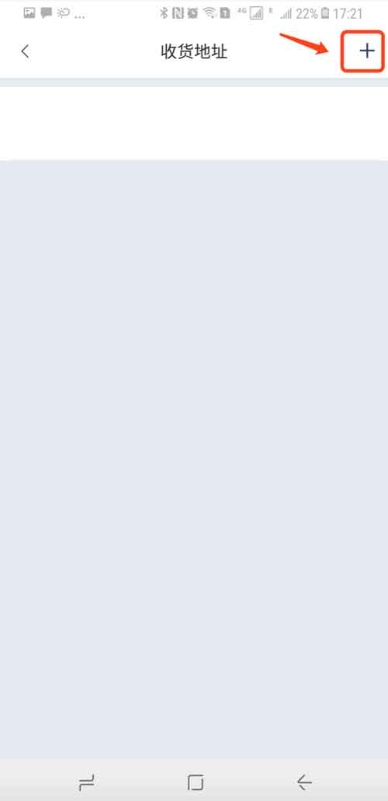
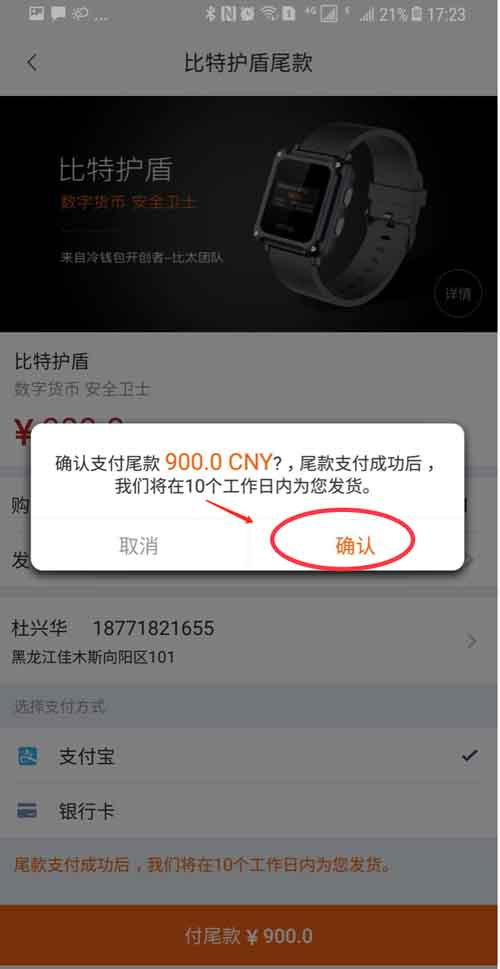
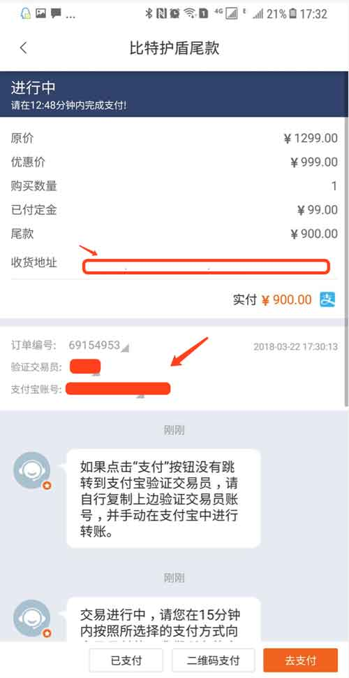

派商店
======================

比特护盾付尾款操作
---------------------------

期待已久的 BITHD 来了，比特护盾定金交过的，请进行以下操作付尾款。

1、钱包首页-派商店-选择'比特护盾'-选择右上角"明细"'－选择'购买 比特护盾定金 '一栏中的付尾款按钮。

2、如果您有发布会活动优惠，可选择输入手机号。选择 请填写收货地址一栏。

3、在收货地址界面选择右上角 "+" 。

4、新建收货地址界面入收货人、联系方式、所在地区、详细地址，选择确认。

5、选择新建好的收货地址。

6、返回到比特护盾尾款界面，选择付尾款按钮。

7、会弹出 确认支付尾款？尾款支付成功后，我们将在10个工作日内为您发货。确认。

8、在订单详情界面，查看交易员、付款方式。将尾款付给对应的交易员及收款账户中。然后选择已支付。

9、在派商店明细界面中可查看购买比特护盾的订单状态。