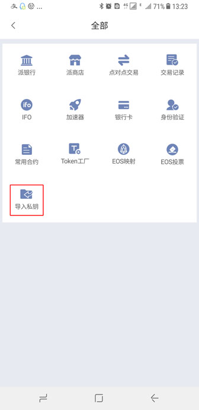
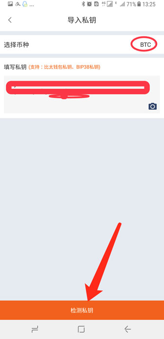
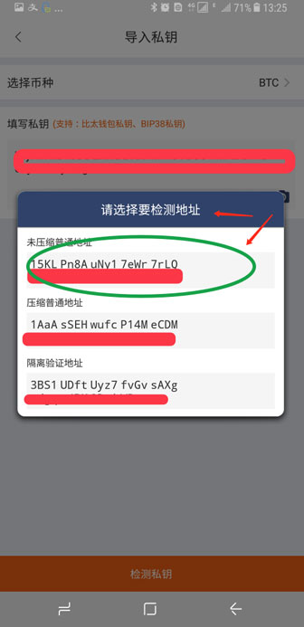
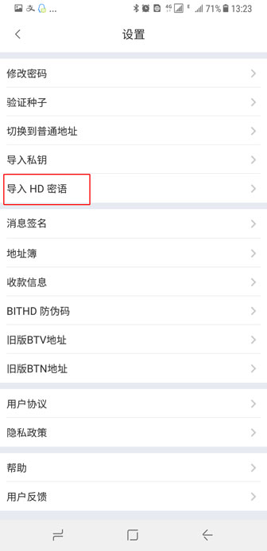
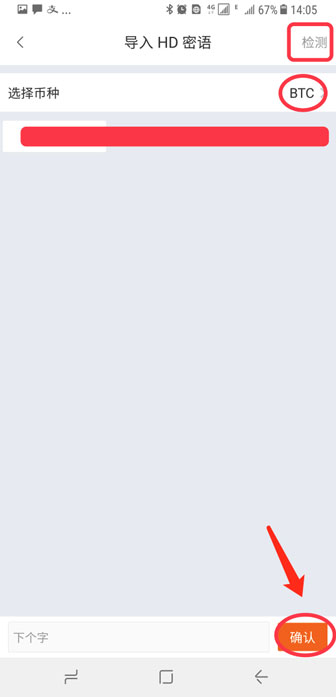

导入私钥、密语HD提取资产至比特派
===================================

比特派导入私钥、密语 HD 功能支持币种：BTC、BTC 下的分叉币（BCH、SBTC、BCD、BTV、BCX、BTW、BBC）、CDY、ETH、ETH 下的 ERC20 token、EOS、USDT、DASH、DOGE、ETC、QTUM等。下面以导入BTC为例。

BTC 私钥导入私钥为例
---------------------

1、比特派版本号大于 3.3.3。

2、可通过 钱包首页 - 全部 - 导入私钥 或者 钱包首页 - 我的菜单 - 右上角"齿轮"设置按钮 - 导入私钥。支持比太钱包私钥、BIP38 私钥导入。

.. image:: ../img/key_import_options.jpg
    :width: 336px
    :height: 691px
    :scale: 100%
    :align: center

3、选择币种，选择 BTC；将您备份好的 BIP38 私钥填入 "私钥输入框内"，输入完 BIP38 私钥之后，选择检测私钥。

4、选择要检测的地址，如果地址有余额，会提示您 检测到多少 BTC 导入到比特护账户？矿工费多少 BTC 。

BTC HD 密语导入为例
-------------------------------

1、比特派版本号大于 3.3.3。

2、钱包首页 - 我的菜单 - 右上角"齿轮"设置按钮 - 导入 HD 密语 - 选择来自 HD 密语或者 来自比特派旧版二维码。

3、选择币种，选择 BTC ；输入 HD 密语，这里导入的 HD 密语来自比太的 HD 密语 12个单词，你也可以使用其它钱包的 HD 密语导入，每输完一个单词，按确认。

4、输完 12个单词之后，选择右上角的检测。如果地址有余额，会提示您 检测到多少 BTC 导入到比特护账户？矿工费多少 BTC 。

