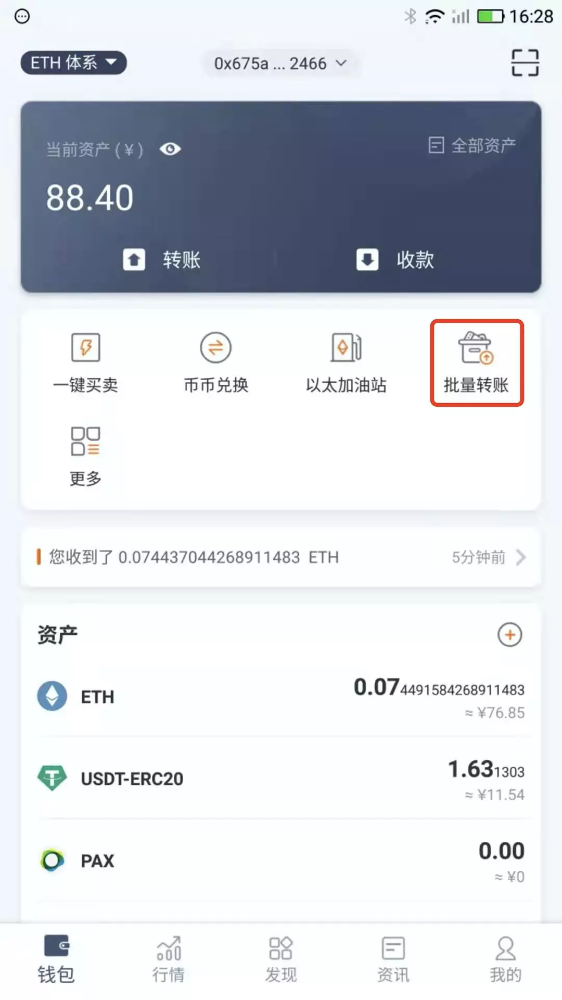
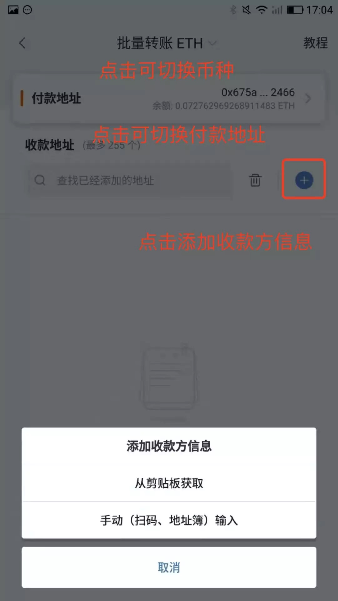
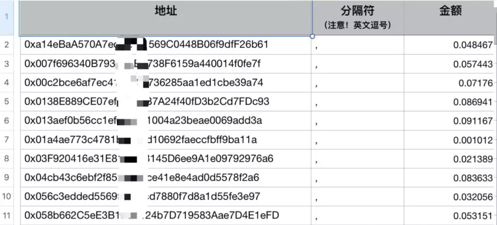
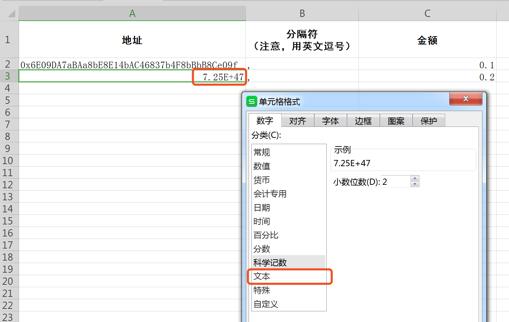
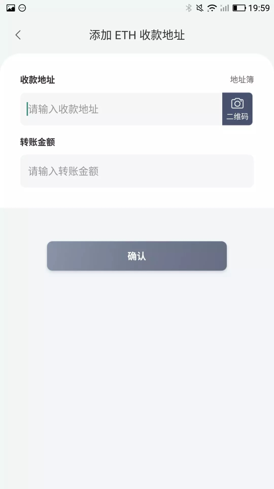
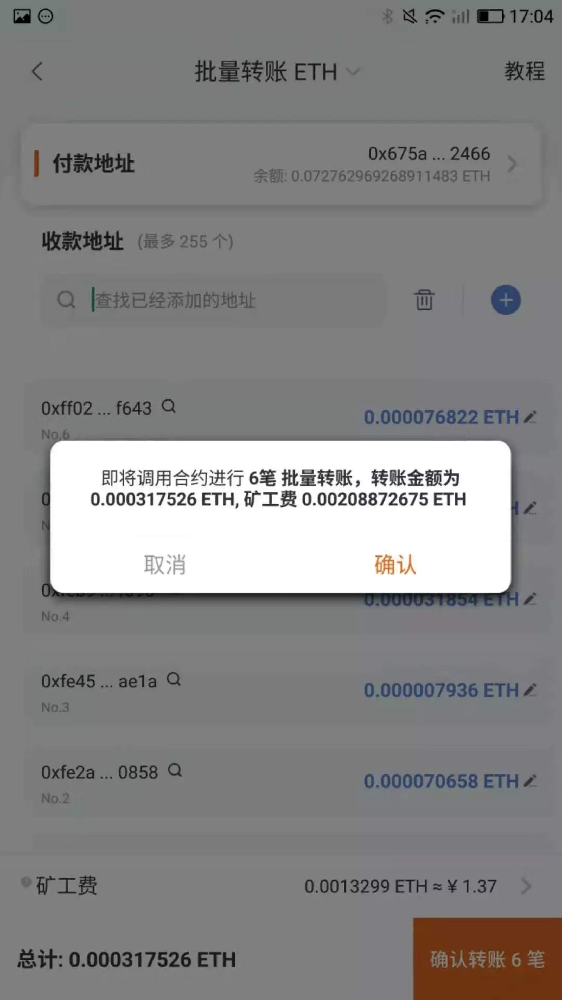
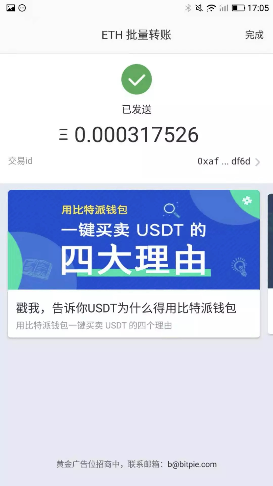

批量转账教程
================

功能简介：
----

比特派的批量转账功能可以将你的 ETH 或 ERC20 的 TOKEN 同时发送到多个地址（当前最多支持255个）。

优势：
----

节省操作时间，节省矿工费。

操作教程：
----

1、打开比特派，在左上角切换到“ETH 体系”点击 “批量转账”

2、进入操作页面后，首先确认自己用来付款的的币种、地址。然后点击加号【+】来添加收款方信息。

3、你可以选择【从剪贴板获取】或者【手动输入】收款方信息。

**当你选择从剪贴板获取时：**

你需要按固定格式提前复制好相关内容，再点击此按钮才可添加成功。

格式为：

 **地址,金额** （地址和金额之间用英文的逗号分隔，多组信息之间需要换行）

例如：

0xc35f4f66ef......20db8f7d , 0.001

0xfe4503c78......4e4ae1ae , 0.002

如果您要处理的地址较多，建议使用电脑表格软件进行整理，格式如下。

当你整理的地址在表格内显示异常时，选中所有异常的表格，右键选择单元格格式，并将单元格格式选择文本。（不同的软件操作步骤略有差异，核心操作在于将单元格文本格式选择成文本。）

整理完成后，可通过微信等其他软件将内容发送到手机并复制，打开批量转账页面点击加号+，选择从剪贴板复制，即可批量添加收款信息。

**当你选择手动输入时：**

可以手动输入地址、金额。也可以通过扫码、地址簿添加等方式添加地址。

4、地址信息添加完成并确认无误后，点击确认转账，核对好相关信息后点击确认，即可发出。等待合约确认后，便可查看所有的转账详情。

批量转账视频：https://m.weibo.cn/6404560407/4442923904567124