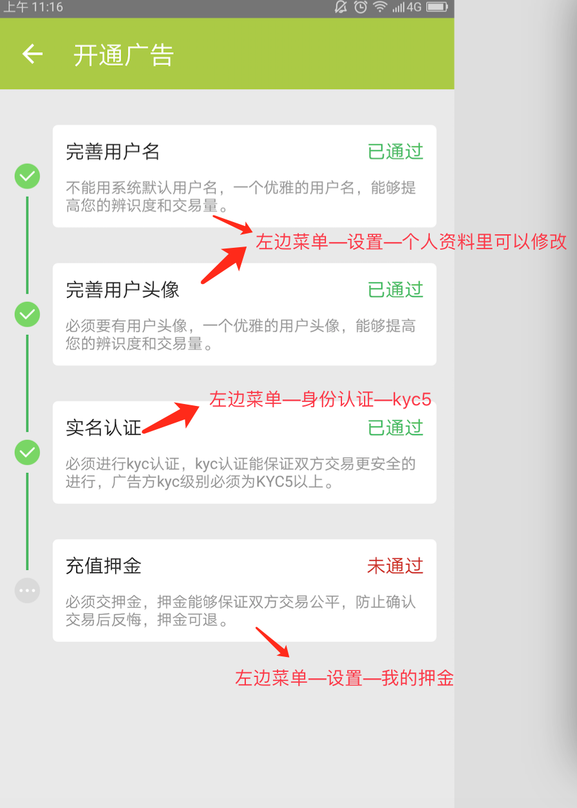

OTC交易
========

概述
---------

OTC交易也可以叫做P2P交易或者托管交易。简单可理解为个人对个人的比特币交易。

广告方
----------

准备工作
^^^^^^^^^^^^^^^^^

1. 默认用户名是noname- 开头的，这样很难便于区分，所以，到个人资料里设置下自己的用户名和头像。
2. 广告功能需要KYC5，提前做好身份认证。
3. 需要预先存入 100元人民币 或 0.01 BTC 的押金（之前开通过广告功能的用户的相关开通费用会自动转为押金）

创建广告
^^^^^^^^^^^^^^^^^^^

1. 左边菜单—我的广告—创建广告
2. 广告类型设置成在线，目前不支持现金交易。可以选择购买或出售。广告设置中的——购买就是别人卖币给你，出售就是你卖币给别人。
3. 限额就是别人来你这里购买或者出售的最小最大额度。
4. 你需要设置一个加个，可以设置浮动价格或者固定价格。
5. 浮动价格：根据选择交易所价格，设置溢价，价格是变动的。固定价格：就是你手动设置一个固定的价格（可修改）。
6. 支付方式可以选择支付宝，微信和银行卡。
7. 广告信息处填写你的一些联系方式，或者给自己打个广告。吸引更多的人和你交易。
8. 默认是和KYC2以上的用户进行加交易，这可以有效的保护广告方的资金安全。
9. 可以选择和是否交押金的用户进行交易。
10. 广告信息填写完毕后，设置为激活，点最下方按钮创建广告，广告创建完毕。
11. 左边菜单——在线  设置在线后其他用户就可以看到你的广告了。

..  image:: ../img/12.png
    :width: 320px
    :height: 520px
    :scale: 100%
    :align: center

下单方
------

准备工作
^^^^^^^^^^^^^^

1. 为了有效的保护广告方的资金安全，订单方需要至少KYC2。
2. 缴纳押金（可选），订单方需要预先存入 50元人民币 或 0.005 BTC的押金，缴纳押金后，可以和所有广告方进行交易。如果没有缴纳押金，只能和不带（押）字的广告方交易。

下订单
^^^^^^^^^^^^^^^

我们举个例子，下单方如何通过OTC交易从广告方这里买币的

1. 下单方到OTC订单列表里，找到和合适的卖家下单方，感觉价格靠谱点击聊天按钮，和卖家进行沟通，比如，是否有币，是否可以在线完成交易。没问题的话，买家就可以点击购买下单了，确定购买金额，付款方式都没问题，点购买下单。
2. 下单成功后买家看到的是等待接收。（等卖家决定是否接收订单）如果卖家长时间不回复的话，可以取消此订单，找其他人下单。卖家此时可以接收或者拒绝订单。
3. 卖家接收订单后，双方看到的是等待交易确认，（因为OTC交易是链上的比特币交易，这里的等待交易确认的意思是，卖家将币发送到托管状态，这个过程是需要网络确认的，就是等矿工把这笔交易做到区块儿里，就会有确认了），这个时间不确定，可能几分钟，也可能会时间稍微长些。买家卖家需要耐心等等。
4. 交易确认后，表示币已经被托管成功了，现在，卖家可以提供收款信息，大额的话建议使用银行卡收款。（像建设银行之类的转账或者叫接收比较慢的尽量不要使用哈，本人推荐招商银行，转账确认很快的。），买家按照卖家提供的付款方式，核对无误后可以给卖家付款，在留言或者备注中，填写下订单号，这样方便买卖双方进行交易。买家付款后，点击已付款。买家剩下的就是等待对方放币了。
5. 卖家在收到款后，并且核对无误后，点击释放托管中的比特币，把币释放给买家。
6. 此订单完成。

..  image:: ../img/13.png
    :width: 320px
    :height: 520px
    :scale: 100%
    :align: center

注意事项
^^^^^^^^^^^^^^^^^^^^^^

1. 进行OTC交易，必须等币成功被托管了，双方才能进行法币的操作。就是“交易已经确认”这个状态之后，买家再付款。
2. 广告放尽量需要下单方缴纳押金才可以下单，这样可以提高你的订单成功率。
3. 不管是下单方还是广告方，都要保证订单创建后，尽可能的在线哈，建议不要把手机调成静音，当交易确认了，比特派是会有通知消息的，并隔断时间看下自己的订单是否已确认。
4. 不管和对方交易多少次，一定要在OTC上进行交易，不能因为熟悉了就私下交易哈。
5. 如果发生纠纷，可以申请仲裁。

申请仲裁流程
^^^^^^^^^^^^^^^^^^^^^^^^

​如果出现纠纷比如买家没付款，买卖双方有一方长时间不回复，付款后卖家没放币，或者其他原因，都可以申请仲裁的。申请仲裁后，仲裁相关人员会尽快通过小秘书的形式来通知买卖双方如何操作。申请仲裁后，双方也是可以继续交易的，可能是因为一些小小的误会或者误操作，一方发起了仲裁。如果双方还想继续交易的话，另一方也申请仲裁，买家正常付款给卖家，卖家确认收到款后，点同意放币，释放币给买家。这样，即使申请仲裁了，也可以继续交易的。

