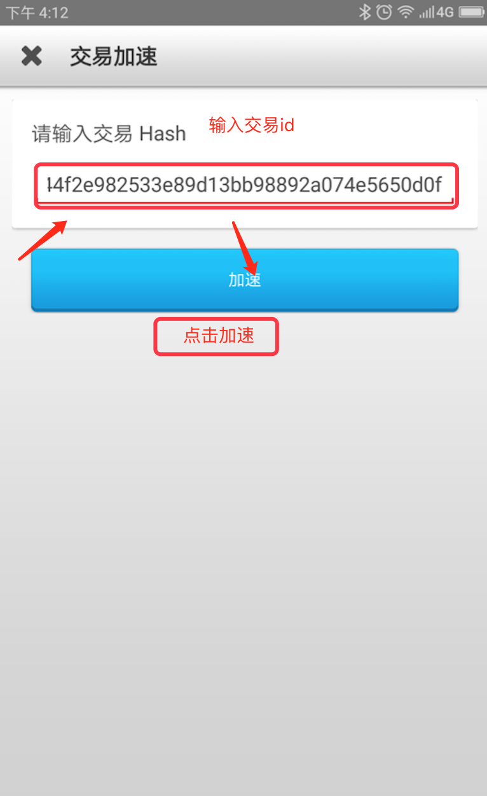

交易加速器使用
===================

说明
----------------

加速器是针对未确认的交易进行加速的，一个加速器对应一个未确认交易，如果你的依赖交易比较多，可能不止需要一个加速器的。

比特派加速器可以给任何平台比特币交易进行交易加速。

比特派交易加速器购买方法
--------------------------------------------

1. 交易加速器支持比特币，人民币购买。
2. 需要购买些加速器，在设置—个人设置—交易加速器。你可以购买加速器。
3. 购买加速器后可在交易加速器界面中查看交易器数量。

比特派交易加速使用方法
------------------------------------------

1. 设置－个人设置－交易加速器－右上角（加速）。

..  image:: ../img/19.png
    :width: 320px
    :height: 520px
    :scale: 100%
    :align: center

2. 在交易加器界面中，待加速。查看“待加速”的交易和“已加速”的交易。在“待加速”列表中选择要一项加速的交易，点击“加速”按钮进行加速。
3. tx_id可以指定比特币交易id进行加速（输入正确的交易id，不能包含空格及其他的特殊字符）。

..  image:: ../img/35.png
    :width: 320px
    :height: 520px
    :scale: 100%
    :align: center

