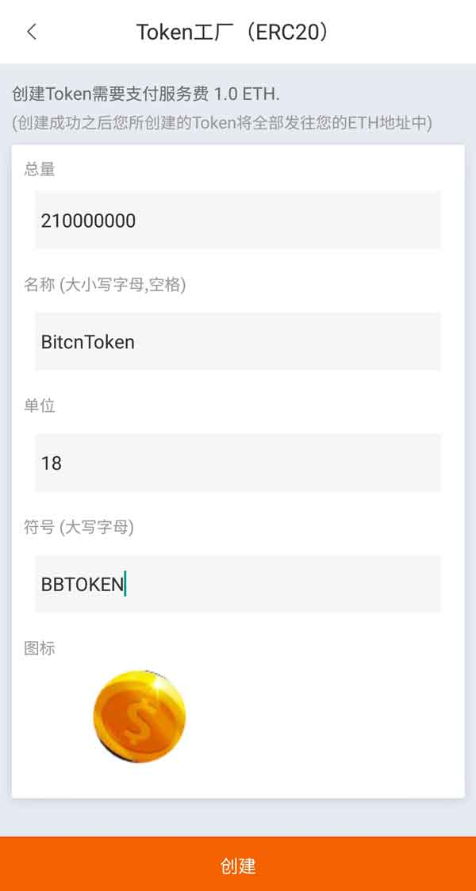
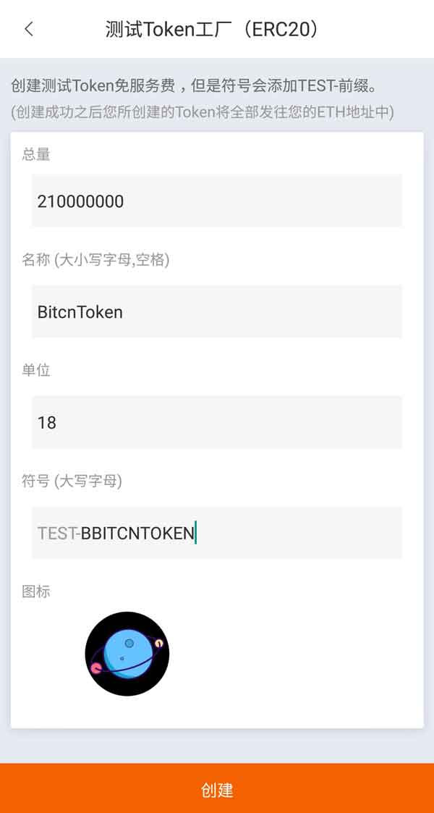
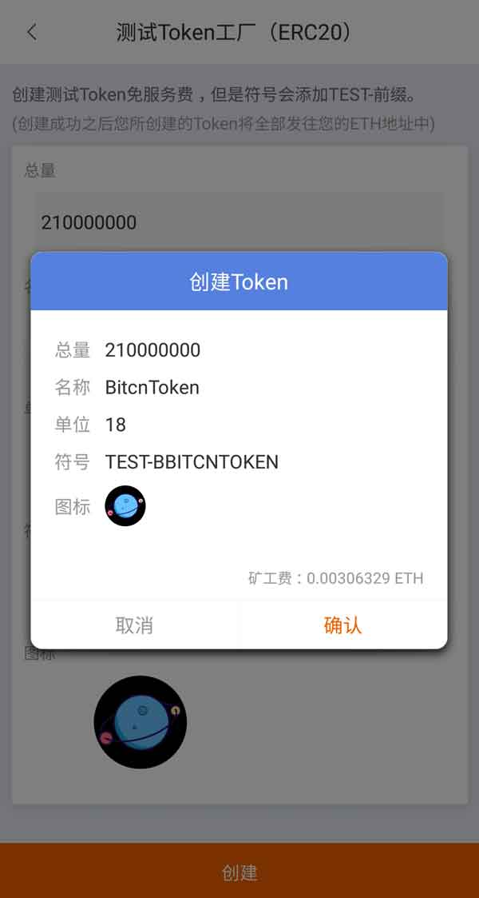

Token 工厂
=======================

正式 Token 工厂 (ERC20)
---------------------------

创建属于自己的 ERC20 代币，简单方便快捷。

1、Bitpie APP 版本大于 3.1.1 。

2、创建 Token 需要支付服务费 1.0ETH，在创建时请先保障您的 ETH 余额大于 1.0ETH。

3､ 钱包首页－全部－选择 Token 工厂-正式。

4､ 输入对应的总量、名称（大小写字母，空格）、单位、符号（大写字母）、上传图标，选择创建。

5､ 创建成功之后您所创建的 Token 将全部发住您的 ETH 地址中。

测试 Token 工厂 (ERC20)
---------------------------

创建测试 Token 免服务费，但是符合会添加 TEST-前缀。测试需要一点矿工费。测试 Token 工厂是为了让用户更好的了解 Token 工厂。

1、Bitpie APP 版本大于 3.1.1 。

2､ 钱包首页－全部－选择 Token 工厂－测试。

3、输入对应的总量、名称（大小写字母，空格）、单位、符号（大写字母）、上传图标，选择创建。

4､ 创建成功之后您所创建的 Token 将全部发住您的 ETH 地址中。